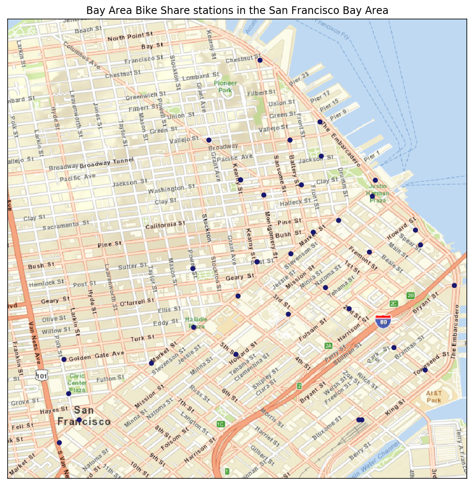
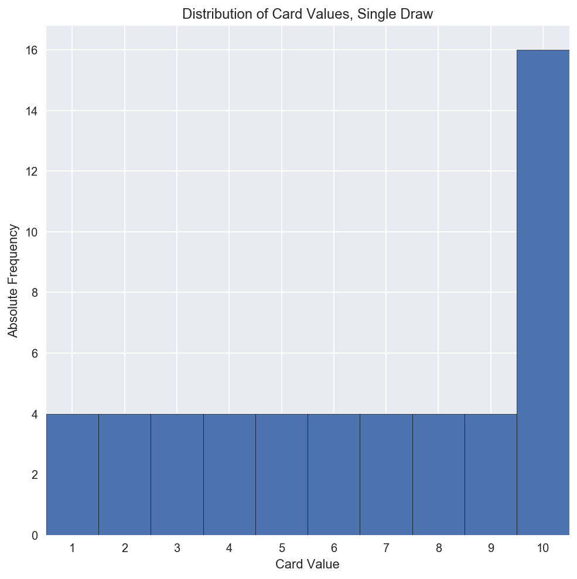

# Udacity Data Analyst Nanodegree
My Udacity Data Analyst Nanodegree projects. In Python, unless otherwise stated.

__[Link to syllabus](./projects/dand-old-syllabus.pdf)__

__Featured project:__ [Explore what I consider my best project to date!](https://github.com/federicomariamassari/udacity-dand/blob/master/projects/p3/dand-p3-wrangle-openstreetmap.md)

## P0 [Bay Area Bike Share Analysis](./projects/p0/dand-p0-bay-area-bike-share-analysis.md)

__Completion time:__ 5 days

__Supporting lesson content:__ _[Introduction to Python Programming](https://eu.udacity.com/course/introduction-to-python--ud1110)_ (Beginner)

__Acquired familiarity with:__ Python

[Link to project specification](projects/p0/dand-p0-project-specification.md)

### Overview

_Analyse data from Ford GoBike, a bike sharing company in the San Francisco Bay Area, using Python. Clean the dataset, create visualisations from the wrangled data, uncover and explore trends._

This is a rework of the original __introductory project__, to complete within the first week of enrolment in the Data Analyst Nanodegree program. Using Pandas, Seaborn, and Basemap I explore two years of daily trip data across five US cities (Mountain View, Palo Alto, Redwood City, San Francisco, and San Jose), and for two types of users (annual subscribers and customers).

<table>
  <tr>
    <td align="center"></td>
    <td align="center"></td>
  </tr>
</table>

### What was the biggest challenge?
Although I had just finished the _Python introductory course_, I found the provided code quite difficult to grasp. To read and write text files, for example, the assignment made extensive use of the `csv` module (which I would later review for P2 and P3), in place of the more intuitive Pandas. The dataset, however, was extremely interesting, so digging into it was definitely an enriching experience.

### Which part of the code do you like best?
Revealing that a small group of annual subscribers, possibly unaware of overtime fees, keep the bike for an entire working day; discovering that Ford GoBike, in accordance with my findings, decided to drop the program in three out of five cities.

## P1 [Compute Statistics from Card Draws](https://nbviewer.jupyter.org/github/federicomariamassari/udacity-dand/blob/master/projects/p1/dand-p1-compute-statistics-from-card-draws.ipynb)

__Completion time:__ 5 days

__Supporting lesson content:__ _[Intro to Descriptive Statistics](https://eu.udacity.com/course/intro-to-descriptive-statistics--ud827)_ (Beginner)

__Acquired familiarity with:__ NumPy, SciPy, Matplotlib

### Overview
_In this project, you will demonstrate your knowledge of descriptive statistics by conducting an experiment dealing with drawing from a deck of playing cards and creating a write up containing your findings._

This is a practical application of the __central limit theorem__. I generate a deck of cards, draw randomly from it, analyse the distribution of outcomes, compute basic statistics and, if applicable, provide confidence intervals for the population mean when only sample moments are available, as well as the cumulative distribution function for a random variable _X_, _F(x)_ = _P(X_ ≤ _x)_, the probability of it being below a certain threshold value _x_.

<table>
  <tr>
    <td align="center"></td>
    <td align="center"></td>
  </tr>
</table>

### What was the biggest challenge?
Dealing with the replacement option, which impacts on the random card drawing algorithm. I took advantage of Python's definition of `set` and `list` as collections of, respectively, unique and repeatable objects. For `replacement == False`, I initialised the hand to the empty set, so that no two identical cards could be drawn; I also limited the maximum number of cards to pick to 52. For `replacement == True`, instead, I initialised the hand to the empty list, so that the same card could be drawn multiple times; I also removed the 52-card constraint.

### Which part of the code do you like best?
The deck generating process. In particular, the way suits and values are stored in different variables, then randomly paired by the card drawing algorithm. I believe this procedure is very intuitive and neat.

[Link to Python module](/projects/p1/python-modules/)

## P2 [Investigate a Dataset](https://nbviewer.jupyter.org/github/federicomariamassari/udacity-dand/blob/master/projects/p2/dand-p2-investigate-a-dataset.ipynb)

__Completion time:__ 21 days

__Supporting lesson content:__ _[Intro to Data Analysis](https://eu.udacity.com/course/intro-to-data-analysis--ud170)_ (Beginner)

__Textbook:__ Jake VanderPlas, [_Python Data Science Handbook. Essential Tools for Working with Data_](http://shop.oreilly.com/product/0636920034919.do), O'Reilly Media, 2016

__Acquired familiarity with:__ Pandas, Seaborn

[Link to project specification](projects/p2/dand-p2-project-specification.md)

### Overview
_Choose one of Udacity's curated datasets and investigate it using NumPy and Pandas. Go through the entire data analysis process, starting by posing a question and finishing by sharing your findings._

Digging into the __Titanic dataset__, I go through all the steps involved in a typical data analysis process: formulate questions, wrangle (acquire and clean data), explore, draw conclusions, and communicate findings. I mainly use Pandas to store and handle data in tables, SciPy to detect statistical association among variables, and Seaborn to produce plots.

<table>
  <tr>
    <td align="center"></td>
  </tr>
  <tr>
  </tr>
  <tr>
    <td align="center"></td>
  </tr>
</table>

### What was the biggest challenge?
Performing meaningful tests of association between _binary variables_ and plotting the results, offering enough plot variety. Binary variables are challenging for two reasons: on one hand, they make the correlation coefficient difficult to interpret; on the other, very few plot types are suitable to visualise their relationship. To measure the degree of association between variables, I resorted to _contingency tables_, _phi coefficients_ (binary-to-binary) and _Cramér's V_ (nominal-to-binary). To display such association, I experimented with various Seaborn plots: swarm, strip, violin, and joint, among the others.

### Which part of the code do you like best?
Function `association`, which returns phi coefficients (if applicable), Cramér's V, and the result of Pearson's test of independence. For the first two statistics no built-in Python function was available, so I had to define my own.

[Link to Python module](/projects/p2/python-modules/)

## P3 [Wrangle OpenStreetMap Data](https://github.com/federicomariamassari/udacity-dand/blob/master/projects/p3/dand-p3-wrangle-openstreetmap.md)

__Languages:__ Python, SQL

__Completion time:__ 45 days

__Supporting lesson content:__ _[Data Wrangling with MongoDB](https://eu.udacity.com/course/data-wrangling-with-mongodb--ud032)_ (Intermediate)

__Acquired familiarity with:__ ElementTree XML API, SQLite

[Link to project specification](projects/p3/dand-p3-project-specification.md)

### Overview
_Choose an area of the world you care about in [OpenStreetMap.org](https://www.openstreetmap.org) and use data munging techniques to clean the related OSM file (XML). Import the file into a SQL or MongoDB database and run queries to inspect the cleaned data._

This project focuses on the __wrangling__ step of the data analysis process: auditing (using regular expressions) and cleaning an XML document, writing its updated entries on csv files, creating a SQL database and importing the files in it, querying the database, and, finally, producing a report. This is where my Python skills definitely leveled up!

<table>
  <tr>
    <td align="center"></td>
    <td align="center"></td>
  </tr>
</table>

### What was the biggest challenge?
Understanding the structure of the provided version of `data.py` was surprisingly hard, and I spent several days doing this task. The most difficult part was grasping the syntax of `xml.etree.cElementTree`, the Python module to parse the OSM document. However, after this obstacle was overcome, the remaining steps of the process—polishing the XML elements, importing the data into SQL, exploring the database, and producing the pdf report—were thoroughly enjoyable!

### Which part of the code do you like best?
Map generation via the Basemap toolkit. My first experiment with the module, a scatter plot of postal codes in the OSM file on top of a 2D chart of Milan and its surroundings, made me really ecstatic!

[Link to Python modules](/projects/p3/python-modules/)

## P4 [Explore and Summarise Data](https://github.com/federicomariamassari/udacity-dand/blob/master/projects/p4/dand-p4-explore-and-summarise-data.md)

__Languages:__ Python, R

__Completion time:__

__Supporting lesson content:__ _[Data Analysis with R](https://eu.udacity.com/course/data-analysis-with-r--ud651)_ (Intermediate)

__Textbook:__ Ryan Mitchell, [_Web Scraping with Python. Collecting Data from the Modern Web_](http://shop.oreilly.com/product/0636920034391.do), O'Reilly Media, 2015

__Acquired familiarity with:__ Beautiful Soup, R

[Link to project specification](projects/p4/dand-p4-project-specification.md)

### Overview

### What was the biggest challenge?
Choosing the right dataset—one rich enough to be explored along many dimensions—as well as becoming familiar with the R language, proved two pretty challenging tasks. In the first case, I spent days surfing on _Kaggle_ before deciding that, if I wanted to be happy with a dataset, I had to make my own. In the end, I wrangled the content of a website I have long appreciated, _[TheyShootPictures.com](http://theyshootpictures.com)_. I discovered I could legally scrape the website from the _robots meta tags_:
```html
<html lang="en">
  <head>
    <meta name="robots" content="index, follow">
```
Python, especially the combination of `requests` and `BeautifulSoup`, proved invaluable during this phase. In the second case, learning the R syntax was not immediate, although familiarity with MATLAB, NumPy, and Pandas helped me catch up quickly.

### Which part of the code do you like best?

[Link to Python modules](/projects/p4/python-modules/)

[Link to R module](/projects/p4/R-modules/)
