[Table of Contents](https://github.com/federicomariamassari/udacity-dand/blob/master/README.md) | Next: [P1 Compute Statistics from Card Draws](https://nbviewer.jupyter.org/github/federicomariamassari/udacity-dand/blob/master/projects/p1/dand-p1-compute-statistics-from-card-draws.ipynb)
# Data Analyst Nanodegree: P0 Bay Area Bike Share Analysis
__Federico Maria Massari / federico.massari@bocconialumni.it__

_This is a rework of the Udacity Data Analyst Nanodegree introductory project._

## Introduction
_[Bay Area Bike Share](https://www.fordgobike.com) (now Ford GoBike) provides on-demand bike rentals for customers in San Francisco, Redwood City, Palo Alto, Mountain View, and San Jose. Users can unlock bikes from various stations throughout each city, and return them to any station within the same city. Clients pay for the service either through a yearly subscription or by purchasing a 24-hour or 3-day pass. Under service conditions, they can make an unlimited number of trips: trips under thirty minutes in length have no additional charge, longer trips will incur overtime fees._

_Figure 1 maps all Bay Area Bike Share stations available in the period 8-29-13 (inception date) to 8-29-15._

<table>
  <tr>
      <td align="center" colspan="2"><b>Figure 1: Maps of Bay Area Bike Share stations</b></td>
  </tr>
  <tr>
  </tr>
  <tr>
  <td align="center"><b>Figure 1.A</b>: Stations throughout California</td>
  <td align="center"><b>Figure 1.B</b>: Stations in the San Francisco Bay Area</td>
  <tr>
  </tr>
  <tr>
    <td align="center">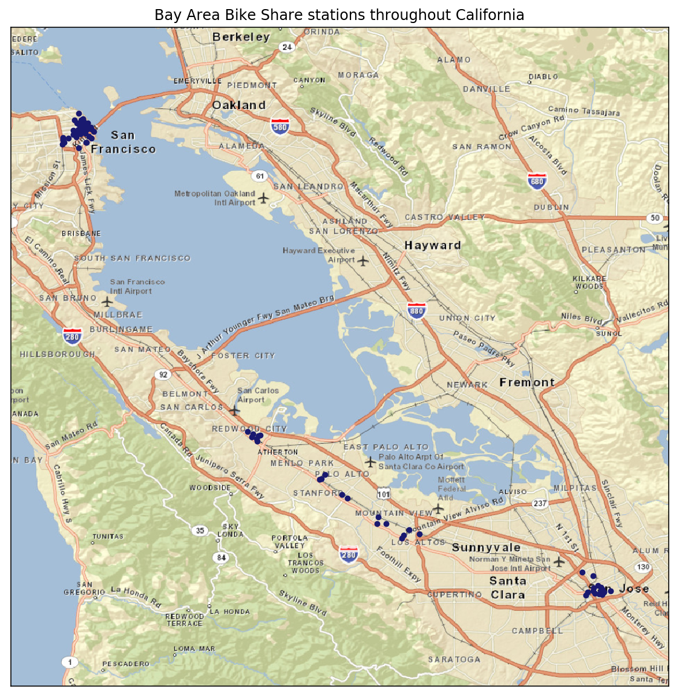</td>
    <td align="center">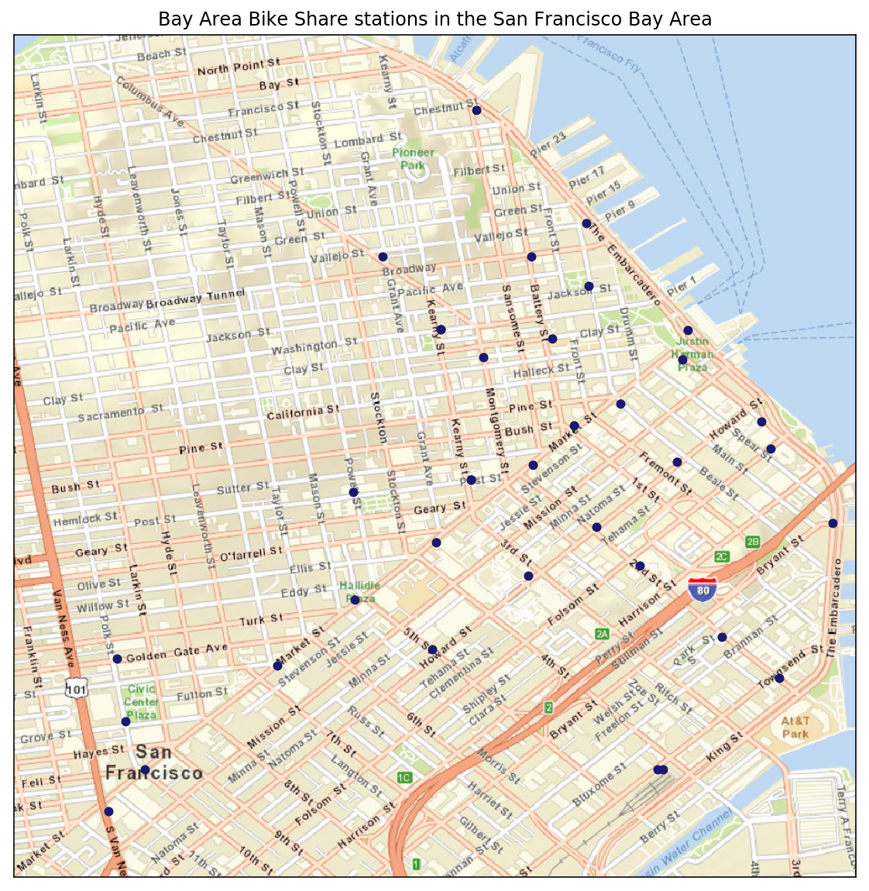</td>
  </tr>
</table>

## Preliminary questions
_In this project, you will put yourself in the shoes of a data analyst performing an exploratory analysis on the data. You will take a look at two of the major parts of the data analysis process: data wrangling and exploratory data analysis. But before you even start looking at the data, think about some questions you may want to answer using them._

In my opinion, the data could help answer three important sets of questions:

__Service location and availability.__
- In which city is the service most popular? Which stations receive the most visits?
- Is there any peak of demand during the day or on any special day?
- Where is it important to expand?

__Customer habits and profit optimisation.__

- Do customers most frequently rent a bike to get to work or for leisure? Which rental option do they prefer?
- What is the average length of a bike ride? Does it vary with subscription type?
- Do weather conditions impact on bike rental?
- How frequently do people forget or are unaware of the additional fee structure of the service?
- Are profits easy to predict? Would they rise if the thirty-minute threshold were extended?

__Safety and quality of the service.__

- On average, are bikes returned in sound conditions? Are they safe to ride? How often do they get checked-up?
- Are bikes stolen frequently? Are they found? Where and in which conditions?
- How many accidents are related to bike malfunctions?
- And finally, what is the average rating of the overall Ford GoBike experience?

## Open Data Challenge
_In 2014, Bay Area Bike Share held an Open Data Challenge to encourage data analysts to create visualizations based on their open data set. Take a look at the [submission winner for Best Analysis](http://thfield.github.io/babs/index.html) from Tyler Field: are you able to answer either of the questions you identified above based on Tyler’s analysis? Why or why not?_

Tyler's report nicely answers the questions posed in the first two sets. With regards to set one, it shows that:

- the bike rental service is most popular in San Francisco, which makes up ~90% of system use (despite only 50% of the overall number of stations and docks being available there);
- in that city, Caltrain (Townsend at 4th), Harry Bridges Plaza (Ferry Building), and Embarcadero at Sansome are the busiest stations;
- the peaks of demand for bikes occur on work days at 8am, noon, and 5pm, when most users go to work, have lunch, and go back home;
- there is room for expansion within the San Francisco SoMa area, in which a large percentage of commuters work.

As for set two, it tells that:

- most users are commuters who rent a bike daily to go to work; these are generally annual subscribers;
- the average length of a bike ride is 5-10 minutes for commuters and slightly below 30 minutes for tourists; both types are, in Tyler's words, "savvy to the price structuring";
- weather conditions do impact the bike rental service: rides drop significantly when it rains, although only slightly during the coldest days of winter (i.e., late December to early February) thanks to the moderate temperatures all year long in the Bay Area;
- in contrast to subscribers, a significant number of tourists seem to be either unaware or forgetful of the additional fee structure (5.378 / 30.368 = ~17.7% of bike rides by tourists last longer than 1 hour, and of these, about 1% longer than 1 day); also, some customers ignore the rule according to which inter-city trips are not allowed (isolated spots on the heatmap show this);
- as most service users are annual subscribers, revenues should be fairly stable and easy to predict; as most rides are 5-10 minutes (commuters) or slightly less than 30 minutes (tourists) in length, the standard half-hour time seems adequate and requires no modifications.

As for set three, however, the analysis does not reveal much. This is not Tyler's fault; rather, it is due to the lack of data related to bike conditions and theft. All one could say is that:

- some trips lasting longer than one hour _may_ be due to theft;
- some inter-city trips _may_ also be related to theft.

But, as Tyler adds, other reasons could be confusion about the 24-hour (and 3-day) pass, getting lost, or forgetfulness, so it is impossible to be more precise. It would be interesting to investigate the following dimensions:

- theft rate of the bikes;
- average condition of the bikes and frequency of maintenance;
- correlation between any low app rating and users' confusion on how the service works.

For this last point, I believe Ford GoBike should improve communication with one-time customers and tourists to avoid incidents of this kind.

## Performing your own analysis
### Individual trips by subscription type
__Number of trips.__ The total number of individual trips in the first two years was approximately 670,000 (_Table 1_). The share of trips by annual subscribers rose to ~84.5%, compared to almost 80% reported by Tyler during the first six months of the service, and it is more than five times the share of trips by customers (_Figure 2.A_). It seems Ford GoBike is going a great length towards promoting its service to workers and locals. It may also be that a good number of customers switched to the annual subscription.

<table>
  <tr>
    <td align="center" colspan="4"><b>Table 1: Trips by subscription type</b></td>
  </tr>
  <tr>
  </tr>
  <tr>
      <td align="right"></td>
      <td align="right"><b>Annual subscribers</b></td>
      <td align="right"><b>Customers</b></td>
      <td align="right"><b>Total</b></td>
  </tr>
  <tr>
  </tr>
  <tr>
      <td>Number of individual trips</td>
      <td align="right">566,746</td>
      <td align="right">103,213</td>
      <td align="right">669,959</td>
  </tr>
  <tr>
  </tr>
  <tr>
      <td>Percentage of individual trips</td>
      <td align="right">84.59</td>
      <td align="right">15.41</td>
      <td align="right">100.00</td>
  </tr>
  <tr>
  </tr>
  <tr>
      <td>Average trip duration (minutes)</td>
      <td align="right">9.83</td>
      <td align="right">65.86</td>
      <td align="right">18.47</td>
  </tr>
  <tr>
  </tr>
  <tr>
      <td>Median trip length (minutes)</td>
      <td align="right">7.93</td>
      <td align="right">18.60</td>
      <td align="right">8.62</td>
  </tr>
  <tr>
  </tr>
  <tr>
      <td>First quartile (q25)</td>
      <td align="right">5.38</td>
      <td align="right">10.97</td>
      <td align="right">5.73</td>
  </tr>
  </tr>
  <tr>
  </tr>
  <tr>
      <td>Third quartile (q75)</td>
      <td align="right">11.10</td>
      <td align="right">38.82</td>
      <td align="right">12.58</td>
  </tr>
</table>

__Length of trips.__ The median trip length was around 8 minutes for subscribers, and about 20 for customers (_Figure 2.B_). The average trip duration (red triangles in the box-whisker plot), instead, is around 10 minutes for the former and over one hour for the latter (the mean is not robust to outliers). 50% of the trips are between 5 and 11 minutes (subscribers) and between 11 and 40 minutes (customers).

<table>
  <tr>
      <td align="center" colspan="2"><b>Figure 2: Number and duration of trips by subscription type</b></td>
  </tr>
  <tr>
  </tr>
  <tr>
  <td align="center"><b>Figure 2.A</b>: Number of trips</td>
  <td align="center"><b>Figure 2.B</b>: Boxplot of trip duration (minutes)</td>
  <tr>
  </tr>
  <tr>
    <td align="center">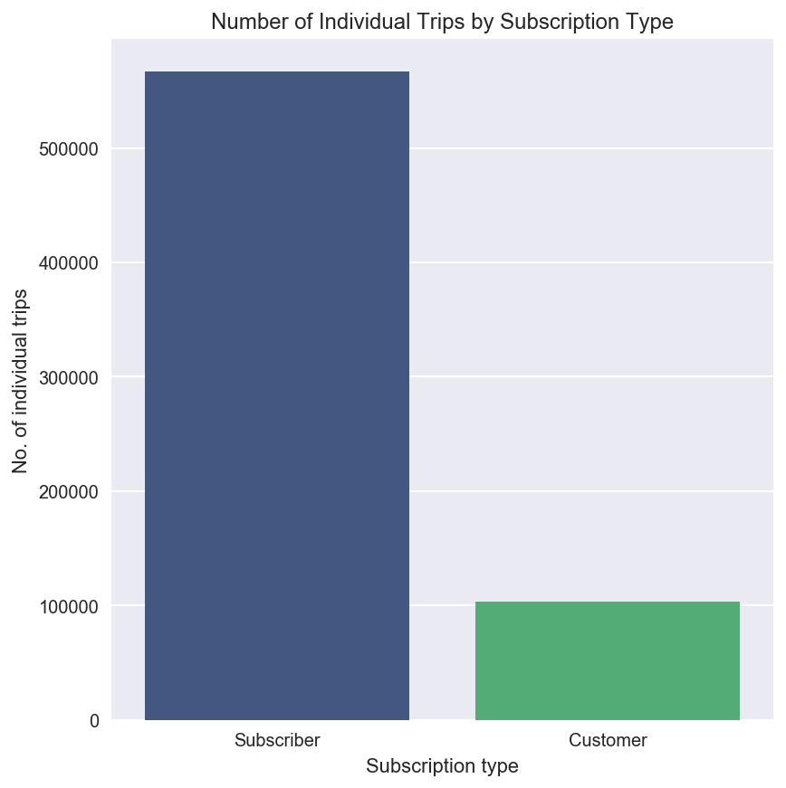</td>
    <td align="center">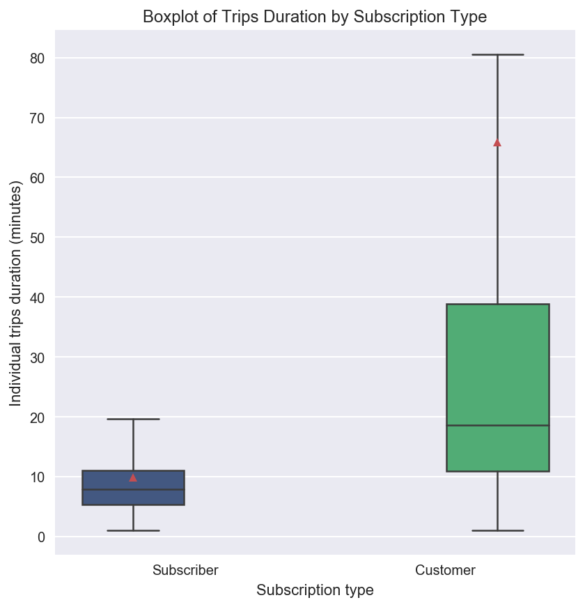</td>
  </tr>
</table>

### Daily and weekly use
__Annual subscribers.__ As Tyler pointed out, annual subscribers are generally workers who use the service from Monday to Friday, at around 8-9am and 5-6pm (_Figure 3_). A few (but not as many as he found out) also use it to go to lunch, at 12 noon.
<table>
  <tr>
      <td align="center" colspan="2"><b>Figure 3: Daily and weekly habits of annual subscribers</b></td>
  </tr>
  <tr>
  </tr>
  <tr>
  <td align="center"><b>Figure 3.A</b>: Number of trips by hour</td>
  <td align="center"><b>Figure 3.B</b>: Number of trips by weekday</td>
  <tr>
  </tr>
  <tr>
    <td align="center">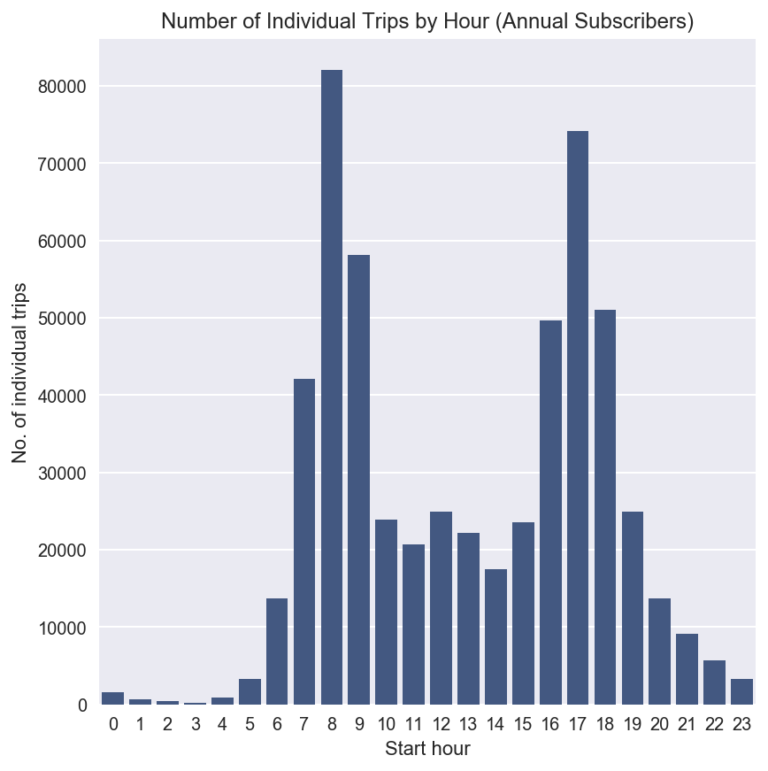</td>
    <td align="center">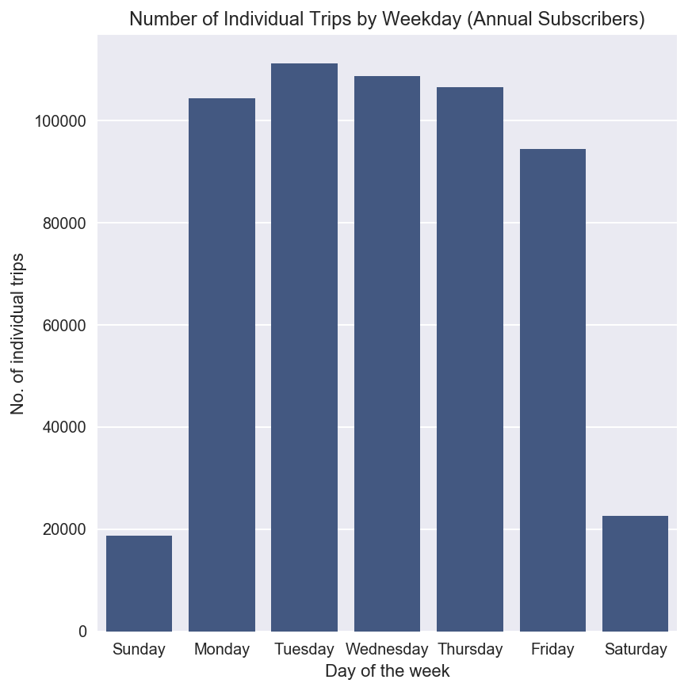</td>
  </tr>
</table>

__Customers.__ Casual riders generally use the service on weekends and, in Tyler's words, their hourly usage falls along a bell-shaped distribution, with a peak at 2pm (_Figure 4_). Also, on weekends, both the number of customers and that of subscribers renting a bike are the same, approximately 20-22k.
<table>
  <tr>
      <td align="center" colspan="2"><b>Figure 4: Daily and weekly habits of customers</b></td>
  </tr>
  <tr>
  </tr>
  <tr>
  <td align="center"><b>Figure 4.A</b>: Number of trips by hour</td>
  <td align="center"><b>Figure 4.B</b>: Number of trips by weekday</td>
  <tr>
  </tr>
  <tr>
    <td align="center">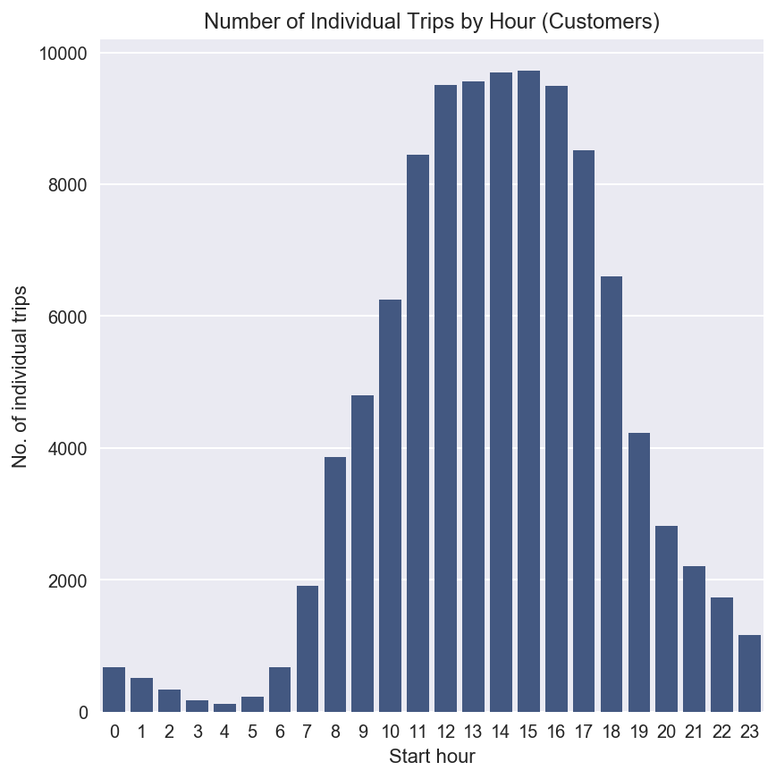</td>
    <td align="center">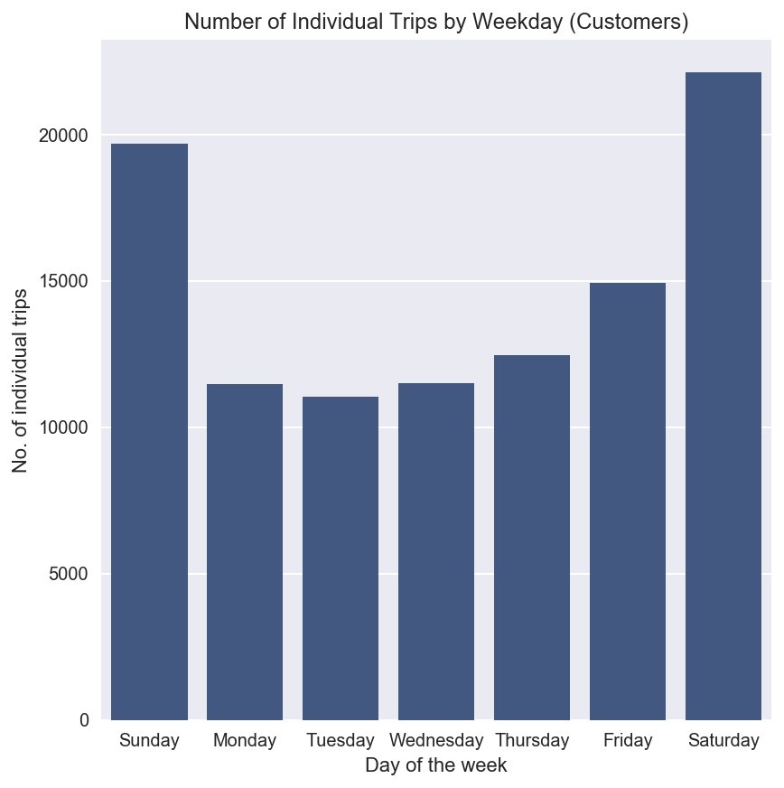</td>
  </tr>
</table>

### Service intended use
Almost all trips by subscribers (562,938 / 566,746 = 99.33%) are shorter than half an hour, to signify subscribers use the service correctly (_Table 2_). However, only ~70% of the trips by customers (71,946 / 103,213 = 69.71%) are shorter than half an hour, to show that Ford GoBike should make a greater effort to communicate more efficiently with these users.

<table>
  <tr>
    <td align="center" colspan="4"><b>Table 2: Trips within 30 minutes by subscription type</b></td>
  </tr>
  <tr>
  </tr>
  <tr>
      <td align="right"></td>
      <td align="right"><b>Annual subscribers</b></td>
      <td align="right"><b>Customers</b></td>
      <td align="right"><b>Total</b></td>
  </tr>
  <tr>
  </tr>
  <tr>
      <td>Number of trips</td>
      <td align="right">562,938</td>
      <td align="right">71,946</td>
      <td align="right">634,884</td>
  </tr>
  <tr>
  </tr>
  <tr>
      <td>Percentage of trips</td>
      <td align="right">84.03</td>
      <td align="right">10.74</td>
      <td align="right">100.00</td>
  </tr>
  <tr>
  </tr>
  <tr>
      <td>Percentage over category total</td>
      <td align="right">99.33</td>
      <td align="right">69.71</td>
      <td align="right">94.76</td>
  </tr>
</table>

### Where to expand, where to contract
San Francisco makes up about 90% of total traffic, while the other cities combined only make up around 10% (_Table 3_).

<table>
  <tr>
    <td align="center" colspan="4"><b>Table 3: Trips by city</b></td>
  </tr>
  <tr>
  </tr>
  <tr>
      <td align="right"></td>
      <td align="right"><b>San Francisco</b></td>
      <td align="right"><b>Other cities</b></td>
      <td align="right"><b>Total</b></td>
  </tr>
  <tr>
  </tr>
  <tr>
      <td>Number of trips</td>
      <td align="right">603,708</td>
      <td align="right">66,251</td>
      <td align="right">669,959</td>
  </tr>
  <tr>
  </tr>
  <tr>
      <td>Percentage of trips</td>
      <td align="right">90.11</td>
      <td align="right">9.89</td>
      <td align="right">100.00</td>
  </tr>
  <tr>
  </tr>
  <tr>
      <td>Median trip length (minutes)</td>
      <td align="right">8.75</td>
      <td align="right">7.03</td>
      <td align="right">8.62</td>
  </tr>
</table>

According to the [San Francisco Chronicle](http://www.sfchronicle.com/business/networth/article/Bay-Area-bike-share-expansion-gets-rolling-11209596.php) (June 21, 2017), the program was too small to achieve critical mass in Palo Alto, Redwood City, and Mountain View. For this reason, the cities were dropped because too few people used the bikes. This was not surprising since these cities combined represented only 4.24% of total traffic (_Figure 5_).

Yet, due to its large population size, San Jose was not dropped from the program, despite at the time representing only 5.65% of total traffic. In fact, [Ford GoBike's website](https://member.fordgobike.com/map/) now lists San Francisco and San Jose as its main targets for expansion. It would be interesting to compare service popularity in San Francisco and San Jose these days.

<table>
  <tr>
      <td align="center" colspan="2"><b>Figure 5: Number of trips by starting city</b></td>
  </tr>
  <tr>
  </tr>
  <tr>
  <td align="center"><b>Figure 5.A</b>: All trips</td>
  <td align="center"><b>Figure 5.B</b>: Trips excluding San Francisco</td>
  <tr>
  </tr>
  <tr>
    <td align="center">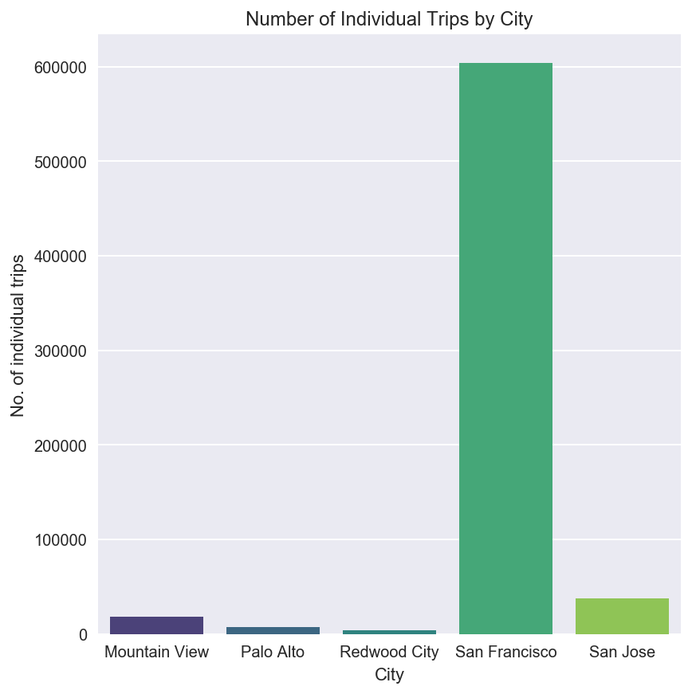</td>
    <td align="center">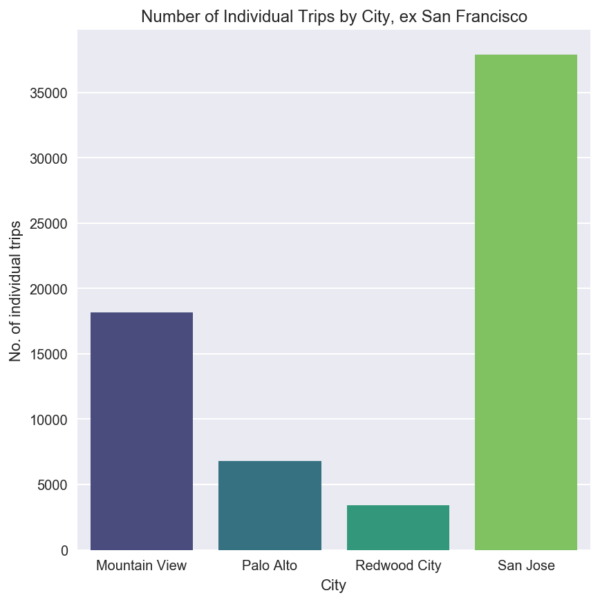</td>
  </tr>
</table>

### Communicating problems with users
_Figure 6_ shows two aspects of possible ineffective communication of Ford GoBike with its users:

- A few annual subscribers keep the bike for the whole workday (8am-5pm);
- Users in small cities more frequently break the "no inter-city trips" rule.

#### Annual subscribers keeping the bike for the whole workday
With regard to the first point, I previously stated that most annual subscribers (~99.33%) use the bike rental service as it should, namely, they take trips shorter than 30 minutes. Among the very few who do not, there is a minority who actually keeps the bike for about 8 hours, probably taking it to get to work at 8am, keeping it, and leaving it to go back home, at 5pm. This behaviour is clearly visible in the spike around the 480-minute mark in _Figure 6.A_, and it is not one customers (_Figure 6.B_) show.

<table>
  <tr>
      <td align="center" colspan="2"><b>Figure 6: Distribution of overtime trips duration by subscription type</b></td>
  </tr>
  <tr>
  </tr>
  <tr>
  <td align="center"><b>Figure 6.A</b>: Overtime trips by annual subscribers</td>
  <td align="center"><b>Figure 6.B</b>: Overtime trips by customers</td>
  <tr>
  </tr>
  <tr>
    <td align="center">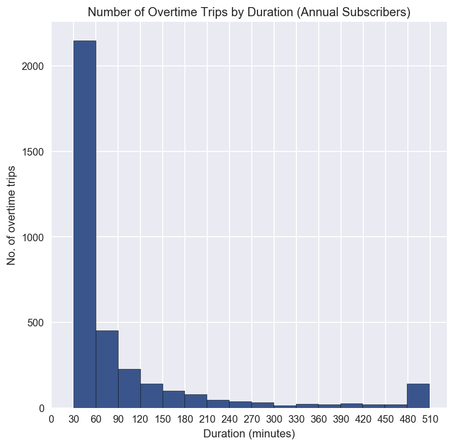</td>
    <td align="center">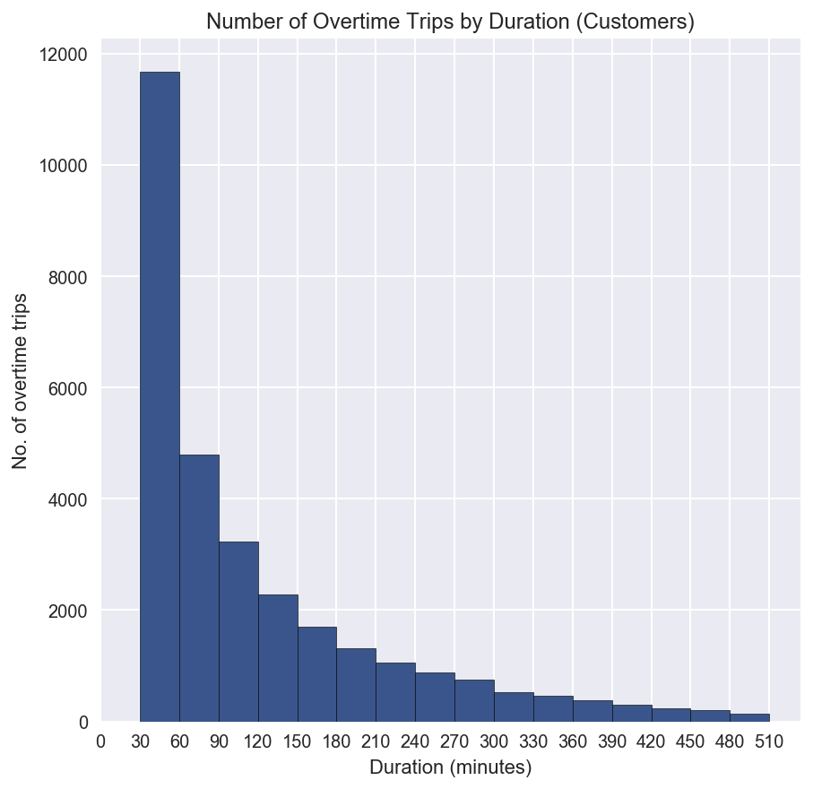</td>
  </tr>
</table>

#### Smaller cities less knowledgeable about the "no inter-city trip" rule
With respect to the second point, users in smaller places seem to more frequently rent the bike in one city and leave it in a different one, despite the rule that prohibits such behaviour. For example, about 7% of trips in Palo Alto, 3% in Redwood City, and 2.3% in Mountain View were inter-city trips. This might have been one of the reasons these cities were later dropped. By contrast, only about 6 every 10,000 in San Jose and ~3 every 100,000 in San Francisco were inter-city trips. Of course, these cities are much bigger, so the chance to leave the city is not so high.

<table>
  <tr>
    <td align="center" colspan="6"><b>Table 4: Inter-city trips by starting city</b></td>
  </tr>
  <tr>
  </tr>
  <tr>
      <td align="right"></td>
      <td align="right"><b>Mountain View</b></td>
      <td align="right"><b>Palo Alto</b></td>
      <td align="right"><b>Redwood City</b></td>
      <td align="right"><b>San Francisco</b></td>
      <td align="right"><b>San Jose</b></td>
  </tr>
  <tr>
  </tr>
  <tr>
      <td>Number of inter-city trips</td>
      <td align="right">421</td>
      <td align="right">480</td>
      <td align="right">104</td>
      <td align="right">15</td>
      <td align="right">22</td>
  </tr>
  <tr>
  </tr>
  <tr>
      <td>Number of in-city trips</td>
      <td align="right">18,167</td>
      <td align="right">6,773</td>
      <td align="right">3,433</td>
      <td align="right">603,708</td>
      <td align="right">37,878</td>
  </tr>
  <tr>
  </tr>
  <tr>
      <td>Percentage of inter-city trips</td>
      <td align="right">2.32</td>
      <td align="right">7.09</td>
      <td align="right">3.03</td>
      <td align="right">0.0025</td>
      <td align="right">0.06</td>
  </tr>
  <tr>
  </tr>
</table>

## Conclusion
The number of annual subscribers of Ford GoBike's service steadily grew in the past two years. Subscribers are generally workers who rent a bike Monday to Friday, at 8-9am (to go to work), 5-6pm (to go back home), and, occasionally, at noon (to have lunch). The number of customers, instead, has shrunk. Customers are usually tourists who use the service on weekends, and some of them might have become subscribers. Most subscribers use the service correctly, and do not incur in overtime fees. However, only 70% of customers do so: Ford GoBike should make a greater effort to communicate more efficiently with these users. The main targets of expansion are San Francisco, which makes about ~90% of total traffic, and San Jose, which has modest traffic (~5.5%) but a large population.

[Table of Contents](https://github.com/federicomariamassari/udacity-dand/blob/master/README.md) | Next: [P1 Compute Statistics from Card Draws](https://nbviewer.jupyter.org/github/federicomariamassari/udacity-dand/blob/master/projects/p1/dand-p1-compute-statistics-from-card-draws.ipynb)
