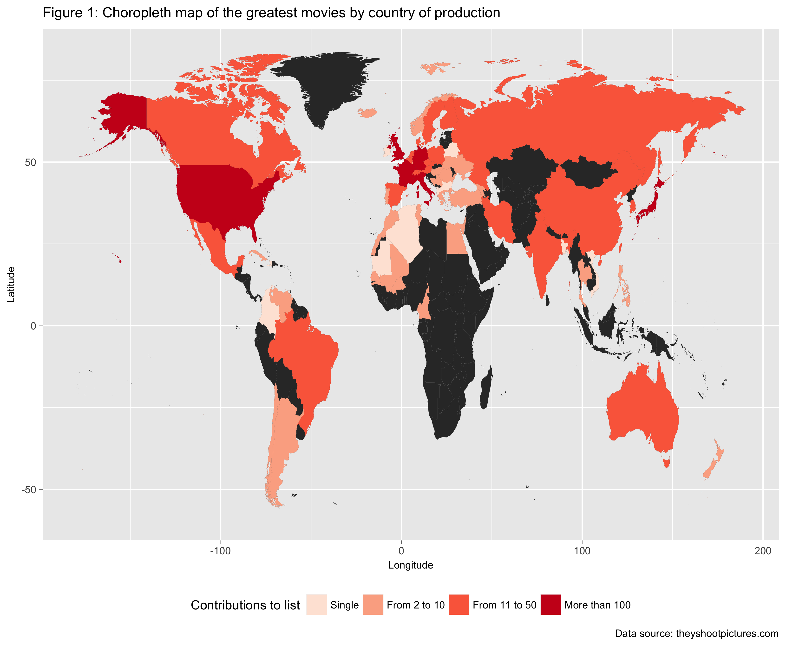
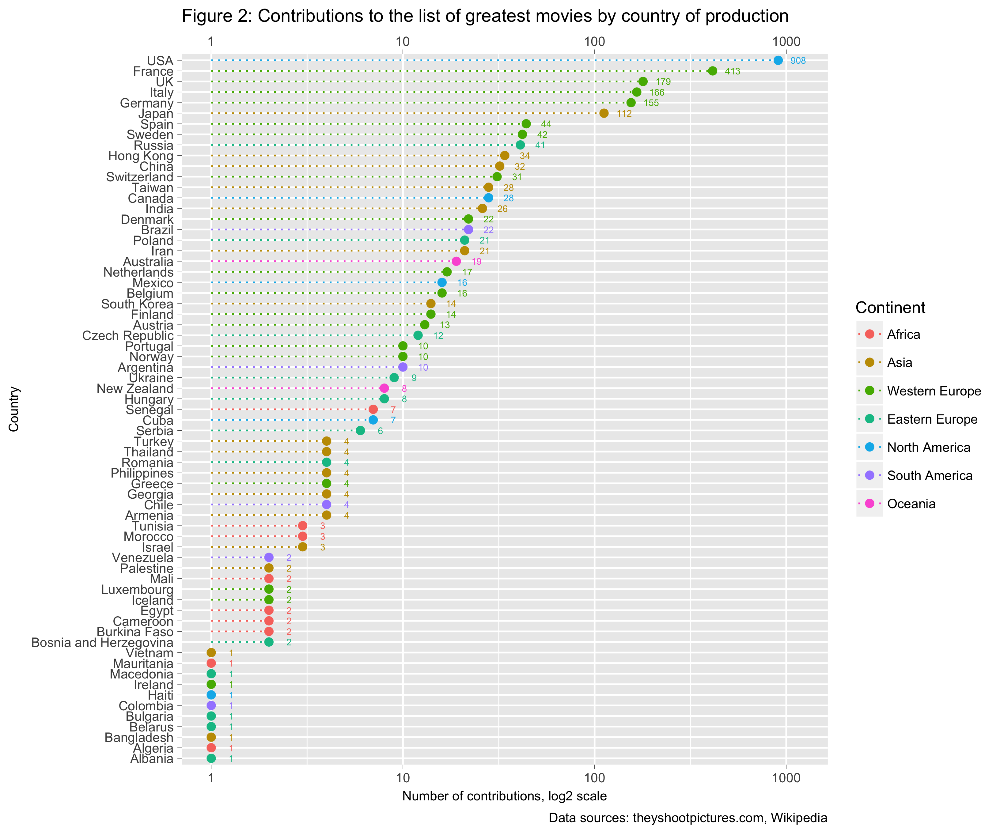
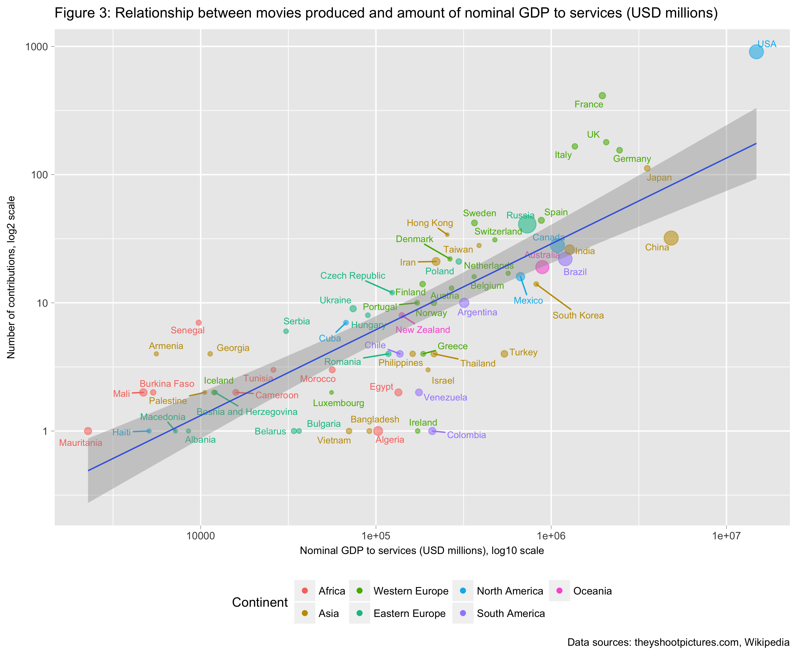
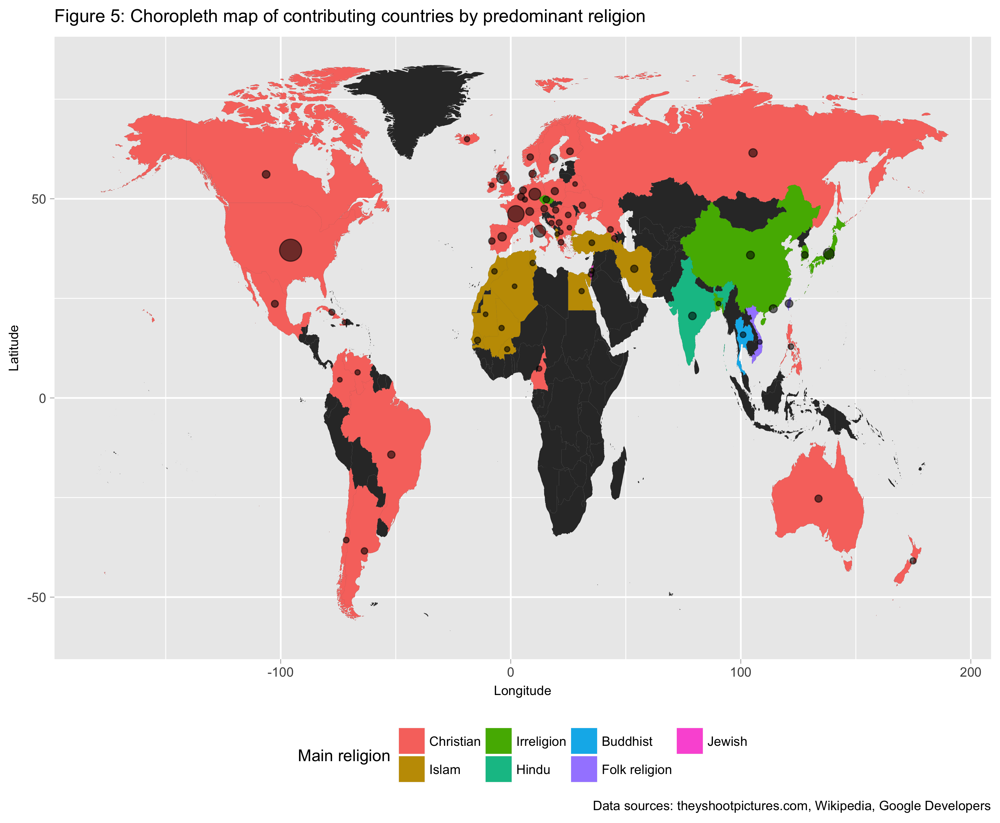
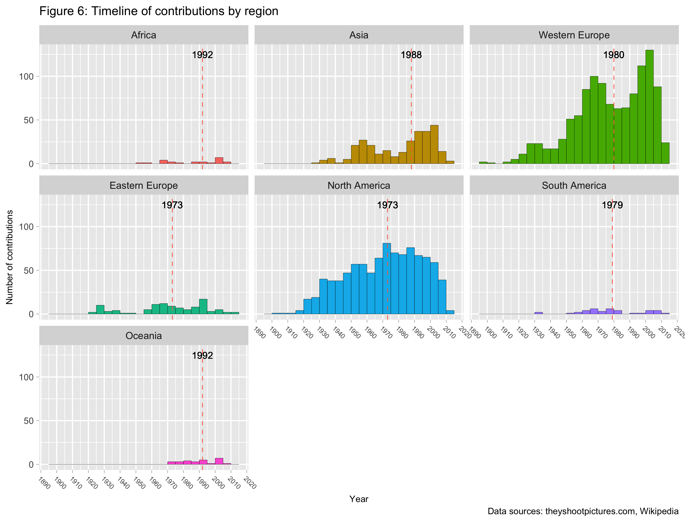
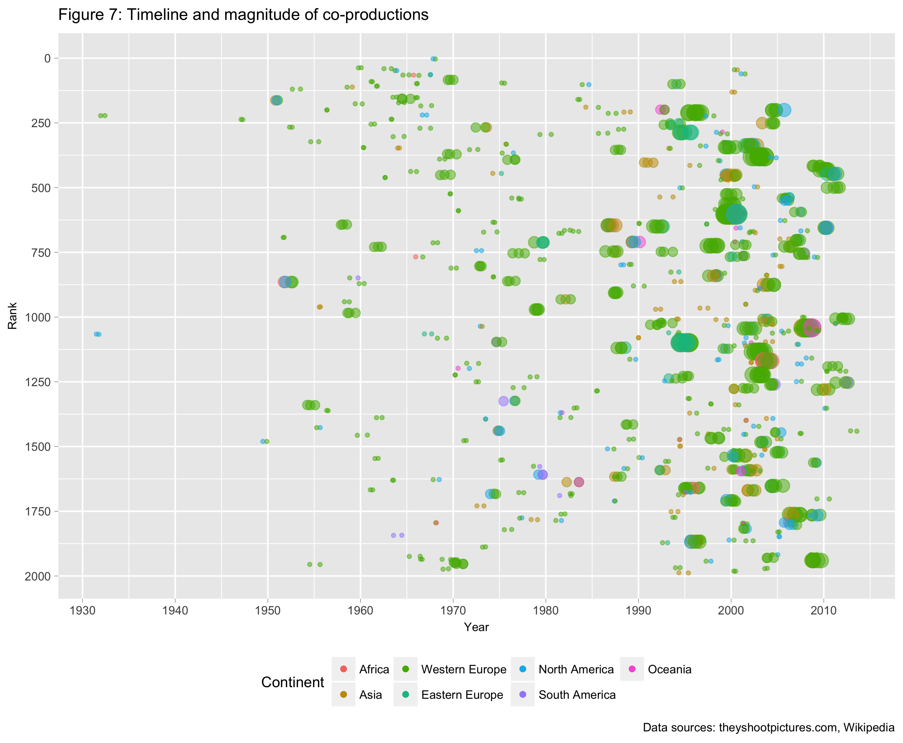
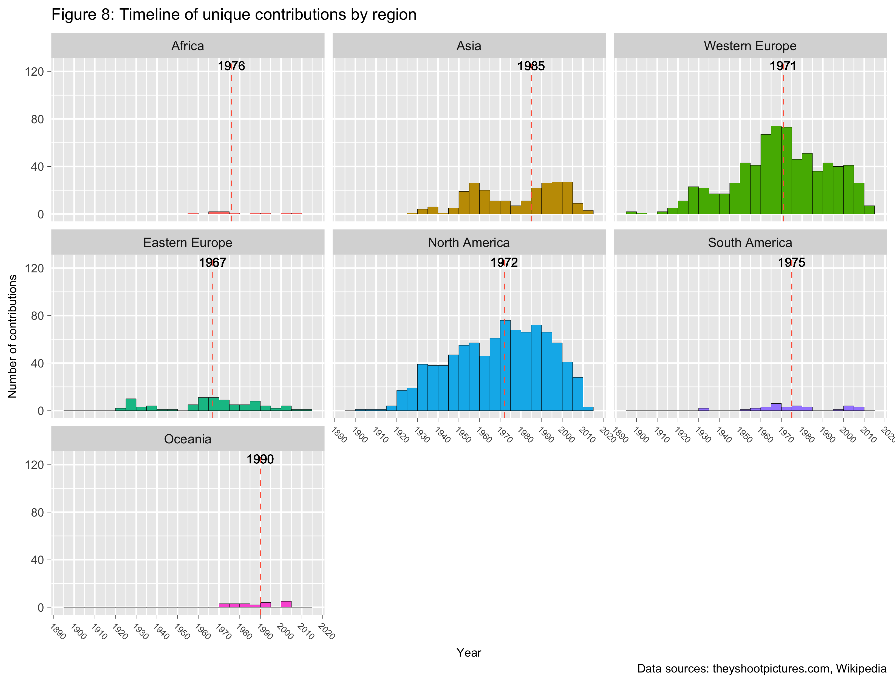
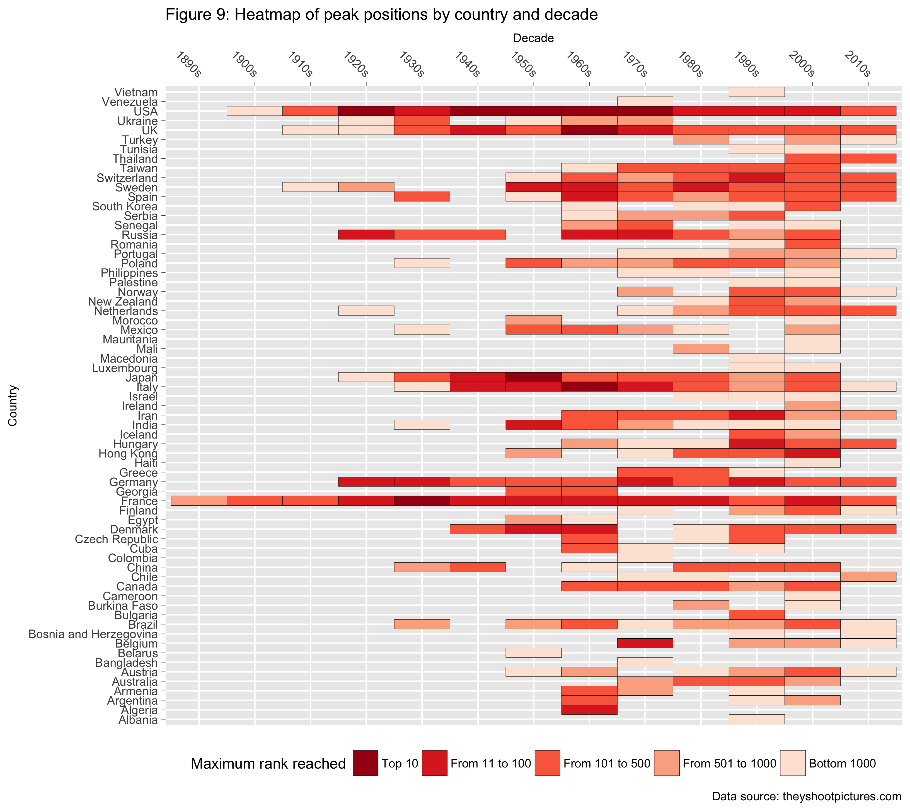
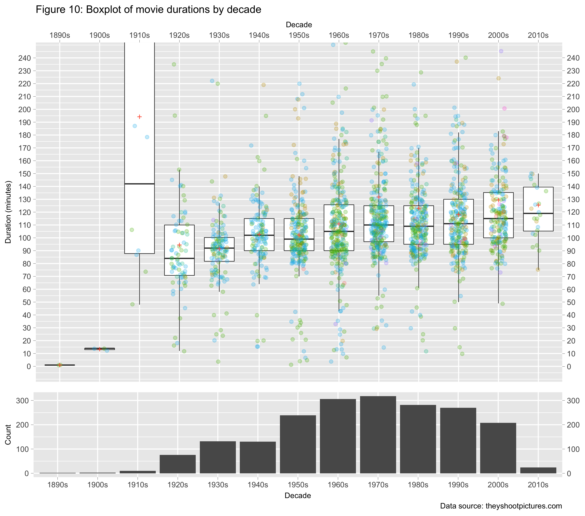

Data Analyst Nanodegree: P4 Explore and Summarise Data
================
**Federico Maria Massari**

**Introduction**
----------------

*[They Shoot Pictures, Don't They?](http://www.theyshootpictures.com)*, by Bill Georgaris and Vicki Platt, is among the definitive guides for cinema aficionados. The website features some of the most referenced film lists on the Internet, notably "The 1,000 Greatest Films", which showcases the most groundbreaking and highly artistic movies ever made (and which was recently expanded to include 2,000 films in total), "The 21st Century's Most Acclaimed Films", which presents the best works of the past two decades, and "Top 250 Directors", which ranks filmmakers by historical importance.

Each list is a synthesis of thousands of individual polls and ballots, so it is not only pleasant to read, but also "statistically sound". As a consequence, the website represents an invaluable resource for both professionals and beginners alike.

Eytan Bakshy, a scientist at Facebook, suggests that future data scientists find data they are interested in, and play with them, to develop expertise. I have been a fan of *TSPDT* for years, so this is my chance to visually explore some of its rich datasets. Among the others, I will investigate:

-   Reason 1

-   Reason 2

-   Reason 3

To answer questions as they come to mind, in a stream-of-consciousness narrative style, the main datasets are enriched with content from Wikipedia and Google.

------------------------------------------------------------------------

**Data acquisition**
--------------------

### **Datasets**

*They Shoot Pictures* provides a wealth of datasets related to both movies and filmmakers. For this project, I focused on the following:

-   [The 1,000 Greatest Films](http://www.theyshootpictures.com/gf1000.htm) and [Films Ranked 1,001-2,000](http://www.theyshootpictures.com/gf1000_films1001-2000.htm) (henceforth, "main"): among the most important lists on the website, these contain information on current ranking, titles, directors, years and countries of production, genres, and whether a particular film was shot in colour or black-and-white. The lists are available as Excel files, so they are easy to acquire.

-   [Top 250 Directors](http://www.theyshootpictures.com/gf1000_top250directors.htm): this provides information about the most critically acclaimed filmmakers, including current ranking, number of movies appearing in "The 1,000 Greatest Films", and number of movies featured in other lists (i.e., "cited"). Particularly important is the directors' rankings, since I am going to manually determine, for each director, the number of films among the top 2,000. I could not find the list in an easily downloadable format, so I had to scrape the data from the webpage (on ethical scraping, see the next paragraph), and store them in a csv file;

-   Auxiliary data come from Wikipedia (breakdown of countries by continent, area, code, nominal gdp, gdp by sector, and religion) and Google Developers (country coordinates).

### **Data acquisition process**

The data are acquired using Python libraries [Requests](http://docs.python-requests.org/en/master/) and [Beautiful Soup](https://www.crummy.com/software/BeautifulSoup/bs4/doc/). To respect intellectual property, the content is not stored in this repository, but rather automatically placed inside a new folder `data` at module runtime. Web scraping was done ethically, obeying to either the `robots.txt` file or the *robots meta tag*, whichever was available. For example, the following snippet from the "Top 250 Directors" page should indicate that data acquisition is allowed:

``` html
<html lang="en">
  <head>
    <meta name="robots" content="index, follow">
```

Care was also taken to ensure that at least five seconds pass before an additional page is requested (the default time is ten seconds). This added constraint makes the data retrieval process time consuming (it clocks in at about one minute), but avoids causing server saturation, and is only done once.

See the [related folder](https://github.com/federicomariamassari/udacity-dand/tree/master/projects/p4/python-modules) for information on the Python modules.

### **Data loading**

#### **Use Python to acquire external datasets**

``` r
# Run the following commands with "p4" as current working directory
modules <- c("get_xls.py", 
             "scrape_rankings.py", 
             "scrape_wikipedia.py", 
             "scrape_auxiliary.py")

#sapply(X = modules, FUN = function(module)
#         system(paste("python3 ./python-modules/", module, sep = "")))
```

#### **Import the datasets into RStudio**

``` r
# Load frequently used libraries
libraries <- c("dplyr", "ggplot2", "stringr", "magrittr", "viridis")

sapply(X = libraries, FUN = require, character.only = TRUE)
```

``` r
# Store filenames in a list by extension
filenames <- list("xls" = c("1000GreatestFilms",
                            "Films-Ranked-1001-2000"),
                  
                  "csv" = c("continents", 
                            "coordinates", 
                            "country_area", 
                            "country_codes", 
                            "gdp_by_sector", 
                            "nominal_gdp", 
                            "religions"))

# Import "Greatest Films" datasets as list of data frames
greatest <- sapply(X = filenames$xls, FUN = function(filename) 
  readxl::read_excel(paste("./data/xls/", filename, ".xls", sep = "")))

# Rename list items
names(greatest) <- c("Top.1000", "Bottom.1000")

# Bind list to data frame removing unshared columns
greatest <- rbind(greatest$Top.1000[, -c(2:3)], greatest$Bottom.1000) %>%
  arrange(Pos)

# Import "Top 250 Directors" dataset
directors <- read.csv("./data/csv/top_250_directors.csv")

# Import auxiliary datasets
auxiliary <- sapply(X = filenames$csv, FUN = function(filename)
  assign(filename, read.csv(paste("./data/csv/", filename, ".csv", sep = ""), 
                            stringsAsFactors = FALSE)))

# Import world map from ggplot2
world <- filter(map_data("world"), region != "Antarctica")
```

**Data cleaning**
-----------------

### **Add factor levels**

The world map dataset from the `maps` package only distinguishes between China and Hong Kong at the sub-regional level. This is an understandable choice, since Hong Kong is not an independent country but a special administrative region of China. However, given the prominence of Hong Kong's film industry, I consider the city as separate from the Mainland:

``` r
world %<>%
  mutate(region = case_when(subregion == "Hong Kong" ~ "Hong Kong",
                            # Include catch-all statement
                            TRUE ~ region))
```

### **Rename data frame columns**

``` r
greatest <- rename(greatest, Countries = Country)
directors <- rename(directors, Dir.Rank = Rank)
world <- rename(world, Country = region)
```

### **Impute missing values**

In the main dataset, entries missing or otherwise difficult to process are of two kinds: unknown length, genre, or colour type; and production year as a year range.

#### **Unknown length, genre, or colour type**

-   *Eniaios* (\#1544), by Gregory Markopoulos, is the only film with unknown length. The full movie lasts ~80 hours, but it has never been screened in its entirety. A new cycle, of the twenty-two in total, has been released to the public every four years since 2004, also thanks to a successful [Kickstarter campaign](https://www.kickstarter.com/projects/1525866264/towards-eniaios-and-the-temenos) initiated in 2012. How long the movie was when it entered the various polls it is not known, so I leave the value blank and will omit the entry when analysing the length dimension;

-   *Reisender Krieger \[TV\]* (\#1947), by Christian Schocher, has unknown genre; *Line Describing a Cone* (\#1422), by Anthony McCall, has unknown colour specification. The former is a *road movie* which focuses on the protagonists' journey, both physical and spiritual, so I list it as such. The latter is an *experimental film* that invites the viewer to interact with light: as such, I give it the features of both a black-and-white and a colour movie, and list it as "Col-BW".

``` r
greatest %<>%
  mutate(Genre = replace(Genre, Genre == "---", "Road Movie"),
         Colour = replace(Colour, Colour == "---", "Col-BW"))
```

#### **Production year as a year range**

-   *Scenes from Under Childhood* (\#1490), by Stan Brakhage, *Little Stabs at Happiness* (\#1599), by Ken Jacobs, and *The Wire \[TV\]* (\#1934), by various directors, list production year as a range of years. I replace the latter with an average, rounding down unless the average is an integer.

``` r
replace.with.mean <- function(df, column, delimiter = "-") {
  # Replace year range with the rounded mean of single years.
  #
  # Arguments:
  #   df -- data frame. The data frame with entries to replace.
  #   column -- character. The column name, as text.
  #
  # Keyword arguments:
  #   delimiter -- character. The character separating the two years 
  #     (default: "-").
  #
  # Returns:
  #   df -- data frame. The supplied data frame, with year ranges "YYYY-YYYY"
  #     replaced by the average of the single years.
  
  # Extract the indices of cells containing a year range
  idx <- which(grepl(x = df[[column]], pattern = delimiter, fixed = TRUE))
  
  average.range <- function(string, pattern = delimiter) {
    # Compute and round the average of a year range "YYYY-YYYY".
    
    string <- str_split_fixed(string, pattern, Inf)
    string <- round(mean(as.numeric(string)), 0)
    
    return(string)
  }
  
  # Replace year ranges with rounded average values
  to_replace <- df[[column]][idx]
  replacement <- sapply(X = idx, FUN = function(i) average.range(to_replace))
  
  df[[column]][idx] <- replacement
  
  return(df)
}
```

``` r
# Replace year ranges and convert to numeric
greatest %<>% 
  replace.with.mean(., "Year") %>%
  mutate(Year = as.numeric(Year))
```

### **Correct typos and replace delimiters**

``` r
greatest %<>%
  # Fix typos from the Excel files
  mutate(Countries = gsub("Herzergovina", "Herzegovina", Countries),
         Countries = gsub("--", "-", Countries)) %>%
  # Replace delimiters with clearer ones
  mutate(Countries = gsub("-", ", ", Countries),
         Director = gsub("/", "; ", Director)) %>%
  # Avoid splitting "Avant-Garde"
  mutate(Genre = gsub("Avant-Garde", "Avant Garde", Genre),
         Genre = gsub("-", ", ", Genre))
```

### **Add new variables**

Five variables are added to the data frame: "Co-Production" and "Co-Director" (Boolean) signal whether a certain movie was co-produced by different countries or shot by various directors; "Decade" and "Rank Category" provide a higher level of aggregation with respect to "Year" and "Position"; "Co-Producers" counts the number of co-producers for each movie.

``` r
decades <- c("1890s", "1900s", "1910s", "1920s", "1930s", "1940s", "1950s", 
             "1960s", "1970s", "1980s", "1990s", "2000s", "2010s")

ranking <- c("Top 10", "From 11 to 100", "From 101 to 500", "From 501 to 1000",
             "Bottom 1000")

year_breaks <- seq(1890, 2020, 10)
rank_breaks <- c(0, 10, 100, 500, 1000, 2000)

greatest %<>%
  # Add boolean variables
  mutate(Co.Production = grepl(pattern = ",", x = Countries),
         Co.Director = grepl(pattern = ";", x = Director)) %>%
  # Add categorical variables
  mutate(Decade = cut(Year, breaks = year_breaks, dig.lab = 5, 
                      right = FALSE, labels = decades),
         Rank.Category = cut(Pos, breaks = rank_breaks, labels = ranking)) %>%
  # Count co-producers, account for self
  mutate(Co.Producers = 1 + str_count(Countries, pattern = ","))
```

**Data tidying**
----------------

Hadley Wickham (Wickham, 2014) defines as "tidy" any dataset with the following three characteristics: every row is an observation, every column a variable, and every table a type of observational unit. The main dataset falls short of the second requirement, since "Countries" and "Genre" both contain multiple variables. For example:

<table>
<thead>
<tr>
<th style="text-align:right;">
Pos
</th>
<th style="text-align:left;">
Title
</th>
<th style="text-align:left;">
Director
</th>
<th style="text-align:right;">
Year
</th>
<th style="text-align:left;">
Countries
</th>
<th style="text-align:right;">
Length
</th>
<th style="text-align:left;">
Genre
</th>
<th style="text-align:left;">
Colour
</th>
<th style="text-align:left;">
Co.Production
</th>
<th style="text-align:left;">
Co.Director
</th>
<th style="text-align:left;">
Decade
</th>
<th style="text-align:left;">
Rank.Category
</th>
<th style="text-align:right;">
Co.Producers
</th>
</tr>
</thead>
<tbody>
<tr>
<td style="text-align:right;">
45
</td>
<td style="text-align:left;">
In the Mood for Love
</td>
<td style="text-align:left;">
Wong Kar-wai
</td>
<td style="text-align:right;">
2000
</td>
<td style="text-align:left;">
Hong Kong, France
</td>
<td style="text-align:right;">
97
</td>
<td style="text-align:left;">
Romance, Drama
</td>
<td style="text-align:left;">
Col
</td>
<td style="text-align:left;">
TRUE
</td>
<td style="text-align:left;">
FALSE
</td>
<td style="text-align:left;">
2000s
</td>
<td style="text-align:left;">
From 11 to 100
</td>
<td style="text-align:right;">
2
</td>
</tr>
</tbody>
</table>
A tidy dataset requires three steps:

-   splitting the content of the target columns by delimiter to obtain "colvars" (i.e., individual variables stored in multiple columns);

-   "melting" the colvars (i.e., turning them into rows of a single column) using a primary key to uniquely relate the output to the corresponding observations;

-   "left joining" (i.e., merging two datasets, conforming the size of the second one to that of the first one) the molten data on content from the original dataset.

In my view, "Countries" is richer with information than "Genre", and revealing the contribution of individual nations to the list of greatest movies is an important goal of the project. Tidying the dataset with respect to the former variable will grow the number of observations to 2,591. This is the total used for the exploratory analysis.

``` r
# Tidy the main dataset with respect to "Countries"
greatest %<>%
  mutate(Country = str_split(Countries, pattern = ", ", n = Inf)) %>%
  tidyr::unnest(Country)
```

### **Update country levels**

Because the main dataset spans over a century of world cinema, some of its entries refer to countries that no longer exists (i.e., Czechoslovakia, USSR, West Germany, and Yugoslavia). In mapping these countries to modern nations, I credited to Czech Republic movies produced in Czechoslovakia, to Serbia those shot in Yugoslavia, and to Armenia, Belarus, Georgia, Russia, and Ukraine, based on filmmakers' nationality, those produced in the USSR.

``` r
country_names <- c("Czechia" = "Czech Republic",
                   "Czechoslovakia" = "Czech Republic",
                   "West Germany" = "Germany",
                   "Republic of Ireland" = "Ireland",
                   "Republic of Macedonia" = "Macedonia",
                   "Kingdom of the Netherlands" = "Netherlands",
                   "Arab Palestinian areas" = "Palestine",
                   "Palestinian Territories" = "Palestine",
                   "State of Palestine" = "Palestine",
                   "West Bank and Gaza" = "Palestine", 
                   "USSR" = "Russia",
                   "Yugoslavia" = "Serbia",
                   "Korea, South" = "South Korea",
                   "United Kingdom" = "UK",
                   "United States" = "USA")

greatest %<>%
  mutate(Country = str_replace_all(Country, country_names))
```

``` r
ex_USSR <- list("Armenia" = c("Parajanov, Sergei", 
                              "Peleshian, Artavazd"),
                "Belarus" = c("Kheifits, Iosif"),
                "Georgia" = c("Kalatozov, Mikhail", 
                              "Khutsiev, Marlen"),
                "Ukraine" = c("Bondarchuk, Sergei", 
                              "Chukhraj, Grigori", 
                              "Donskoi, Mark", 
                              "Dovzhenko, Alexander", 
                              "Kozintsev, Grigori", 
                              "Muratova, Kira", 
                              "Shepitko, Larisa"))

greatest %<>%
  mutate(Country = case_when(Director %in% ex_USSR$Armenia ~ "Armenia",
                             Director %in% ex_USSR$Belarus ~ "Belarus",
                             Director %in% ex_USSR$Georgia ~ "Georgia",
                             Director %in% ex_USSR$Ukraine ~ "Ukraine",
                             # Include catch-all statement
                             TRUE ~ Country))
```

``` r
update.countries <- function(df, column, replacement = country_names) {
  # Update country names based on supplied mappings.
  #
  # Arguments:
  #   df -- data frame. The data frame with entries to replace.
  #   column -- character. The column name, as text.
  #
  # Keyword arguments:
  #   replacement -- character. Vector of mappings (default: country_names).
  #
  # Returns:
  #   df -- data frame. The updated data frame.
  
  df[[column]] <- str_replace_all(df[[column]], replacement)
  
  return(df)
}

# Uniform country names in all auxiliary datasets
auxiliary <- sapply(X = names(auxiliary), FUN = function(x) 
  update.countries(df = auxiliary[[x]], column = "Country"))
```

``` r
# Merge auxiliary datasets (outer join)
merged <- plyr::join_all(auxiliary, by = "Country", type = "full")

# Left join auxiliary dataset to main one
greatest %<>%
  left_join(x = ., y = merged, by = "Country") %>%
  # Drop unnecessary columns
  select(.data = ., -c(Christian:Jewish))
```

### **Additional data processing**

I also include each country's amount of nominal GDP to services, distinguish between Western (historically wealthier) and Eastern Europe, and sort religions according to their [prevalence worldwide](https://en.wikipedia.org/wiki/Religions_by_country#World).

``` r
greatest %<>%
  mutate(GDP.to.Services = Nominal.GDP * Services/100)
```

``` r
europe <- list("Western" = c("Austria", "Belgium", "Denmark",
                             "Finland", "France", "Germany", 
                             "Greece", "Iceland", "Ireland", 
                             "Italy", "Luxembourg", "Netherlands",
                             "Norway", "Portugal", "Spain",
                             "Sweden", "Switzerland", "UK"),
               
               "Eastern" = c("Albania", "Belarus", 
                             "Bosnia and Herzegovina", "Bulgaria",
                             "Czech Republic", "Hungary",
                             "Macedonia", "Poland", "Romania",
                             "Russia", "Serbia", "Ukraine"))

greatest %<>%
  mutate(Continent = case_when(Country %in% europe$Western ~ "Western Europe",
                               Country %in% europe$Eastern ~ "Eastern Europe",
                               # Include catch-all statement
                               TRUE ~ Continent))
```

``` r
continent_levels <- c("Africa", "Asia", "Western Europe", "Eastern Europe",
                      "North America", "South America", "Oceania")

religion_levels <- c("Christian", "Islam", "Irreligion", "Hindu", "Buddhist",
                     "Folk religion", "Jewish")

greatest %<>%
  # Convert character columns to factor
  mutate_if(.predicate = is.character, .funs = as.factor) %>%
  # Drop unused levels
  droplevels(.$Continent, exclude = "Europe") %>%
  # Reorder factor levels
  mutate(., Continent = factor(.$Continent, levels = continent_levels)) %>%
  mutate(., Main.Religion = factor(.$Main.Religion, levels = religion_levels))
```

### **Tidied data frame**

The result of tidying with respect to "Countries" and updating the factor levels is the following:

<table>
<thead>
<tr>
<th style="text-align:right;">
Pos
</th>
<th style="text-align:left;">
Title
</th>
<th style="text-align:left;">
Director
</th>
<th style="text-align:right;">
Year
</th>
<th style="text-align:left;">
Countries
</th>
<th style="text-align:right;">
Length
</th>
<th style="text-align:left;">
Genre
</th>
<th style="text-align:left;">
Colour
</th>
<th style="text-align:left;">
Co.Production
</th>
<th style="text-align:left;">
Co.Director
</th>
<th style="text-align:left;">
Decade
</th>
<th style="text-align:left;">
Rank.Category
</th>
<th style="text-align:right;">
Co.Producers
</th>
<th style="text-align:left;">
Country
</th>
<th style="text-align:left;">
Continent
</th>
<th style="text-align:right;">
Latitude
</th>
<th style="text-align:right;">
Longitude
</th>
<th style="text-align:right;">
Total.Area
</th>
<th style="text-align:right;">
Land
</th>
<th style="text-align:right;">
Water
</th>
<th style="text-align:left;">
Code
</th>
<th style="text-align:right;">
Agriculture
</th>
<th style="text-align:right;">
Industry
</th>
<th style="text-align:right;">
Services
</th>
<th style="text-align:right;">
Nominal.GDP
</th>
<th style="text-align:left;">
Main.Religion
</th>
<th style="text-align:right;">
GDP.to.Services
</th>
</tr>
</thead>
<tbody>
<tr>
<td style="text-align:right;">
45
</td>
<td style="text-align:left;">
In the Mood for Love
</td>
<td style="text-align:left;">
Wong Kar-wai
</td>
<td style="text-align:right;">
2000
</td>
<td style="text-align:left;">
Hong Kong, France
</td>
<td style="text-align:right;">
97
</td>
<td style="text-align:left;">
Romance, Drama
</td>
<td style="text-align:left;">
Col
</td>
<td style="text-align:left;">
TRUE
</td>
<td style="text-align:left;">
FALSE
</td>
<td style="text-align:left;">
2000s
</td>
<td style="text-align:left;">
From 11 to 100
</td>
<td style="text-align:right;">
2
</td>
<td style="text-align:left;">
Hong Kong
</td>
<td style="text-align:left;">
Asia
</td>
<td style="text-align:right;">
22.39643
</td>
<td style="text-align:right;">
114.109497
</td>
<td style="text-align:right;">
2755
</td>
<td style="text-align:right;">
1106
</td>
<td style="text-align:right;">
1649
</td>
<td style="text-align:left;">
HK
</td>
<td style="text-align:right;">
0.1
</td>
<td style="text-align:right;">
6.8
</td>
<td style="text-align:right;">
93.2
</td>
<td style="text-align:right;">
274027
</td>
<td style="text-align:left;">
Irreligion
</td>
<td style="text-align:right;">
255393.2
</td>
</tr>
<tr>
<td style="text-align:right;">
45
</td>
<td style="text-align:left;">
In the Mood for Love
</td>
<td style="text-align:left;">
Wong Kar-wai
</td>
<td style="text-align:right;">
2000
</td>
<td style="text-align:left;">
Hong Kong, France
</td>
<td style="text-align:right;">
97
</td>
<td style="text-align:left;">
Romance, Drama
</td>
<td style="text-align:left;">
Col
</td>
<td style="text-align:left;">
TRUE
</td>
<td style="text-align:left;">
FALSE
</td>
<td style="text-align:left;">
2000s
</td>
<td style="text-align:left;">
From 11 to 100
</td>
<td style="text-align:right;">
2
</td>
<td style="text-align:left;">
France
</td>
<td style="text-align:left;">
Western Europe
</td>
<td style="text-align:right;">
46.22764
</td>
<td style="text-align:right;">
2.213749
</td>
<td style="text-align:right;">
640679
</td>
<td style="text-align:right;">
640427
</td>
<td style="text-align:right;">
3374
</td>
<td style="text-align:left;">
FR
</td>
<td style="text-align:right;">
1.8
</td>
<td style="text-align:right;">
18.8
</td>
<td style="text-align:right;">
79.4
</td>
<td style="text-align:right;">
2465453
</td>
<td style="text-align:left;">
Christian
</td>
<td style="text-align:right;">
1957569.7
</td>
</tr>
</tbody>
</table>
Clean up global environment before proceeding with the analysis:

``` r
# Remove all but the necessary variables
required <- c(lsf.str(), "greatest", "directors", "world",
              "decades", "ranking", "rank_breaks", "year_breaks")
rm(list = setdiff(ls(), required))
```

------------------------------------------------------------------------

**Data exploration**
--------------------

### **A. Geography of the greatest films**

The first dimension I would like to explore is the geographical one:

-   *Where were the greatest movies produced?*
-   *Are contributions evenly distributed, or is any particular area of the world under- or overrepresented?*

### **I. Choropleth map of countries of production**

The best way to answer these questions is through a choropleth map, a thematic chart in which colour intensity for each country is positively associated to the number of contributions that country made to the list (with black areas reflecting absence of contributions).

``` r
# Select columns to keep excluding the one used to group_by
keep_cols <- c("Continent", "Longitude", "Latitude", "Land", 
               "GDP.to.Services", "Main.Religion")

# Summarise country contributions and add to world map
greatest.by_country <- greatest %>%
  group_by(.dots = c("Country", keep_cols)) %>%
  summarise(n = n()) %>%
  mutate(Bin = cut(x = n, breaks = c(-Inf, 1,  10, 50, 100, +Inf),
                   labels = c("Single", "From 2 to 10", "From 11 to 50", 
                              "From 51 to 100", "More than 100")))

world %<>%
  left_join(x = ., y = greatest.by_country, by = "Country")
```

``` r
# Define attributes shared by plots, to override if necessary
shared_themes <- theme(plot.title = element_text(size = 11),
                       plot.caption = element_text(size = 8),
                       axis.title = element_text(size = 8),
                       axis.text = element_text(size = 8),
                       axis.ticks = element_line(size = 0.1),
                       legend.title = element_text(size = 10),
                       legend.text = element_text(size = 8),
                       legend.position = "bottom")

# Generate world map and define common features
world_base <- ggplot() +
  geom_polygon(data = world, aes(x = long, y = lat, group = group)) +
  xlab("Longitude") +
  ylab("Latitude") +
  shared_themes

# Make choropleth map
world_base +
  geom_polygon(data = subset(world, !is.na(Bin)),
             aes(x = long, y = lat, group = group, fill = Bin)) +
  scale_fill_brewer(palette = "Reds") +
  labs(fill = "Contributions to list",
       caption = "Data source: theyshootpictures.com") +
  ggtitle(paste("Figure 1: Choropleth map of the greatest movies by country",
                "of production"))
```



#### **Observations**

The distribution of co-productions appears to be heavily skewed, with very few countries contributing most entries in the list. Each of these countries (France, Germany, Italy, Japan, the United Kingdom, and the United States) was involved in at least 100 productions. The USSR (not shown) was the only territory committing between 51 and 100 movies to the list, but total contributions are now split among former bloc members. Of the latter, Russia was the most prolific, with 11-50 films made. Africa is the least represented continent, in terms of both countries shown and number of co-productions: with the exception of Cameroon, no state in the Central, Eastern, or Southern region of Africa appears in the list. Other prominent black areas are in the Middle East (Syria, Iraq, the Arabian Peninsula), Central and East Asia (the *-stan* nations, Mongolia), South-East Asia, and Latin America.

### **II. Number of contributions by country**

How skewed is the distribution of co-productions? That is, how many films did each country contribute?

``` r
log10_ticks <- c(0, 1, 10, 100, 1000)

ggplot(data = greatest.by_country,
       aes(x = log2(n), y = reorder(Country, n), color = Continent)) +
  geom_point(size = 2) +
  geom_segment(aes(x = 0, xend = log2(n), y = Country, yend = Country),
               size = 0.5, linetype = 3) +
  geom_text(aes(label = n), size = 2, nudge_x = 0.35, check_overlap = TRUE) +
  scale_x_continuous(breaks = log2(log10_ticks), 
                     labels = log10_ticks,
                     sec.axis = dup_axis(name = NULL)) +
  ggtitle(paste("Figure 2: Contributions to the list of greatest movies by",
                "country of production")) +
  xlab("Number of contributions, log2 scale") +
  ylab("Country") +
  labs(fill = "Contributions to list",
       caption = "Data sources: theyshootpictures.com, Wikipedia") +
  shared_themes +
  # Override "shared_themes" legend position
  theme(legend.position = "right")
```



#### **Observations**

The distribution of co-productions is highly asymmetric, as expected. The United States and France are by far the largest contributors, with respectively a half and a fifth of the movies in the list. A few reasons could be the prominent role the United States played in post-war reconstruction, on the one hand, and the prestige of France as cinema's place of birth, on the other. On average, Western Europe has been the most prolific region, with a median of 16.5 movies co-produced per country (Table 1) and six spots among the top ten: after France, UK, Italy, and Germany contributed ~8% films each, Spain and Sweden ~2%. Africa, instead, has been the least fecund continent, with very small statistics and concentration in the bottom area of the plot.

``` r
pretty.print <- function(df, decimals = 4) {
  # Prettify dplyr's printed output.
  #
  # Arguments:
  #   df -- data frame. The summarised data frame to print.
  #
  # Keyword arguments:
  #   decimals -- numeric. Round output to selected decimal (default: 4).
  #
  # Returns:
  #   Prettified print of the supplied data frame.
  
  df %>% 
    mutate_if(.predicate = is.numeric, .funs = round, decimals) %>%
    as.data.frame()
}

stats.table <- function(df, group, column) {
  # Summarise data using measures of central tendency and dispersion.
  #
  # Arguments:
  #   df -- data frame.
  #   group -- variable. Column to group_by, as variable (no quotes).
  #   column -- variable. The data frame column to summarise.
  #
  # Returns:
  #   Printed summary of the supplied data frame.

  group <- enquo(group)
  column <- enquo(column)
  
  df %>%
    group_by(!!group) %>%
    summarise(mean = mean(!!column),
              median = median(!!column),
              sd = sd(!!column)) %>%
    # Round numeric values to the second decimal
    pretty.print(decimals = 2)
}
```

#### **Table 1: Summary of contributions by continent**

``` r
stats.table(greatest.by_country, Continent, n)
```

    ##        Continent   mean median     sd
    ## 1         Africa   2.56    2.0   1.81
    ## 2           Asia  18.38    4.0  27.71
    ## 3 Western Europe  63.39   16.5 105.20
    ## 4 Eastern Europe   8.92    5.0  11.74
    ## 5  North America 192.00   16.0 400.39
    ## 6  South America   7.80    4.0   8.67
    ## 7        Oceania  13.50   13.5   7.78

### **III. Contributions by amount of nominal GDP to services**

Why are the United States and Western Europe so prominent, and why is Africa largely absent from the list? The difference in output could be linked, among the others, to the amount of resources a country can afford to invest in cinema.

``` r
ggplot(data = greatest.by_country,
       aes(x = log10(GDP.to.Services), y = log2(n), color = Continent)) +
  # Use "Land" instead of "Total Area" to determine country size
  geom_point(aes(size = Land, alpha = 0.2)) +
  ggrepel::geom_text_repel(aes(label = Country), size = 2.5,
                           show.legend = FALSE) +
  geom_smooth(method = "lm", se = TRUE, size = 0.5, color = "royalblue") +
  scale_x_continuous(breaks = seq(0, 8, 1), labels = 10 ** seq(0, 8, 1)) +
  scale_y_continuous(breaks = log2(log10_ticks), labels = log10_ticks) +
  ggtitle(paste("Figure 3: Relationship between movies produced and amount of",
                "nominal GDP to services (USD millions)")) +
  xlab("Nominal GDP to services (USD millions), log10 scale") +
  ylab("Number of contributions, log2 scale") +
  labs(caption = "Data sources: theyshootpictures.com, Wikipedia") +
  shared_themes +
  scale_size(guide = "none") +
  scale_alpha(guide = "none")
```



#### **Observations**

Figure 3 is a scatter plot of co-productions versus amount of nominal GDP to services, a possible proxy for the ability of a country to invest in cinema. The size of each dot is proportional to the land size of the corresponding state (i.e., the bigger the nation, the larger the point diameter). The plot gives, at best, an approximate picture for two reasons. First, the data on GDP breakdown were recorded in different years, ranging from 2007 (Luxembourg) to 2016 (e.g., Australia). Second, GDP composition may have changed dramatically over a century: for example, Western Europe spent more on agriculture and industry in the years immediately following World War II, and more on services since the Sixties. Also, two assumptions were made: that countries tend to invest more resources in the tertiary sector as they develop, and that the share of GDP to cinema is a constant proportion of that to services.

One can divide the plot into three sections: the shaded region matching the 95% confidence bands of the regression line, an area where actual and predicted values for the points generally agree; the region above the upper band, where virtuous countries (contributing more films to the list than their GDP to services would suggest) lie; and that below the lower band, where inefficient countries (participating in a smaller number of co-productions than their investment in services would imply) are located.

*Kendall's tau*, a measure of association robust to transformations, suggests a positive and strong relationship between the amount of GDP to services and the number of co-productions (~65%, Table 2). This looks intuitive: as a country develops and its wealth increases, that country should invest more on cinema, on average. Excellent examples are the United States, Japan, and the top contributors in Western Europe (with France, placing farthest from the upper confidence band, being the best performer).

#### **Table 2: Kendall's Tau, GDP to services and number of contributions**

``` r
greatest.by_country %>%
  plyr::summarise(., Tau = cor(GDP.to.Services, n, method = "kendall")) %>%
  pretty.print()
```

    ##      Tau
    ## 1 0.6451

Deviations from this pattern exist, however. Most prominent is the case of Africa: the poorer countries in the region appear to be the more virtuous ones (above all Senegal, with ~$10,000 million GDP to services and 7 contributed films), while the wealthier nations (e.g., Algeria, Egypt) seem to be the more inefficient ones. A breakdown of Kendall's tau by region gives similar insight: although still positive, the figure for Africa is the weakest one (~13%, Table 3). South America has generally contributed fewer movies to the list than the average GDP to services would suggest; in this region, Colombia is the least virtuous, with a single co-production in spite of ~$200 billion to the tertiary sector.

#### **Table 3: Kendall's Tau, breakdown by region**

``` r
greatest.by_country %>%
  group_by(Continent) %>%
  summarise(., Tau = cor(GDP.to.Services, n, method = "kendall")) %>%
  pretty.print()
```

    ##        Continent    Tau
    ## 1         Africa 0.1260
    ## 2           Asia 0.5858
    ## 3 Western Europe 0.7698
    ## 4 Eastern Europe 0.6992
    ## 5  North America 1.0000
    ## 6  South America 0.4000
    ## 7        Oceania 1.0000

### **IV. Contributions by country predominant religion**

Is there any link between a country's predominant religion and the number of movies that country co-produced? Several black regions in the map are Islamic nations which, apart from Iran, have historically contributed less to the list than states with a different prevalent religion.

``` r
ggplot(data = greatest.by_country, 
       aes(x = Main.Religion, y = n / sum(n), fill = Main.Religion)) +
  geom_bar(stat = "identity") +
  # Add percentages on top of the bars
  geom_text(aes(label = paste(round(..y.. * 100, 2), "%")), 
            fun.y = "sum", stat = "summary", size = 3, vjust = -0.5) +
  scale_y_continuous(breaks = seq(0, 1, 0.1)) +
  ggtitle(paste("Figure 4: Breakdown of co-productions by countries'",
                "predominant religion")) +
  xlab("Religion") +
  ylab("Relative frequency") +
  labs(fill = "Religion",
       caption = "Data sources: theyshootpictures.com, Wikipedia") +
  shared_themes +
  theme(legend.position = "none")
```


``` r
world_base +
  geom_polygon(data = subset(world, !is.na(Main.Religion)),
               aes(x = long, y = lat, group = group, fill = Main.Religion)) +
  geom_point(data = greatest.by_country, 
             aes(x = Longitude, y = Latitude, size = n, alpha = 0.2),
             show.legend = FALSE) +
  labs(size = "Contributions", fill = "Main religion", 
       caption = paste("Data sources: theyshootpictures.com", "Wikipedia", 
                       "Google Developers", sep = ", ")) +
  ggtitle(paste("Figure 5: Choropleth map of contributing countries",
                "by predominant religion"))
```



#### **Observations**

Almost 90% of individual contributions belong to nations whose prevailing faith (which may or may not be the official one) is Christian. These include the United States and Western Europe, which alone make up for ~80% of total co-productions. This trait is evidenced by the size and concentration of black bubbles in the regions. The second most common faith in the list is Irreligion, with ~8% of contributions (mainly due to Japan, Hong Kong, and China), while Islam places third, with only ~2% (mostly due to Iran).

### **B. Timeline of contributions**

The second dimension I would like to explore is time:

-   *What are the shapes of the conditional (i.e., by region) distributions of co-productions through time?*
-   *Which are the golden and silver periods of cinema for a few selected countries in the list?*

### **V. Timeline of contributions by region**

``` r
greatest %<>%
  subset(., !is.na(Year)) %>%
  group_by(Continent) %>%
  # Add conditional medians column
  mutate(Median.Year = ceiling(median(Year))) %>%
  # Ungroup for future manipulations
  ungroup()

conditional.histograms <- function(df) {
  # Generate conditional histograms of co-productions by region.
  #
  # Arguments:
  #   df -- data frame.
  #
  # Returns:
  #   Printed plot of conditional histograms with superimposed medians.
  
  ggplot(data = df, aes(x = Year, fill = Continent)) +
    geom_histogram(binwidth = 5, boundary = 0, colour = "black", 
                   size = 0.1, show.legend = FALSE) +
    scale_x_continuous(breaks = year_breaks) +
    # Add conditional medians as vertical line to subplots
    geom_vline(aes(xintercept = Median.Year, group = Continent),
               linetype = "dashed", size = 0.3, color = "tomato") +
    # Superimpose conditional median labels on the vertical lines
    geom_text(aes(x = Median.Year, y = 125, group = Continent,
                  label = Median.Year), size = 3) +
    facet_wrap(~Continent) +
    ylab("Number of contributions") +
    labs(caption = "Data sources: theyshootpictures.com, Wikipedia") +
    shared_themes +
    # Override x tick labels font size and orientation
    theme(axis.text.x = element_text(size = 6, angle = -45, 
                                     hjust = 0, vjust = 1))
}

greatest %>%
  conditional.histograms() +
  ggtitle("Figure 6: Timeline of contributions by region")
```



#### **Observations**

Figure 6 breaks down the timeline of co-productions by region. Each subplot includes a conditional median as a dashed red line with superimposed value. Axes scales are kept constant across subplots, to have uniform timelines (x-axis) and to account for magnitude (y-axis). Histogram binwidth is equal to 5 years. Same region co-productions are included: if more countries in the same region contributed to the same movie, all their efforts are added to the distribution.

The conditional distributions are negatively skewed, with thicker tails compared to the Gaussian density (Table 4). They have a long left tail and the body shifted to the right, telling that fewer contributions were made in the early years of world cinema and more since the 70s, a feature apparent in the conditional median values. Most histograms are also bimodal, with at least one decade between the two peaks showing decreased contributions.

#### **Table 4: Higher moments of the conditional distributions**

``` r
greatest %>%
  group_by(Continent) %>%
  summarise(Skewness = moments::skewness(Year),
            # Calculate Pearson's excess kurtosis
            Excess.Kurtosis = moments::kurtosis(Year)) %>%
  pretty.print()
```

    ##        Continent Skewness Excess.Kurtosis
    ## 1         Africa  -0.4297          1.7888
    ## 2           Asia  -0.5663          2.1850
    ## 3 Western Europe  -0.5981          2.7863
    ## 4 Eastern Europe  -0.4844          2.2728
    ## 5  North America  -0.3143          2.1763
    ## 6  South America  -0.1912          2.8719
    ## 7        Oceania  -0.2217          1.8341

### **VI. Timeline and magnitude of co-productions**

Which part of the shapes reflects genuine additions to the list, and which is inflated by same region co-productions?

``` r
ggplot(data = subset(greatest, Co.Production == TRUE), 
       aes(x = Year, y = Pos)) +
  geom_jitter(aes(color = Continent, size = Co.Producers), stroke = 0.5,
              width = 0.75, height = 0.75, alpha = 0.5, show.legend = TRUE) +
  scale_x_continuous(breaks = year_breaks) +
  scale_y_reverse(breaks = seq(0, 2000, 250)) +
  ggtitle("Figure 7: Timeline and magnitude of co-productions") +
  ylab("Rank") +
  labs(caption = "Data sources: theyshootpictures.com, Wikipedia") +
  shared_themes +
  # Override alpha aesthetics and remove size legend
  guides(colour = guide_legend(override.aes = list(alpha = 1)), size = FALSE)
```



#### **Observations**

Figure 7 scatter plots co-productions over time, jointly accounting for region of production (the colour of the bubbles), ranking (the position on the y-axis), and magnitude of the collaboration (the size of the bubbles). Only films with two or more contributing countries are included.

Co-production efforts have intensified and grown in scale, especially since the 90s. Particularly striking are partnerships among European countries, often considerable in size (Table 5). Collaborations among Asian or African countries are quite rare in the list but a few points stand out, such as *Raise the Red Lantern*, by Zhang Yimou (\#403, 1991) or *Moolaadé*, by Ousmane Sembene (\#1169, 2004). It is also interesting to see that only two co-productions were made before the end of World War II, and both in 1932: *Vampyr*, by Carl Theodor Dreyer, and *¡Que viva México!*, by Sergei Eisenstein (Table 6).

#### **Table 5: Largest co-productions in the list**

``` r
greatest.by_coproduction <- subset(greatest, Co.Production == TRUE) %>%
  group_by(Pos, Title, Year, Countries) %>%
  summarise(n = n()) %>%
  # Sort descendingly by number, then year
  arrange(desc(n), desc(Year))

head(greatest.by_coproduction) %>%
  # Generate printer-friendly output
  knitr::kable(format = "html", row.names = FALSE)
```

<table>
<thead>
<tr>
<th style="text-align:right;">
Pos
</th>
<th style="text-align:left;">
Title
</th>
<th style="text-align:right;">
Year
</th>
<th style="text-align:left;">
Countries
</th>
<th style="text-align:right;">
n
</th>
</tr>
</thead>
<tbody>
<tr>
<td style="text-align:right;">
603
</td>
<td style="text-align:left;">
Dancer in the Dark
</td>
<td style="text-align:right;">
2000
</td>
<td style="text-align:left;">
Denmark, France, Sweden, Italy, Germany, Norway, Netherlands, Iceland, Finland, UK, USA
</td>
<td style="text-align:right;">
11
</td>
</tr>
<tr>
<td style="text-align:right;">
1042
</td>
<td style="text-align:left;">
Waltz with Bashir
</td>
<td style="text-align:right;">
2008
</td>
<td style="text-align:left;">
Israel, France, Germany, USA, Japan, Finland, Switzerland, Belgium, Australia
</td>
<td style="text-align:right;">
9
</td>
</tr>
<tr>
<td style="text-align:right;">
381
</td>
<td style="text-align:left;">
Dogville
</td>
<td style="text-align:right;">
2003
</td>
<td style="text-align:left;">
Denmark, Sweden, France, UK, Germany, Finland, Italy, Netherlands, Norway
</td>
<td style="text-align:right;">
9
</td>
</tr>
<tr>
<td style="text-align:right;">
1099
</td>
<td style="text-align:left;">
Ulysses' Gaze
</td>
<td style="text-align:right;">
1995
</td>
<td style="text-align:left;">
Greece, France, Italy, Germany, UK, Yugoslavia, Bosnia and Herzegovina, Albania, Romania
</td>
<td style="text-align:right;">
9
</td>
</tr>
<tr>
<td style="text-align:right;">
1133
</td>
<td style="text-align:left;">
Five Obstructions, The
</td>
<td style="text-align:right;">
2003
</td>
<td style="text-align:left;">
Denmark, Belgium, Switzerland, France, Sweden, Finland, UK, Norway
</td>
<td style="text-align:right;">
8
</td>
</tr>
<tr>
<td style="text-align:right;">
1169
</td>
<td style="text-align:left;">
Moolaadé
</td>
<td style="text-align:right;">
2004
</td>
<td style="text-align:left;">
Senegal, Burkina Faso, Morocco, Tunisia, Cameroon, Switzerland, Germany
</td>
<td style="text-align:right;">
7
</td>
</tr>
</tbody>
</table>
Data source: theyshootpictures.com

#### **Table 6: Earliest co-productions in the list**

``` r
# Print co-productions made before the end of World War II
subset(greatest.by_coproduction, Year <= 1945) %>%
  knitr::kable(format = "html", row.names = FALSE)
```

<table>
<thead>
<tr>
<th style="text-align:right;">
Pos
</th>
<th style="text-align:left;">
Title
</th>
<th style="text-align:right;">
Year
</th>
<th style="text-align:left;">
Countries
</th>
<th style="text-align:right;">
n
</th>
</tr>
</thead>
<tbody>
<tr>
<td style="text-align:right;">
222
</td>
<td style="text-align:left;">
Vampyr
</td>
<td style="text-align:right;">
1932
</td>
<td style="text-align:left;">
Germany, France
</td>
<td style="text-align:right;">
2
</td>
</tr>
<tr>
<td style="text-align:right;">
1066
</td>
<td style="text-align:left;">
Que viva Mexico!
</td>
<td style="text-align:right;">
1932
</td>
<td style="text-align:left;">
Mexico, USA
</td>
<td style="text-align:right;">
2
</td>
</tr>
</tbody>
</table>
Data source: theyshootpictures.com

### **VII. Timeline of unique contributions by region**

As the largest co-productions were made in the last three decades, filtering out the duplicates should make some peaks in the right hand side (RHS) of the conditional histograms less pronounced. Is this the case?

``` r
# Filter out duplicates in the conditional histograms
unique <- subset(greatest, !duplicated(Pos)) %>%
  group_by(Continent) %>%
  # Include updated conditional medians
  mutate(Median.Year = ceiling(median(Year)))

unique %>%
  conditional.histograms() +
  ggtitle("Figure 8: Timeline of unique contributions by region")
```



#### **Observations**

Figure 8 uses as source a filtered dataset that only includes the main producer for each movie (the country listed first in column "Countries"). This dataset has 2,000 observations.

The histogram for Western Europe now more closely resembles a Gaussian or Student's t distribution, and shows that the region made most contributions to the list between the 60s and the mid 70s. The histogram for Asia is still bimodal, but with a less pronounced peak in the RHS. The distribution for North America (mostly the United States) is nearly identical, and tells that the countries in this region were either the sole or the main producers for several films in the list. This fact is underlined by the conditional median, which has the smallest decrease among all values.

### **VIII. Golden and silver ages of world cinema**

A joint analysis of three dimensions (i.e., country, decade, and ranking) may help shed light on the golden and silver ages of world cinema.

``` r
# Aggregate data by country and decade, then summarise
greatest.by_decade <- greatest %>%
  group_by(Country, Decade) %>%
  summarise(Max.Rank = min(Pos)) %>%
  mutate(Rank.Cat = cut(x = Max.Rank, breaks = rank_breaks, labels = ranking))

ggplot(data = greatest.by_decade, aes(x = Decade, y = Country)) +
  geom_tile(aes(fill = Rank.Cat), colour = "black") +
  scale_x_discrete(position = "top") +
  scale_fill_brewer(palette = "Reds", direction = -1) +
  ggtitle("Figure 9: Heatmap of peak positions by country and decade") +
  labs(fill = "Maximum rank reached", 
       caption = "Data source: theyshootpictures.com") +
  shared_themes +
  theme(axis.text.x = element_text(angle = -45, hjust = 1.05))
```



#### **Observations**

Figure 9 is a heatmap of the maximum ranks attained over the decades by each country in the list. The redder a particular tile, the higher the position reached by the associated country. All individual contributions are included.

In my view, the most visible clusters in the graph relate to France and the United States. France is the only nation to have co-produced at least one critically acclaimed movie since the birth of cinema, and for over a century the maximum rank in each decade has never been below 500. The United States have committed at least one top 100 movie each decade since the 20s, and most of these movies are in the top 10.

**Table 7: Top 10 greatest movies (2018 ranking)**

``` r
head(greatest, n = 10) %>%
  select(Title, Director, Year, Countries, Decade) %>%
  pretty.print()
```

    ##                     Title              Director Year Countries Decade
    ## 1            Citizen Kane         Welles, Orson 1941       USA  1940s
    ## 2                 Vertigo     Hitchcock, Alfred 1958       USA  1950s
    ## 3   2001: A Space Odyssey      Kubrick, Stanley 1968   UK, USA  1960s
    ## 4   2001: A Space Odyssey      Kubrick, Stanley 1968   UK, USA  1960s
    ## 5  Rules of the Game, The          Renoir, Jean 1939    France  1930s
    ## 6             Tokyo Story         Ozu, Yasujiro 1953     Japan  1950s
    ## 7          Godfather, The Coppola, Francis Ford 1972       USA  1970s
    ## 8                      8½     Fellini, Federico 1963     Italy  1960s
    ## 9                 Sunrise          Murnau, F.W. 1927       USA  1920s
    ## 10         Searchers, The            Ford, John 1956       USA  1950s

### **IX. Selected timelines of the greatest movies**

#### **Japan**

### **C. Duration**

``` r
# Generate boxplot of movie durations by decade
box_plt <- ggplot(data = subset(unique, !is.na(Length)),
                  aes(x = Decade, y = Length)) +
  geom_boxplot(size = 0.3, outlier.shape = NA) +
  geom_jitter(aes(color = Continent), width = 0.2, alpha = 0.25, 
              show.legend = FALSE) +
  scale_x_discrete(position = "top") +
  scale_y_continuous(breaks = seq(0, 240, 10),
                     sec.axis = dup_axis(name = NULL)) +
  # Do not display movies longer than 4 hours (240 mins)
  coord_cartesian(ylim = c(0, 240)) +
  # Include mean duration per decade
  stat_summary(fun.y = mean, geom = "point", size = 1, shape = 3,
               color = "tomato", show.legend = FALSE) +
  ggtitle("Figure 10: Boxplot of movie durations by decade") +
  xlab("Decade") +
  ylab("Duration (minutes)") +
  shared_themes +
  guides(colour = guide_legend(override.aes = list(alpha = 1)), size = FALSE)

# Generate barplot of movies by decade
bar_plt <- ggplot(data = unique, aes(x = Decade)) +
  geom_bar() +
  scale_y_continuous(sec.axis = dup_axis(name = NULL)) +
  labs(caption = "Data source: theyshootpictures.com") +
  xlab("Decade") +
  ylab("Count") +
  shared_themes

# Combine plots
gridExtra::grid.arrange(box_plt, bar_plt, layout_matrix = cbind(c(1, 1, 1, 2)))
```


