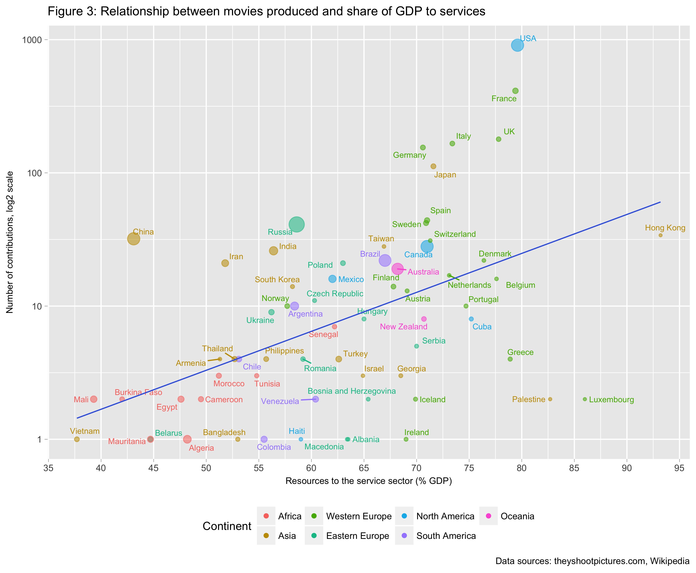
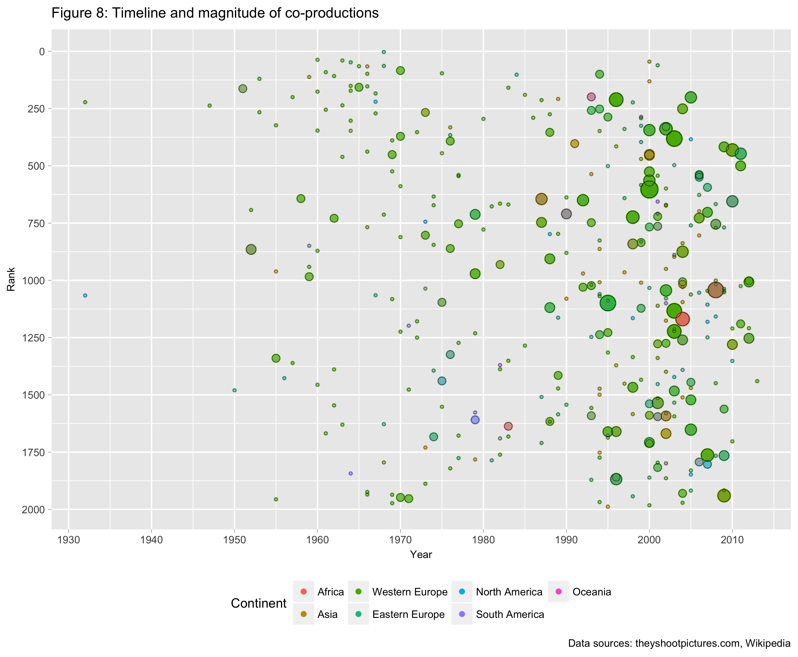
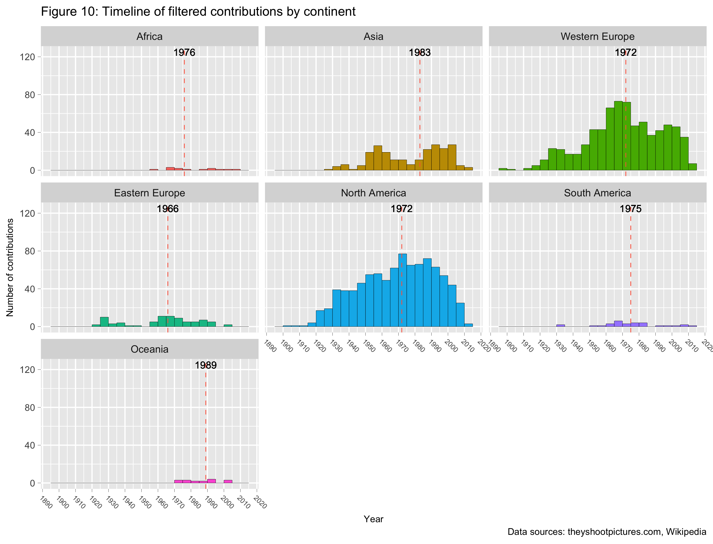
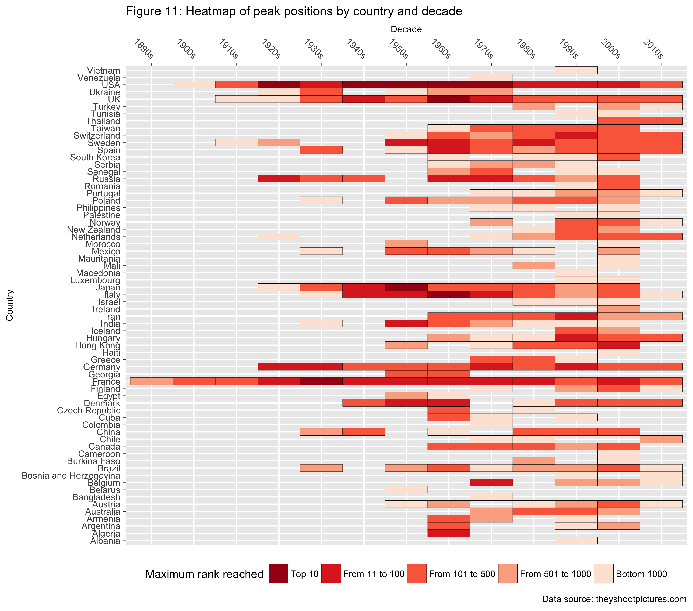

Data Analyst Nanodegree: P4 Explore and Summarise Data
================
**Federico Maria Massari / <federico.massari@bocconialumni.it>**

**Introduction**
----------------

*[They Shoot Pictures, Don't They?](http://www.theyshootpictures.com)*, by Bill Georgaris and Vicki Platt, is among the definitive guides for cinema aficionados. The website features some of the most referenced film lists on the Internet, notably "The 1,000 Greatest Films", which showcases the most groundbreaking and highly artistic movies ever made (and which was recently expanded to include 2,000 films in total), "The 21st Century's Most Acclaimed Films", which presents the best works of the past two decades, and "Top 250 Directors", which ranks filmmakers by historical importance.

Each list is a synthesis of thousands of individual polls and ballots, so it is not only pleasant to read, but also "statistically sound". As a consequence, the website represents an invaluable resource for both professionals and beginners alike.

Eytan Bakshy, a scientist at Facebook, suggests that future data scientists find data they are interested in, and play with them, to develop expertise. I have been a fan of TSPDT for years, so this is my chance to visually explore some of its rich datasets. Among the others, I will investigate:

-   which countries (co-)produced the greatest movies of all time, whether any particular region stands out in terms of either the number of contributions or film quality and, if so, why;

-   which co-production relationships were the most frequent, whether the choice was dictated by historical or economic reasons, and whether geographical or linguistic proximity also played a role;

-   

To answer questions as they come to mind, in a stream-of-consciousness narrative style, the main datasets are enriched with content from Wikipedia and Google.

**Data acquisition**
--------------------

### **Datasets**

*They Shoot Pictures* provides a wealth of datasets related to both movies and filmmakers. For this project, I concentrated on the following rankings:

-   [The 1,000 Greatest Films](http://www.theyshootpictures.com/gf1000.htm) and [Films Ranked 1,001-2,000](http://www.theyshootpictures.com/gf1000_films1001-2000.htm) (henceforth, "main"): among the most important lists on the website, these contain information on current rankings, titles, directors, years and countries of production, genres, and whether a particular film was shot in colour or black-and-white. The lists are available as Excel files, so they are definitely easy to acquire. "The 1,000 Greatest Films" also includes rankings for the past two years, but I decided to drop the columns for a few reasons: the second list does not include such columns (the order was disclosed this year for the first time); there is little variability among positions year-over-year, especially at the top; and the samples vary over time (some movies are new entries, some are re-entries, and some dropped out of the lists);

-   [Top 250 Directors](http://www.theyshootpictures.com/gf1000_top250directors.htm): this provides information on the most critically acclaimed filmmakers of all-time, including current rankings, the number of movies appearing in "The 1,000 Greatest Films", and that of movies featured in other lists (i.e., "cited"). Particularly important is the directors' rankings, since I am going to manually determine, for each director, the number of films among the top 2,000. I could not find the list in an easily downloadable format, so I had to scrape the data from the webpage (on ethical scraping, see the next paragraph), and store them in a csv file;

-   Auxiliary data come from Wikipedia (breakdown of countries into continent, area, code, gdp, gdp sector composition, and religion) and Google Developers (country coordinates).

### **Data acquisition process**

The data are acquired using Python libraries [Requests](http://docs.python-requests.org/en/master/) and [Beautiful Soup](https://www.crummy.com/software/BeautifulSoup/bs4/doc/). To respect intellectual property, the content is not stored in this repository, but rather automatically placed inside a new folder `data` at module runtime. Web scraping was done ethically, obeying to either the `robots.txt` file or the *robots meta tag*, whichever was available. For example, the following snippet from the "Top 250 Directors" page should indicate that data acquisition is allowed:

``` html
<html lang="en">
  <head>
    <meta name="robots" content="index, follow">
```

Care was also taken to ensure that at least five seconds pass before an additional page is requested (the default time is ten seconds). This added constraint makes the data retrieval process time consuming (it clocks in at about one minute), but it avoids causing server saturation, and is only done once.

See the [related folder](https://github.com/federicomariamassari/udacity-dand/tree/master/projects/p4/python-modules) for information on the Python modules.

### **Data loading**

#### **Acquire external datasets using Python**

``` r
# Run this command while "p4" is the current working directory
modules <- c("get_xls.py", "scrape_webpage.py", "scrape_wikipedia.py",
             "scrape_others.py")
sapply(modules,
       function(x) system(paste("python3 ./python-modules/", x, sep = "")))
```

#### **Import datasets into R**

``` r
# Import frequently used libraries
libraries <- c("dplyr", "ggplot2", "kableExtra")
sapply(libraries, require, character.only = TRUE)
```

``` r
# Import main files as data frames
greatest_pt1 <- readxl::read_excel("./data/xls/1000GreatestFilms.xls")
greatest_pt2 <- readxl::read_excel("./data/xls/Films-Ranked-1001-2000.xls")
directors <- read.csv("./data/csv/top_250_directors.csv")

# Import auxiliary documents as data frames
variables <- c("continents", "coordinates", "country_area", "country_codes",
               "religions", "nominal_gdp", "gdp_by_sector")

for (variable in variables) {
  assign(variable, read.csv(paste("./data/csv/", variable, ".csv", sep = "")))
}

# Import world map from ggplot2 library
world <- filter(map_data("world"), region != "Antarctica")

# Uniform the data frames, append pt2 to pt1
greatest <- rbind(greatest_pt1[, -c(2:3)], greatest_pt2)
```

**Data cleaning**
-----------------

### **Character-to-factor conversion**

``` r
convert.to.factor <- function(df) {
  # Convert all "chr" columns of a data frame to "Factor".
  #
  # Arguments:
  #   df: Data frame with columns of type "chr" to convert to "Factor".
  #
  # Returns:
  #   Data frame df with converted column types.
  #
  df <- as.data.frame(unclass(df))
  return(df)
}
```

``` r
world <- convert.to.factor(world)
greatest <- convert.to.factor(greatest)
```

### **Factor level inclusion**

The world map dataset from the `maps` package only distinguishes between China and Hong Kong at the sub-regional level. This is an understandable choice, since Hong Kong is not an independent country but a special administrative region of China. However, given the prominence of its film industry, it is useful to consider the city as separate from the mainland:

``` r
# Distinguish between China and Hong Kong at level "region"
levels(world$region) <- c(levels(world$region), "Hong Kong")
index <- as.numeric(rownames(subset(world, subregion == "Hong Kong")))
world[index, ]$region <- "Hong Kong"

# Add new row related to Hong Kong in auxiliary data frame
continents <- rbind(continents,
                    data.frame(Continent = "Asia", Country = "Hong Kong"))
```

### **Column renaming**

``` r
world <- rename(world, Country = region)
greatest <- rename(greatest, Countries = Country)
directors <- rename(directors, Dir.Rank = Rank)
```

### **Missing values imputation**

In the main dataset, missing or otherwise difficult to process entries are of two kinds: unknown length, genre, or colour; and a range of values for production year.

-   The only film with unknown length is *Eniaios* (\#1544), by Gregory Markopoulos. The full movie lasts about 80 hours, but it has not been screened yet in its entirety. A few new cycles, of the twenty-two in total, have been released to the public every four years since 2004, also thanks to a successful [Kickstarter campaign](https://www.kickstarter.com/projects/1525866264/towards-eniaios-and-the-temenos) in 2012. How long the movie was when it entered various polls is not known, so the value is left blank (the observation is removed when the length dimension is analysed);

-   One movie has unknown genre and one unknown colour specification. These are, respectively, *Reisender Krieger \[TV\]* (\#1947), by Christian Schocher, and *Line Describing a Cone* (\#1422), by Anthony McCall. The former is a *road movie* that focuses on the protagonists' journey, both physical and spiritual, so I list it as such. The latter is an *experimental* film that invites the viewer to interact with light, so it could be seen as having the features of both black-and-white and colour movies;

-   Three movies have a range of values for production year. These are *Scenes from Under Childhood* (\#1490), by Stan Brakhage, *Little Stabs at Happiness* (\#1599), by Ken Jacobs, and *The Wire \[TV\]* (\#1934), by various directors. In this case, I replaced the range of years with the average, rounding down unless the latter was an integer.

``` r
replace.with.mean <- function(df, column, delimiter = "-") {
  # Replace entry "YYYY-YYYY" with the rounded mean of the single years.
  #
  # Arguments:
  #   df: Data frame.
  #   column: Data frame column with entries to replace. Enter as text (i.e.,
  #     "column", since the function evaluates it as df[["column"]]).
  #
  # Keyword arguments:
  #   delimiter: The character separating the two years (default: "-").
  #
  # Returns:
  #   A data frame in which entries "YYYY-YYYY" in the supplied column are
  #   replaced by the average of the single YYYY entries.
  #
  # Store all rows in which delimiter appears in a subset
  df_subset <- df[grepl(delimiter, df[[column]], fixed = TRUE), ]

  # Separately store corresponding row indices
  indices <- as.numeric(rownames(df_subset))

  # Replace entry with conditional mean value
  for (i in 1:length(indices)) {
    string <- stringr::str_split_fixed(df_subset[[column]][i], delimiter, Inf)
    string <- round(mean(as.numeric(string)), 0)
    df[[column]][indices[i]] <- as.factor(string)
  }
  return(df)
}

replace.value <- function(df, column, replacement, to_replace = "---") {
  # Replace data frame entry "---" with user-defined value.
  #
  # Arguments:
  #   df: Data frame.
  #   column: Data frame column with entries to replace. Enter as text (i.e.,
  #     "column", since the function evaluates it as df[["column"]]).
  #   replacement: The desired replacement value, as text.
  #
  # Keyword arguments:
  #   to_replace: The character to replace (default: "---").
  #
  # Returns:
  #   A data frame in which entries "---" in the supplied column are replaced
  #   by a custom value supplied by the user.
  #
  df[[column]][grepl(to_replace, df[[column]], fixed = TRUE)] <- replacement
  return(df)
}
```

``` r
# Split each "YYYY-YYYY" in column "Year", replace it with the rounded mean of
# the two values, then convert the output to numeric
greatest <- replace.with.mean(greatest, "Year")
greatest$Year <- as.numeric(as.character(greatest$Year))

# Replace "---" in columns "Colour" and "Genre" with suitable values
greatest <- replace.value(greatest, "Colour", "Col-BW")
greatest <- replace.value(greatest, "Genre", "Road Movie")
```

### **Typo correction and delimiter replacement**

``` r
# Fix typo from the Excel file
greatest$Countries <-
  gsub("Herzergovina", "Herzegovina", greatest$Countries)

# Fix typo in column "Countries": "--" -> "-"
greatest$Countries <- gsub("--", "-", greatest$Countries)

# Replace delimiters with clearer ones
for (column in c("Countries", "Genre")) {
  greatest[[column]] <- gsub("-", ", ", greatest[[column]])
}
greatest$Director <- gsub("/", "; ", greatest$Director)
```

### **Other type conversions**

``` r
# Convert "gdp_by_sector" factor columns to numeric using lambda function
cols <- c("Agriculture", "Industry", "Services")
gdp_by_sector[, cols] = apply(gdp_by_sector[, cols], 2,
                              function(x) as.numeric(as.character(x)))
```

### **Variables creation**

Four variables are added to the data frame: "Co-Production" and "Co-Director" (Boolean) signal whether a certain movie was co-produced by different countries or shot by various directors; "Decade" and "Rank Category" provide a higher level of aggregation with respect to "Year" and "Position".

``` r
add.bool.column <- function(df, cond.column, new.column, delimiter,
                            if_TRUE = "Yes", if_FALSE = "No") {
  # Add Boolean column to data frame.
  #
  # Arguments:
  #   df: Data frame.
  #   cond.column: The data frame column upon which to build the Boolean
  #     column. If entry i in cond.column contains a specific delimiter,
  #     new.column[i] is set to if_TRUE; else, it is set to if_FALSE.
  #     Enter cond.column as text (i.e., "cond.column").
  #   new.column: The new column name, as text.
  #   delimiter: Delimiter to search in cond.column, as text.
  #   
  # Keyword arguments:
  #   if_TRUE: The conditional affirmative value of new.column entries, as text
  #     (default: "Yes").
  #   if_FALSE: The conditional negative value of new.column entries, as text
  #     (default: "No").
  #
  # Returns:
  #   The data frame, augmented by a Boolean column according to the specified
  #   conditions.
  #
  # Initialise data frame column
  df[[new.column]] <- NA

  for (i in 1:nrow(df)) {
    ifelse(grepl(delimiter, df[[cond.column]][i], fixed = TRUE),
           df[[new.column]][i] <- if_TRUE,
           df[[new.column]][i] <- if_FALSE)  
  }
  return(df)
}
```

``` r
# Add column "Co.Production"
greatest <- add.bool.column(df = greatest, cond.column = "Countries",
                            new.column = "Co.Production", delimiter = ", ")

# Add column "Co.Director"
greatest <- add.bool.column(df = greatest, cond.column = "Director",
                            new.column = "Co.Director", delimiter = "; ")

# Add column "Decade"
greatest$Decade <- cut(greatest$Year, breaks = seq(1890, 2020, 10),
                       dig.lab = 5, right = FALSE)

levels(greatest$Decade) <- c("1890s", "1900s", "1910s", "1920s", "1930s",
                             "1940s", "1950s", "1960s", "1970s", "1980s",
                             "1990s", "2000s", "2010s")

# Add column "Rank.Category"
greatest$Rank.Category <- cut(greatest$Pos,
                              breaks = c(0, 10, 100, 500, 1000, 2000))

levels(greatest$Rank.Category) <- c("Top 10", "From 11 to 100",
                                    "From 101 to 500", "From 501 to 1000",
                                    "Bottom 1000")
```

### **Data tidying**

Hadley Wickham (Wickham, 2014) defines as "tidy" any dataset with the following three characteristics: every row is an observation, every column a variable, and every table a type of observational unit. The main dataset falls short of the second requirement, since "Countries" and "Genre" both contain multiple variables. For example:

<table>
<thead>
<tr>
<th style="text-align:right;">
Pos
</th>
<th style="text-align:left;">
Title
</th>
<th style="text-align:left;">
Director
</th>
<th style="text-align:right;">
Year
</th>
<th style="text-align:left;">
Countries
</th>
<th style="text-align:right;">
Length
</th>
<th style="text-align:left;">
Genre
</th>
<th style="text-align:left;">
Colour
</th>
<th style="text-align:left;">
Co.Production
</th>
<th style="text-align:left;">
Co.Director
</th>
<th style="text-align:left;">
Decade
</th>
<th style="text-align:left;">
Rank.Category
</th>
</tr>
</thead>
<tbody>
<tr>
<td style="text-align:right;">
45
</td>
<td style="text-align:left;">
In the Mood for Love
</td>
<td style="text-align:left;">
Wong Kar-wai
</td>
<td style="text-align:right;">
2000
</td>
<td style="text-align:left;">
Hong Kong, France
</td>
<td style="text-align:right;">
97
</td>
<td style="text-align:left;">
Romance, Drama
</td>
<td style="text-align:left;">
Col
</td>
<td style="text-align:left;">
Yes
</td>
<td style="text-align:left;">
No
</td>
<td style="text-align:left;">
2000s
</td>
<td style="text-align:left;">
From 11 to 100
</td>
</tr>
</tbody>
</table>
To tidy the dataset three steps are needed:

-   splitting the content of the target columns by delimiter, to obtain "colvars" (i.e., individual variables stored in multiple columns);

-   "melting" the colvars (i.e., turning them into rows of a single column), using a primary key to uniquely relate the output to the corresponding observations;

-   "left joining" (i.e., merging two datasets, conforming the size of the second one to that of the first one) the molten data on content from the original dataset.

Revealing the contributions of individual countries is an important goal of the project, so I am going to tidy the dataset with respect to "Countries" first.

#### **Split by and melt column variables**

``` r
split.strings <- function(df, column, delimiter = ", ") {
  # Split data frame column entries by delimiter and vectorise the output.
  #
  # Arguments:
  #   df: Data frame.
  #   column: Data frame column with entries to split. Enter as text (i.e.,
  #     "column", since the function evaluates it as df[["column"]]).
  #
  # Keyword arguments:
  #   delimiter: The character separating the individual items (default: ", ").
  #
  # Returns:
  #   A single column of type "chr", where each row represents a single element
  #   resulting from splitting each entry of the original data frame column by
  #   the provided delimiter, and where blank spaces are not removed.
  #
  output <- stringr::str_split_fixed(df[[column]], delimiter, Inf)

  # Do not remove blanks yet
  output <- unlist((as.list(output)))
  return(output)
}

rename.factor <- function(df, column, old_name, new_name) {
  # Rename a single factor level in a data frame column.
  #
  # Arguments:
  #   df: Data frame.
  #   column: Data frame column with factor level to rename. Enter as text
  #     (i.e., "column", since the function evaluates it as df[["column"]]).
  #   old_name: The factor level to replace.
  #   new_name: The new name of the factor level.
  #
  # Returns:
  #   A data frame with a replaced factor level in the supplied column.
  #
  df[[column]][df[[column]] == old_name] <- new_name
  return(df)
}

rename.all.factors <- function(df, column, old_names, new_names) {
  # Rename all factor levels in a data frame column.
  #
  # Arguments:
  #   df: Data frame
  #   column: Data frame column with factor levels to rename. Enter as text
  #     (i.e., "column", since the function evaluates it as df[["column"]]).
  #   old_names: List of factor levels to replace.
  #   new_names: List of new names for the factor levels.
  #
  # Returns:
  #   A data frame with the replaced factor levels in the supplied column.
  #
  for (i in 1:length(old_names)) {
    df <- rename.factor(df, column, old_names[i], new_names[i])
  }
  return(df)  
}

update.factor.columns <- function(df, old_names, new_names) {
  # Rename factor levels in all the columns of a data frame.
  #
  # Arguments:
  #   df: Data frame.
  #   old_names: Array of factor levels to replace.
  #   new_names: Array of new factor levels.
  #
  # Returns:
  #   A data frame with the replaced factor levels in all columns.
  #
  for (column in names(df)) {

    # Add new factor levels to data frame column
    levels(df[[column]]) <- c(levels(df[[column]]), new_names)

    # Rename factor levels for each column
    df <- rename.all.factors(df, column, old_names, new_names)
  }
  return(df)
}

extract.countries <- function(df, column, old_names, new_names) {
  # Extract countries from data frame column with delimiter-separated levels.
  #
  # Arguments:
  #   df: Data frame.
  #   column: Data frame column with factor levels to split. Enter as text
  #     (i.e., "column", since the function evaluates it as df[["column"]]).
  #   old_names: Array of factor levels to replace.
  #   new_names: Array of new factor levels.
  #
  # Returns:
  #   A (n*m, 1)-dimensional data frame, in which "n" is the length of the
  #   supplied column, and "m" the largest number of split factor levels in
  #   a row. Blank spaces are not removed (see function: "split.strings");
  #   additionally, all factor levels are uniformed to those of the "world"
  #   dataset.
  #
  # Split column by delimiter and convert to data frame
  Country <- split.strings(df, column)
  df_out <- data.frame(Country, stringsAsFactors = TRUE)

  # Add new factor levels to data frame
  levels(df_out$Country) <- c(levels(df_out$Country), new_names)

  # Update country names, sort factor levels alphabetically
  df_out <- rename.all.factors(df_out, "Country", old_names, new_names)
  df_out$Country <- as.factor(as.character(df_out$Country))

  return(df_out)
}
```

#### **Update country factor levels**

Because the main dataset spans over a century of world cinema, some of its entries refer to countries that no longer exists (i.e., Czechoslovakia, USSR, West Germany, and Yugoslavia). In mapping these countries to modern nations, I accredited to Czech (not Slovak) Republic movies produced in Czechoslovakia, to Serbia those shot in Yugoslavia, and to Armenia, Belarus, Georgia, Russia, and Ukraine those produced in the USSR. The decision was based on filmmakers' nationality.

``` r
replace.from.list <- function(df, cond.column, replace.in, to.replace,
                              factor.list) {
  # Replace factor level if a condition is met.
  #
  # Arguments:
  #   df: Data frame.
  #   cond.column: Name of the column with the condition to test.
  #   replace.in: Name of the column in which to replace the factor level.
  #   to.replace: The factor level to replace.
  #   factor.list: A list of the key-value form, with key being the level to
  #     replace, and value the particular condition to test.
  #
  # Returns:
  #   The data frame, with new factor levels replacing the old ones in rows
  #   in which a particular condition is met.
  for (i in 1:length(factor.list)) {

    # Add new factor level to data frame
    levels(df[[replace.in]]) <-
      c(levels(df[[replace.in]]), names(factor.list[i]))

    # Replace factor level if condition is met
    df[df[[cond.column]] %in% factor.list[[i]], ][[replace.in]] <-
      gsub(to.replace, names(factor.list[i]),
           df[df[[cond.column]] %in% factor.list[[i]], ][[replace.in]])
  }
  return(df)
}
```

``` r
# Replace "USSR" with the matched director's nation
nations <- list("Armenia" = c("Parajanov, Sergei", "Peleshian, Artavazd"),
                "Belarus" = c("Kheifits, Iosif"),
                "Georgia" = c("Kalatozov, Mikhail", "Khutsiev, Marlen"),
                "Ukraine" = c("Bondarchuk, Sergei", "Chukhraj, Grigori",
                              "Donskoi, Mark", "Dovzhenko, Alexander",
                              "Kozintsev, Grigori", "Muratova, Kira",
                              "Shepitko, Larisa"))

greatest <- replace.from.list(df = greatest, cond.column = "Director",
                              replace.in = "Countries", to.replace = "USSR",
                              factor.list = nations)
```

``` r
# Uniform country levels with those of world map
old_names <- c("Arab Palestinian areas", "Czechia", "Czechoslovakia",
               "Kingdom of the Netherlands", "Korea, South",
               "Palestinian Territories", "Republic of Ireland",
               "Republic of Macedonia", "State of Palestine", "United Kingdom",
               "United States", "USSR", "West Bank and Gaza", "West Germany",
               "Yugoslavia")

new_names <- c("Palestine", "Czech Republic", "Czech Republic", "Netherlands",
               "South Korea", "Palestine", "Ireland", "Macedonia", "Palestine",
               "UK", "USA", "Russia", "Palestine", "Germany", "Serbia")

# Single out all countries of production (including co-production ones) and
# store into "contributions", which becomes the main dataset for exploration
contributions <- extract.countries(greatest, "Countries", old_names, new_names)
```

#### **Left join molten data on the original dataset**

``` r
append.columns <- function(df, to_append, shared_col, old_names, new_names) {
  # Append data frame columns to a different data frame.
  #
  # Arguments:
  #   df: The data frame to augment.
  #   to_append: The data frame whose columns are to append to df.
  #   shared_col: Column shared by the two data frames. Enter as text,
  #     (i.e., "column", since the function evaluates it as df[["column"]]).
  #   old_names: List of factor levels to replace.
  #   new_names: List of new names for the factor levels.
  #
  # Returns:
  #   Data frame df, augmented with the columns of a second data frame.
  #
  # Add factor levels and rename
  levels(to_append[[shared_col]]) <- c(levels(to_append[[shared_col]]),
                                       new_names)

  to_append <- rename.all.factors(to_append, shared_col, old_names,
                                  new_names)

  # Append columns to data frame
  df <- plyr::join(x = df, y = to_append, by = shared_col)

  return(df)
}
```

``` r
# Determine the number of array repetitions
nreps <- nrow(contributions) / nrow(greatest)

# Uniform column "Pos" to the length of "contributions". "Pos" will work as a
# primary key in order to migrate content from "greatest"
added_column <- do.call("rbind", replicate(nreps, greatest["Pos"],
                                           simplify = FALSE))

# Column bind, then shrink, the two datasets
contributions <- subset(cbind(contributions, added_column), !Country == "")

# Swap columns
contributions <- contributions[, c("Pos", "Country")]
```

``` r
# Append columns to data frame. This is an elegant, albeit space inefficient,
# way to append multiple data frame columns to "contributions"
df.list <- list(country_codes, continents, coordinates, country_area,
                religions[, 1:2], nominal_gdp, gdp_by_sector)

for (df in df.list) {
  contributions <- append.columns(contributions, df, "Country", old_names,
                                  new_names)
}

# Migrate content of data frame "greatest" to "contributions"
contributions <- merge(contributions, greatest, by = "Pos")
```

#### **Additional data processing**

I also distinguished between Western European countries (historically wealthier) and Eastern European ones, and sorted religions according to their prevalence worldwide.

``` r
add.continent.region <- function(df, column, test.column, continent, group,
                                 if_group) {
  # Break down continent into regions based on a condition.
  #
  # Arguments:
  #   df: Data frame.
  #   column: Name of the column in which to replace the factor level.
  #   test.column: Name of the column with the condition to test.
  #   continent: The continent name. Replace with the new factor level if
  #     tested condition is True.
  #   group: Group of countries belonging to a particular region.
  #   if_group: The name of the continent region.
  #
  # Returns:
  #   The data frame, with new factor levels replacing the old ones in rows
  #   in which a particular condition is met.
  #
  levels(df[[column]]) <- c(levels(df[[column]]), if_group)

  df[[column]][which(df[[test.column]] %in% group)] <- if_group

return(df)
}

reorder.factor.levels <- function(df, column, ordered.levels) {
  # Custom reorder factor levels.
  #
  # Arguments:
  #  df: Data frame.
  #  column: The data frame column containing the factor levels to reorder.
  #  ordered.levels: An array of reordered factor levels.
  #
  # Returns:
  #  The data frame, with reordered factor levels in the specified column.
  #
  df[[column]] <- factor(df[[column]], levels = ordered.levels)

  return(df)
}
```

``` r
# Break down Europe into Western and Eastern regions
eu.regions <- list("Western Europe" = c("Austria", "Belgium", "Denmark",
                                        "Finland", "France", "Germany",
                                        "Greece", "Iceland", "Ireland",
                                        "Italy", "Luxembourg", "Netherlands",
                                        "Norway", "Portugal", "Spain",
                                        "Sweden", "Switzerland", "UK"),
                   "Eastern Europe" = c("Albania", "Belarus",
                                        "Bosnia and Herzegovina",
                                        "Czech Republic", "Hungary",
                                        "Macedonia", "Poland", "Romania",
                                        "Russia", "Serbia", "Ukraine"))

for (i in 1:length(eu.regions)) {
  contributions <- add.continent.region(df = contributions,
                                        column = "Continent",
                                        test.column = "Country",
                                        continent = "Europe",
                                        group = eu.regions[[i]],
                                        if_group = names(eu.regions[i]))
}

# Reorder factor levels
continent_levels <- c("Africa", "Asia", "Western Europe", "Eastern Europe",
                      "North America", "South America", "Oceania")

contributions <- reorder.factor.levels(contributions, "Continent",
                                       continent_levels)
```

``` r
# Reorder factor levels based on prevalent world religions
religion_levels <- c("Christian", "Islam", "Irreligion", "Hindu", "Buddhist",
                     "Folk religion", "Jewish")

contributions <- reorder.factor.levels(contributions, "Main.Religion",
                                       religion_levels)
```

#### **Tidied data frame**

The result of tidying with respect to "Countries" is the following:

<table>
<thead>
<tr>
<th style="text-align:right;">
Pos
</th>
<th style="text-align:left;">
Country
</th>
<th style="text-align:left;">
Code
</th>
<th style="text-align:left;">
Continent
</th>
<th style="text-align:right;">
Latitude
</th>
<th style="text-align:right;">
Longitude
</th>
<th style="text-align:right;">
Total.Area
</th>
<th style="text-align:right;">
Land
</th>
<th style="text-align:right;">
Water
</th>
<th style="text-align:left;">
Main.Religion
</th>
<th style="text-align:right;">
Nominal.GDP
</th>
<th style="text-align:right;">
Agriculture
</th>
<th style="text-align:right;">
Industry
</th>
<th style="text-align:right;">
Services
</th>
<th style="text-align:left;">
Title
</th>
<th style="text-align:left;">
Director
</th>
<th style="text-align:right;">
Year
</th>
<th style="text-align:left;">
Countries
</th>
<th style="text-align:right;">
Length
</th>
<th style="text-align:left;">
Genre
</th>
<th style="text-align:left;">
Colour
</th>
<th style="text-align:left;">
Co.Production
</th>
<th style="text-align:left;">
Co.Director
</th>
<th style="text-align:left;">
Decade
</th>
<th style="text-align:left;">
Rank.Category
</th>
</tr>
</thead>
<tbody>
<tr>
<td style="text-align:right;">
45
</td>
<td style="text-align:left;">
France
</td>
<td style="text-align:left;">
FR
</td>
<td style="text-align:left;">
Western Europe
</td>
<td style="text-align:right;">
46.22764
</td>
<td style="text-align:right;">
2.213749
</td>
<td style="text-align:right;">
640679
</td>
<td style="text-align:right;">
640427
</td>
<td style="text-align:right;">
3374
</td>
<td style="text-align:left;">
Christian
</td>
<td style="text-align:right;">
2465453
</td>
<td style="text-align:right;">
1.8
</td>
<td style="text-align:right;">
18.8
</td>
<td style="text-align:right;">
79.4
</td>
<td style="text-align:left;">
In the Mood for Love
</td>
<td style="text-align:left;">
Wong Kar-wai
</td>
<td style="text-align:right;">
2000
</td>
<td style="text-align:left;">
Hong Kong, France
</td>
<td style="text-align:right;">
97
</td>
<td style="text-align:left;">
Romance, Drama
</td>
<td style="text-align:left;">
Col
</td>
<td style="text-align:left;">
Yes
</td>
<td style="text-align:left;">
No
</td>
<td style="text-align:left;">
2000s
</td>
<td style="text-align:left;">
From 11 to 100
</td>
</tr>
<tr>
<td style="text-align:right;">
45
</td>
<td style="text-align:left;">
Hong Kong
</td>
<td style="text-align:left;">
HK
</td>
<td style="text-align:left;">
Asia
</td>
<td style="text-align:right;">
22.39643
</td>
<td style="text-align:right;">
114.109497
</td>
<td style="text-align:right;">
2755
</td>
<td style="text-align:right;">
1106
</td>
<td style="text-align:right;">
1649
</td>
<td style="text-align:left;">
Irreligion
</td>
<td style="text-align:right;">
274027
</td>
<td style="text-align:right;">
0.1
</td>
<td style="text-align:right;">
6.8
</td>
<td style="text-align:right;">
93.2
</td>
<td style="text-align:left;">
In the Mood for Love
</td>
<td style="text-align:left;">
Wong Kar-wai
</td>
<td style="text-align:right;">
2000
</td>
<td style="text-align:left;">
Hong Kong, France
</td>
<td style="text-align:right;">
97
</td>
<td style="text-align:left;">
Romance, Drama
</td>
<td style="text-align:left;">
Col
</td>
<td style="text-align:left;">
Yes
</td>
<td style="text-align:left;">
No
</td>
<td style="text-align:left;">
2000s
</td>
<td style="text-align:left;">
From 11 to 100
</td>
</tr>
</tbody>
</table>
This dataset is used for most of the exploratory analysis.

#### **Clean up Global Environment**

``` r
# Remove all but necessary variables and functions
required <- c(lsf.str(), "greatest", "contributions", "directors", "world",
              "old_names", "new_names")
rm(list = setdiff(ls(), required))
```

**Data exploration**
--------------------

### **A. Geography of the greatest films**

The first dimension I would like to explore is the geographical one. Some interesting questions could be:

-   *Where were the greatest movies produced?*
-   *Are contributions evenly distributed, or is any particular area of the world under- or overrepresented?*

The best way to answer these questions is through a choropleth map, a thematic chart in which colour intensity for each country is positively associated to the number of contributions that country made to the list (with black areas reflecting absence of contributions).

### **Choropleth map of countries of production**

#### **Aggregate data for exploration**

``` r
aggregate.df <- function(df, column) {
  # Group data frame by column variable and count values.
  #
  # Arguments:
  #   df: Data frame.
  #   column: Data frame column to summarise. Enter as a normal variable, not
  #     as text (i.e., column instead of "column").
  #
  # Returns:
  #   A summary data frame counting the occurrences of factor levels in the
  #   supplied column.
  #
  # Create quosure to use dplyr in function environment
  column <- enquo(column)

  # Unquote (evaluate immediately) quosure expression
  df_out <- df %>%
    group_by(!!column) %>%
    summarise(n = n())

  return(df_out)
}

cut.density <- function(df, to_cut, new_column, breaks, labels) {
  # Cut a continuous density into discrete bins.
  #
  # Arguments:
  #  df: Data frame.
  #  to_cut: Name of the column with the continuous density to cut.
  #  new_column: Name of the output column containing the discrete bins.
  #  breaks: Array of breaks, with limits (-Inf; +Inf).
  #  labels: Array of bin labels.
  #
  # Returns:
  #  The data frame, augmented by column "new_column", breaking a continuous
  #  density into discrete bins.
  #
  df[[new_column]] <- cut(df[[to_cut]], breaks = breaks)
  levels(df[[new_column]]) <- labels

  return(df)
}
```

``` r
# Aggregate data
greatest.by_country <- aggregate.df(contributions, Country)

# Group and label factor levels for convenient representation
greatest.by_country <- cut.density(greatest.by_country, "n", "bin",
                                   breaks = c(-Inf, 1,  10, 50, 100, +Inf),
                                   labels = c("Single", "From 2 to 10",
                                              "From 11 to 50",
                                              "From 51 to 100",
                                              "More than 100"))

# Append selected columns to the dataset
greatest.by_country <- merge(greatest.by_country,
                             unique(contributions[, c(2:14)]),
                             by = "Country")

# Append column on actual amount of country GDP to services
greatest.by_country$GDP.to.Services <- greatest.by_country$Nominal.GDP *
  greatest.by_country$Services / 100

# Append selected columns to data frame "world"
world <- plyr::join(world, greatest.by_country[, c(1:3, 11)], by = "Country")
```

#### **Generate choropleth map**

``` r
# Define attributes shared by plots, to override if necessary
shared_themes <- theme(plot.title = element_text(size = 11),
                       plot.caption = element_text(size = 8),
                       axis.title = element_text(size = 8),
                       axis.text = element_text(size = 8),
                       axis.ticks = element_line(size = 0.1),
                       legend.title = element_text(size = 10),
                       legend.text = element_text(size = 8),
                       legend.position = "bottom")
```

``` r
# Generate world map and define common features
world_base <- ggplot() +
  geom_polygon(data = world, aes(x = long, y = lat, group = group)) +
  xlab("Longitude") +
  ylab("Latitude") +
  shared_themes

# Make choropleth map
world_base +
  geom_polygon(data = subset(world, !is.na(bin)),
             aes(x = long, y = lat, group = group, fill = bin)) +
  scale_fill_brewer(palette = "Reds") +
  labs(fill = "Contributions to list",
       caption = "Data source: theyshootpictures.com") +
  ggtitle(paste("Figure 1: Choropleth map of the greatest movies by country",
                "of production"))
```


#### **Observations**

The distribution of co-productions appears to be heavily skewed, with very few countries contributing most entries to the list. These countries (France, Germany, Italy, Japan, the United Kingdom, and the United States) either produced or helped to produce more than 100 films each. The USSR (not shown) was the only territory committing between 51 and 100 movies to the list, but total contributions are now split among former bloc members. Of the latter, Russia is the most prolific, with 11-50 films made. The least represented continent, in terms of both countries shown and number of co-productions, is certainly Africa. In particular, with the exception of Cameroon, no state in the Central, Eastern, or Southern region of Africa appears in the list. Other prominent black areas are in the Middle East (Syria, Iraq, and the Arabian Peninsula), Central and East Asia (the *-stan* nations, Mongolia), South-East Asia (Malaysia and Indonesia, among the others), and Latin America.

These findings raise interesting questions.

-   First, how skewed is the distribution of co-productions? That is, how many films did the top contributing nations actually shoot, or help shoot, and what fraction of the total do their efforts account for?

-   Second, does any of the following variables help explain why a country has a particular number of entries in the list: the desire to boost the cinema industry (a behaviour proxied by the *share* of nominal GDP to services); the amount of money invested in cinema (as proxied by the *amount* of nominal GDP to services); the size of a country? It appears that the major contributors to the list are among the most developed countries in the world, and these usually devote a larger portion of GDP to the tertiary sector.

-   Third, is there any link between a country's predominant religion and the number of movies that country co-produced? For example, several black regions in the map belong to the so-called Muslim world, and Islamic countries, apart from Iran, seem to have historically contributed less to the list than states with a different prevalent religion.

### **Contributions by country**

``` r
custom_ticks <- c(0, 1, 10, 100, 1000)

ggplot(data = greatest.by_country,
       aes(x = log2(n), y = reorder(Country, n), color = Continent)) +
  geom_point(size = 2) +
  geom_segment(aes(x = 0, xend = log2(n), y = Country, yend = Country),
               size = 0.5) +
  geom_text(aes(label = n), size = 2, nudge_x = 0.35, check_overlap = TRUE) +
  scale_x_continuous(breaks = log2(custom_ticks), labels = custom_ticks,
                     sec.axis = dup_axis(name = NULL)) +
  ggtitle(paste("Figure 2: Contributions to the list of greatest movies by",
                "country of production")) +
  xlab("Number of contributions, log2 scale") +
  ylab("Country") +
  labs(fill = "Contributions to list",
       caption = "Data sources: theyshootpictures.com, Wikipedia") +
  shared_themes +
  # Override "shared_themes" legend position
  theme(legend.position = "right")
```


#### **Table 1: Contributions by continent statistics**

``` r
stats.table <- function(df, group, column) {
  # Summarise data using measures of central tendency and dispersion.
  #
  # Arguments:
  #  df: Data frame.
  #  group: The data frame column used to divide data into groups. Enter as a
  #   variable (i.e., without quotes).
  #  column: The data frame column to summarise.
  #
  # Returns:
  #  A summary data frame with group means, medians, and standard deviations
  #  rounded to the second decimal.
  #
  group <- enquo(group)
  column <- enquo(column)

  tab <- df %>%
    group_by(!!group) %>%
    summarise(mean = mean(!!column),
              median = median(!!column),
              sd = sd(!!column))

  # Round summary statistics to the second decimal
  cbind(tab[, 1], round(tab[, 2:4], 2))
}
```

``` r
stats.table(greatest.by_country, Continent, n)
```

    ##        Continent   mean median     sd
    ## 1         Africa   2.56    2.0   1.81
    ## 2           Asia  18.31    4.0  27.74
    ## 3 Western Europe  63.39   16.5 105.20
    ## 4 Eastern Europe   9.45    5.0  12.05
    ## 5  North America 192.20   16.0 400.27
    ## 6  South America   7.80    4.0   8.67
    ## 7        Oceania  13.50   13.5   7.78

#### **Observations**

The distribution of co-productions is, as expected, highly asymmetric. The United States and France are by far the largest contributors: the former made, or helped make, almost half or all the movies in the list, the latter about a fifth. Some of the reasons of their prevalence could be, on one hand, the significant role the United States played in post-war reconstruction, on the other, the prestige of France as the place of birth of cinema. Both visually and in terms of median values (which are generally robust to outliers), Western European countries have been the most prolific ones, with an average of 16.5 movies co-produced per country and six places among the top ten in the list (Table 1). UK, Italy, and Germany contributed around 8% films each, while Spain and Sweden around 2% each. A higher level of aggregation (i.e., by continent) is, unfortunately, not possible, since the procedure would double-count contributions by same-continent nations that worked on the same movies, and would therefore return distorted statistics. African countries, instead, have been the least fecund, as shown by both their concentration in the bottom area of the plot and their small values for median and standard deviation. The latter show that the distribution of co-productions for Africa is tight around a very small average statistic.

Why are the United States and Western Europe so prominent, and why is Africa largely absent from the list? The difference in output could be linked, among the others, to the willingness of a country to bet on the cinema industry on the one hand, and to the amount of resources that country can afford to invest on the other.

### **Contributions by share of GDP to services**

``` r
ggplot(data = greatest.by_country,
       aes(x = Services, y = log2(n), color = Continent)) +
  geom_point(aes(size = Land, alpha = 0.2)) +
  # Use ggrepel to avoid label overlapping
  ggrepel::geom_text_repel(aes(label = Country), size = 2.5,
                           show.legend = FALSE) +
  geom_smooth(method = "lm", se = FALSE, size = 0.5, color = "royalblue") +
  scale_x_continuous(breaks = seq(0, 100, 5)) +
  scale_y_continuous(breaks = log2(custom_ticks), labels = custom_ticks) +
  ggtitle(paste("Figure 3: Relationship between movies produced and share",
                "of GDP to services")) +
  xlab("Resources to the service sector (% GDP)") +
  ylab("Number of contributions, log2 scale") +
  labs(caption = "Data sources: theyshootpictures.com, Wikipedia") +
  shared_themes +
  scale_size(guide = "none") +
  scale_alpha(guide = "none")
```



#### **Table 2: Contributions by share of GDP to services statistics**

``` r
stats.table(greatest.by_country, Continent, Services)
```

    ##        Continent  mean median    sd
    ## 1         Africa 48.83  48.20  6.86
    ## 2           Asia 60.64  57.30 14.04
    ## 3 Western Europe 73.03  72.20  6.05
    ## 4 Eastern Europe 60.85  63.00  6.56
    ## 5  North America 69.36  71.00  8.71
    ## 6  South America 58.88  58.40  5.32
    ## 7        Oceania 69.45  69.45  1.77

#### **Observations**

Figure 3 is a scatter plot of country co-productions against the share of GDP to services, a possible proxy for the **desire** of a country to invest in the cinema industry. The size of each dot is proportional to the land size of the corresponding state (i.e., the bigger the nation, the larger the point diameter). The plot could ideally be divided into four quadrants, counter-clockwise, with the first quadrant being the upper right one. I & III could be referred to as the "regular" quadrants, those for which a small (III) or significant (I) percentage of resources to cinema translates to a small or large number of entries to the list of critically acclaimed films. IV could collect countries that are either "inefficient" (i.e., those which have been involved in far fewer co-productions than their large share of GDP to services would imply) or "too small" (i.e., those which lack the critical mass to participate in many co-productions, no matter how much money they invest in services). II, instead, could gather "virtuous" countries (i.e., those which managed to work on several films on a tight budget).

It is important to stress that the plot gives, at best, an approximate picture of the share of resources historically destined to cinema by each country, for at least two reasons. First, the data on GDP breakdown were recorded in different years, ranging from 2007 (Luxembourg) to 2016 (e.g., Australia). Second, GDP composition may have changed dramatically in over a century. For instance, Western European nations spent more on agriculture and industry in the years immediately following World War II, and more on services since the Sixties.

In addition, two assumptions were made. One is that countries tend to invest more resources in the tertiary sector when they develop; the other is that, when the share of GDP to services increases, so does the one to cinema, in proportion.

Number of contributions and share of GDP to services seem to be positively correlated, as shown by the positive slope of the regression line. This means that, on average, the more a country has invested in cinema over the years, the more films it has contributed to the list. The line has equation y = -3.14 + 0.097x (Table 3), but the meaningful part is actually the sign of the slope: while the magnitude, together with the associated p-value of the t-test, can be heavily influenced by the particular transformation used (in this case, log2 on y), the sign is invariant, as long as the transformation is monotonically increasing (i.e., square root, logarithm). To measure the association between the two variables one can rely on *Kendall's tau* (Table 4), which is robust to transformations. Kendall's tau is positive and quite significant (~38%), and confirms the previous findings.

As expected, African countries locate in the third quadrant, an area in which a small share of GDP to services corresponds to few contributions to the list (Africa has the smallest median share among all continents, see Table 2). Eastern European countries, slightly more virtuous than the African ones, also place in quadrant III. Apart from Norway, for which investment in the tertiary sector appears to be less notable, Western European countries all place in quadrants I & IV. This means that, while the economies in this group commit a similar (and large) share of GDP to services, individual outcomes vary widely. Indeed, dispersion of contributions for Western Europe is very high (standard deviation: 105, see Table 1), and the statistic might be influenced by a mix of factors. One of them could be *geographic size* (e.g., Luxembourg vs Germany), though the association may not be so clear-cut: for example, the United States and Canada have similar country size but very different number of co-productions. Another one could be *economic size* (i.e., the amount of nominal GDP to services, in dollars), a dimension analysed in Figure 4.

Russia is the only "virtuous" country in quadrant II: despite the relatively small fraction of GDP to services, Russia managed to contribute a large number of high-quality films to the list. One of the reasons could be the high caliber of its filmmakers, like *Sergei Eisenstein* (Battleship Potëmkin, Ivan the Terrible parts I & II, October, Alexander Nevsky) and *Andrei Tarkovsky* (Andrei Rublëv, Mirror, Stalker, Solaris, Ivan's Childhood).

China and Hong Kong are an interesting pair. The two have historically destined very different portions of GDP to services (and to cinema), they are extremely different in size, however they contributed almost the same number of movies to the list. Some good reasons may be that, despite its size, Hong Kong has one of the most developed cinema industries in the world, it is a popular co-production partner, and prides itself on acclaimed filmmakers such as *Wong Kar-wai* (Chungking Express, In The Mood for Love).

#### **Table 3: Linear regression, no. of contributions and share of GDP to services**

``` r
linear.regression <- function(df, x, y, transform.x = NA, transform.y = NA) {
  # Calculate linear regression y ~ x and provide summary statistics.
  #
  # Arguments:
  #   df: Data frame.
  #   x: The independent, or explanatory, variable. Enter as the name of a
  #     data frame column, as text (i.e., "x" instead of x).
  #   y: The dependent, or explained variable (see x for input).
  #
  # Keyword arguments:
  #   transform.x, transform.y: Optional transformations for x and y. Enter as
  #     text, which is then evaluated by the function (default: NA).
  #
  # Returns:
  #   A summary of the linear regression.
  #
  if (!is.na(transform.x)) {
    x <- eval(parse(text = transform.x))(df[[x]])
  } else {
    x <- df[[x]]
  }
  if (!is.na(transform.y)) {
    y <- eval(parse(text = transform.y))(df[[y]])
  } else {
    y <- df[[y]]
  }
  fit <- lm(y ~ x)
  output <- summary(fit)
  return(output)
}
```

``` r
linear.regression(greatest.by_country, "Services", "n", transform.y = "log2")
```

    ##
    ## Call:
    ## lm(formula = y ~ x)
    ##
    ## Residuals:
    ##    Min     1Q Median     3Q    Max
    ## -4.218 -1.205 -0.060  1.107  5.230
    ##
    ## Coefficients:
    ##             Estimate Std. Error t value Pr(>|t|)    
    ## (Intercept) -3.13774    1.37737  -2.278   0.0261 *  
    ## x            0.09716    0.02142   4.536 2.58e-05 ***
    ## ---
    ## Signif. codes:  0 '***' 0.001 '**' 0.01 '*' 0.05 '.' 0.1 ' ' 1
    ##
    ## Residual standard error: 2.025 on 64 degrees of freedom
    ## Multiple R-squared:  0.2433, Adjusted R-squared:  0.2314
    ## F-statistic: 20.57 on 1 and 64 DF,  p-value: 2.581e-05

#### **Table 4: Kendall's Tau, no. of contributions and share of GDP to services**

``` r
kendall.tau <- function(df, x, y) {
  # Compute Kendall's Tau, a correlation measure robust to transformations.
  #
  # Arguments:
  #   df: Data frame.
  #   x: The independent, or explanatory, variable. Enter as text (i.e., "x"
  #    instead of x).
  #   y: The dependent, or explained variable (see x for input).
  #
  # Returns:
  #  Kendall's Tau for the two variables above.
  #
  cor(df[[x]], df[[y]], method = "kendall")
}
```

``` r
kendall.tau(greatest.by_country, x = "Services", y = "n")
```

    ## [1] 0.3767375

### **Contributions by amount of nominal GDP to services**

``` r
ggplot(data = greatest.by_country,
       aes(x = log10(GDP.to.Services), y = log2(n), color = Continent)) +
  geom_point(aes(size = Land, alpha = 0.2)) +
  ggrepel::geom_text_repel(aes(label = Country), size = 2.5,
                           show.legend = FALSE) +
  geom_smooth(method = "lm", se = TRUE, size = 0.5, color = "royalblue") +
  scale_x_continuous(breaks = seq(0, 8, 1), labels = 10 ** seq(0, 8, 1)) +
  scale_y_continuous(breaks = log2(custom_ticks), labels = custom_ticks) +
  ggtitle(paste("Figure 4: Relationship between movies produced and amount of",
                "nominal GDP to services (USD millions)")) +
  xlab("Nominal GDP to services (USD millions), log10 scale") +
  ylab("Number of contributions, log2 scale") +
  labs(caption = "Data sources: theyshootpictures.com, Wikipedia") +
  shared_themes +
  scale_size(guide = "none") +
  scale_alpha(guide = "none")
```


#### **Table 5: Kendall's Tau, no. of contributions and nominal GDP to services**

``` r
kendall.tau(greatest.by_country, "GDP.to.Services", "n")
```

    ## [1] 0.6504686

#### **Observations**

Figure 4 is a plot of country co-productions against the amount of nominal GDP to services, a possible proxy for the **ability** of a country to invest in the cinema industry. The problems highlighted in the previous figure, as well as the assumptions made, also apply to this one.

The plot could ideally be divided into three sections:

-   The *shaded region* corresponding to the 95% confidence bands of the regression line—an area in which the number of co-productions for a country generally match the value predicted, given the amount of nominal GDP to services of that country;

-   The region *above the upper band*, in which virtuous countries—the ones contributing more films to the list than their nominal GDP to services would suggest—lie;

-   The region *below the lower band*, where inefficient countries—those which participated in a smaller number of co-productions than their investment in the tertiary sector would suggest—are located.

Amount of nominal GDP to services and number of co-productions appear to be positively and strongly associated, as the value for Kendall's tau implies (~65%, see Table 5). Accounting for magnitude reveals some interesting insights. To begin with, the poorest African countries now appear to be the most virtuous ones (above all Senegal, with ~10,000 USD million GDP to services and 7 contributed films) while the wealthiest nations (e.g., Algeria, Egypt) are the most inefficient ones.

The top contributing Western European countries are also the most virtuous ones; among them, France (with a nominal GDP to services of ~2 trillion USD and a whooping 413 co-productions) is the best performing, placing farthest from the upper confidence band. Moreover, the top 10 contributing countries (as in Figure 2) are all generally efficient.

On average, South American nations have contributed a lower number of films to the list than their nominal investment in the tertiary sector would suggest. In this group, Colombia has been by far the least efficient, with a single contribution in spite of approximately ~200 billion USD to services. Colombia is also the most distant country from the lower confidence band.

Hong Kong is confirmed as a virtuous region, while China, with only 32 movies in the list despite almost 5 trillion USD to services, seems to be less efficient than originally thought. However, due to the issues highlighted in the previous section (i.e., change in the composition of GDP throughout the decades, technological progress and increased wealth of a nation), this statistic may be highly unreliable.

### **Contributions by country predominant religion**

``` r
ggplot(data = greatest.by_country,
       aes(x = Main.Religion, y = n / sum(n), fill = Main.Religion)) +
  geom_bar(stat = "identity") +
  # Add percentages on top of the bars
  geom_text(aes(label = paste(round(..y.. * 100, 2), "%")),
            fun.y = "sum", stat = "summary", size = 3, vjust = -0.5) +
  scale_y_continuous(breaks = seq(0, 1, 0.1)) +
  ggtitle(paste("Figure 5: Breakdown of co-productions into countries'",
                "predominant religion")) +
  xlab("Religion") +
  ylab("Relative frequency") +
  labs(fill = "Religion",
       caption = "Data sources: theyshootpictures.com, Wikipedia") +
  shared_themes +
  theme(legend.position = "none")
```


``` r
world_base +
  geom_polygon(data = subset(world, !is.na(Main.Religion)),
               aes(x = long, y = lat, group = group, fill = Main.Religion)) +
  geom_point(data = greatest.by_country,
             aes(x = Longitude, y = Latitude, size = n, alpha = 0.2),
             show.legend = FALSE) +
  labs(size = "Contributions", fill = "Main religion",
       caption = "Data sources: theyshootpictures.com, Wikipedia") +
  ggtitle(paste("Figure 6: Choropleth map of contributing countries",
                "by predominant religion"))
```


#### **Observations**

Figure 5 breaks down individual contributions into their associated countries’ predominant religions, and gives the relative frequency for each group. The unit of measure in this chart is contributions, not films (i.e., the total number is 2,588 single efforts, which resulted in 2,000 movies). The religions are sorted descendingly, according to [worldwide diffusion](https://en.wikipedia.org/wiki/Religions_by_country#World).

Figure 6 is a choropleth map of contributing countries by predominant faith, and shows the distribution of religions around the globe for the particular areas of interest. The dots on top of the map locate each represented country, and their size is proportional to the number of contributions that country made to the list.

Approximately 87.5% of individual contributions belong to nations whose prevailing faith (which may or may not be the official one) is Christian. These nations include, among the others, the United States and Western Europe, which alone make up for ~80% of total contributions.

The second most common faith in the list is Irreligion, with ~8% (mainly because of Japan, Hong Kong, and China), while Islam places third, with only ~2%. Apart from Iran, the countries in which Islam is prevalent have historically contributed a scant number of movies to the list (e.g., North African nations, compare Figures 1 and 6).

### **B. Timeline of contributions to the list**

The second dimension I would like to explore is time. Interesting questions could be:

-   *Which shapes do the conditional (i.e., by continent) distributions of co-productions through time have?*

-   *Which are the golden and silver periods of cinema, if any, for each of the represented countries in the list?*

### **Timeline of contributions by continent**

``` r
# Add median year by continent
contributions <- contributions[!is.na(contributions$Year), ] %>%
  group_by(Continent) %>%
  mutate(Median.Year = median(Year))

ggplot(data = subset(contributions, !is.na(Year)),
       aes(x = Year, fill = Continent)) +
  geom_histogram(binwidth = 5, size = 0.1, show.legend = FALSE) +
  scale_x_continuous(breaks = seq(1890, 2020, 10)) +
  # Also plot conditional medians
  geom_vline(aes(xintercept = Median.Year, group = Continent),
             linetype = "dashed", size = 0.3, color = "tomato") +
  # Add conditional median values on top of vlines
  geom_text(aes(x = Median.Year, y = 125, label = Median.Year,
                group = Continent), size = 3) +
  facet_wrap(~Continent) +
  ggtitle("Figure 7: Timeline of contributions by continent") +
  xlab("Year") +
  ylab("Number of contributions") +
  labs(caption = "Data sources: theyshootpictures.com, Wikipedia") +
  shared_themes +
  # Override "shared_themes" x tick labels font size and orientation
  theme(axis.text.x = element_text(size = 6, angle = -45,
                                   hjust = 0, vjust = 1))
```


#### **Table 6: Largest co-productions in the list**

``` r
# Select largest co-productions
largest.contrib <- contributions %>%
  group_by(Pos, Title, Year, Countries) %>%
  summarise(n = n()) %>%
  # Sort descendingly by "n" then "Year"
  arrange(desc(n), desc(Year))

# Print the largest six
knitr::kable(largest.contrib[1:6, ], format = "html", row.names = FALSE)
```

<table>
<thead>
<tr>
<th style="text-align:right;">
Pos
</th>
<th style="text-align:left;">
Title
</th>
<th style="text-align:right;">
Year
</th>
<th style="text-align:left;">
Countries
</th>
<th style="text-align:right;">
n
</th>
</tr>
</thead>
<tbody>
<tr>
<td style="text-align:right;">
603
</td>
<td style="text-align:left;">
Dancer in the Dark
</td>
<td style="text-align:right;">
2000
</td>
<td style="text-align:left;">
Denmark, France, Sweden, Italy, Germany, Norway, Netherlands, Iceland, Finland, UK, USA
</td>
<td style="text-align:right;">
11
</td>
</tr>
<tr>
<td style="text-align:right;">
1042
</td>
<td style="text-align:left;">
Waltz with Bashir
</td>
<td style="text-align:right;">
2008
</td>
<td style="text-align:left;">
Israel, France, Germany, USA, Japan, Finland, Switzerland, Belgium, Australia
</td>
<td style="text-align:right;">
9
</td>
</tr>
<tr>
<td style="text-align:right;">
381
</td>
<td style="text-align:left;">
Dogville
</td>
<td style="text-align:right;">
2003
</td>
<td style="text-align:left;">
Denmark, Sweden, France, UK, Germany, Finland, Italy, Netherlands, Norway
</td>
<td style="text-align:right;">
9
</td>
</tr>
<tr>
<td style="text-align:right;">
1099
</td>
<td style="text-align:left;">
Ulysses' Gaze
</td>
<td style="text-align:right;">
1995
</td>
<td style="text-align:left;">
Greece, France, Italy, Germany, UK, Yugoslavia, Bosnia and Herzegovina, Albania, Romania
</td>
<td style="text-align:right;">
9
</td>
</tr>
<tr>
<td style="text-align:right;">
1133
</td>
<td style="text-align:left;">
Five Obstructions, The
</td>
<td style="text-align:right;">
2003
</td>
<td style="text-align:left;">
Denmark, Belgium, Switzerland, France, Sweden, Finland, UK, Norway
</td>
<td style="text-align:right;">
8
</td>
</tr>
<tr>
<td style="text-align:right;">
1169
</td>
<td style="text-align:left;">
Moolaadé
</td>
<td style="text-align:right;">
2004
</td>
<td style="text-align:left;">
Senegal, Burkina Faso, Morocco, Tunisia, Cameroon, Switzerland, Germany
</td>
<td style="text-align:right;">
7
</td>
</tr>
</tbody>
</table>
Data source: theyshootpictures.com

#### **Observations**

Figure 7 breaks down the timeline of co-productions by continent. For each subplot, a conditional median value—the year in which half of the entries for the related group were produced—is included as a dashed red line with superimposed text. Also, axes scales are not freed (i.e., they are kept constant across subplots), so that the timelines (x-axis) are uniform, and magnitude (y-axis) is accounted for. Histogram binwidth is equal to 5 years.

In general, the conditional distributions appear to be negatively skewed. They have:

-   *a long left tail*, showing that fewer contributions to the list were made in the early years of world cinema;

-   *the body shifted to the right*, meaning that, on average, most contributions to the list were made since the 1970s. This latter feature is also evident in the conditional median values, which are all higher than 1970 (i.e., for each continent, 50% of the contributions were not included until at least the 1970s).

In addition, the distributions appear to be "humped", or bimodal, with at least one decade in between the two peaks in which contributions were fewer than usual. The humps are particularly visible in the densities of Western Europe and Asia, and less in that of North America (whose distribution more closely resembles a Gaussian or Student's t).

Let us analyse the humps further:

-   For **Western Europe**, the humps relate to the periods 1960s-1970s and 1990s-2000s. The first period is the Golden Age of European cinema, and includes genuine contributions from critically acclaimed directors such as: Federico Fellini (*8½*, *La Dolce Vita*), Ingmar Bergman (*Persona*, *The Seventh Seal*), Jean-Luc Godard (*Breathless*, *Contempt*), Luis Buñuel (*Viridiana*, *The Exterminating Angel*), and Stanley Kubrick (*2001: A Space Odyssey*, *Dr. Strangelove or: How I Learned to Stop Worrying and Love the Bomb*). The second period, however, has a spurious peak due to same continent co-productions (the largest cooperative efforts were all made between the '90s and the '00s): an example is Lars von Triers' *Dancer in the Dark* (2000), shot in no less than eleven Western European countries (Table 6). Due to this spurious peak, the median value for Western Europe may well be distorted.

-   For **Asia**, the humps correspond to the periods 1950s-1960s and 1980s-2000s. The first period is also regarded as the Golden Age of Asian cinema, when legendary Japanese directors Kenji Mizoguchi (*Ugetsu Monogatari*, *Sansho the Bailiff*, *The Life of Oharu*), Akira Kurosawa (*Seven Samurai*, *Rashomon*, *Ikiru*, *Throne of Blood*, *Yojimbo*), Yasujiro Ozu (*Tokyo Story*, *Late Spring*, *An Autumn Afternoon*), and Indian filmmaker Satyajit Ray (*The Apu Trilogy*, *Charulata*, *The Music Room*) made their masterpieces. The second period includes, among the others, movies by Taiwan's New Wave directors Edward Yang (*A Brighter Summer's Day*, *Yi Yi*) and Hou Hsiao-hsien (*A City of Sadness*), China's Chen Kaige (*Yellow Earth*, *Farewell My Concubine*) and Zhang Yimou (*Raise the Red Lantern*, *Red Sorghum*), Hong Kong's Wong Kar-wai (*In the Mood for Love*, *Chungking Express*), Japan's Hideo Miyazaki (*Spirited Away*, *My Neighbour Totoro*) and Thailand's Apichatpong Weerasethakul (*Tropical Malady*).

-   For **North America** (mostly the United States), the humps are wider and less pronounced, showing that productions in the continent have been largely consistent throughout the history of cinema. Indeed, Hollywood has always been [the most dominant force in the cinema industry](https://en.wikipedia.org/wiki/Cinema_of_the_United_States) as well as a pole of attraction for some of the most talented international directors. Alfred Hitchcock, for instance, shot 13 out of his 17 films in the list in the United States; to name the highest ranked: *Vertigo* (#2), *Psycho* (#26), *Rear Window* (#41), and *North by Northwest* (#60).

- For **Africa**, **Eastern Europe**, **South America**, and **Oceania**, the humps are less visible, but it is still possible to detect the peaks associated to the years of greatest contribution to the list. For Africa, the peak is in the 2000s; however, this is spurious, since it double counts contributions for Ousmane Sembene's film _Moolaadé_ (Table 6). For Eastern Europe (including Russia) the peaks are in the '30s, '60s, and across the centuries. The first period includes films mostly by Soviet directors (e.g., Dziga Vertov, and the above cited Sergei Eisenstein). The second one—interestingly—movies by filmmakers outside the bloc, especially from Czechoslovakia (e.g., Vera Chytilová, Milos Forman), Poland (e.g., Roman Polanski), Hungary (e.g., Miklós Jancsó), and Ukraine (e.g., Larisa Shepitko, Sergei Bondarchuk). The last one includes several co-production efforts between Western and Eastern European nations—possibly the reason why a larger than average number of Eastern European films were contributed to the list—as well as Theo Angelopoulos' *Ulysses' Gaze* (Table 6), which double counts contributions by four of the latter. For South America, the peaks are in the '60s-'70s and in the '80s. In the first period, additions to the list are mostly from Brazil (e.g., Glauber Rocha, Nelson Pereira dos Santos) and Argentina (e.g., Getino Octavio and Fernando E. Solanas), with a notable effort by Patricio Guzmán (*The Battle of Chile, Pts. 1-3*) co-produced by Chile, Cuba, and Venezuela. In the last one, contributions are almost all by Brazil. Finally, for Oceania, the peaks are in the '70s-'80s and across the centuries. Australian films dominate the first period (thanks to filmmakers like Peter Weir and George Miller), while co-production efforts between Australia and New Zealand prevail in the latter.

The shapes of the conditional distributions tell us something about the number of films produced in a given period (with some caveats related to spurious peaks), but do not say much about the relative quality of such movies. The latter is well described by the _ranking_ dimension. To understand more about the Golden and Silver Ages of world cinema, it could be useful to incorporate such dimension in our timeline.

### **Golden and silver periods of world cinema**

``` r
# Aggregate data by country and decade, then summarise
greatest.by_decade <- contributions %>%
  group_by(.dots = c("Country", "Decade")) %>%
  summarise(Max.Rank = min(Pos))

# Add column "Rank.Category" to data frame
greatest.by_decade$Rank.Category <-
  cut(greatest.by_decade$Max.Rank, breaks = c(0, 10, 100, 500, 1000, 2000))

levels(greatest.by_decade$Rank.Category) <-
  c("Top 10", "From 11 to 100", "From 101 to 500", "From 501 to 1000",
    "Bottom 1000")
```

``` r
ggplot(data = greatest.by_decade, aes(x = Decade, y = Country)) +
  geom_tile(aes(fill = Rank.Category), colour = "black") +
  scale_x_discrete(position = "top") +
  scale_fill_brewer(palette = "Reds", direction = -1) +
  ggtitle("Figure 8: Heatmap of peak positions by country and decade") +
  labs(fill = "Maximum rank reached",
       caption = "Data source: theyshootpictures.com") +
  shared_themes +
  theme(axis.text.x = element_text(angle = -45, hjust = 1.05))
```



**Table 7: Top 10 greatest movies (2018 ranking)**

``` r
greatest[1:10, c("Title", "Director", "Year", "Countries", "Decade")]
```

    ##                     Title              Director Year Countries Decade
    ## 1            Citizen Kane         Welles, Orson 1941       USA  1940s
    ## 2                 Vertigo     Hitchcock, Alfred 1958       USA  1950s
    ## 3   2001: A Space Odyssey      Kubrick, Stanley 1968   UK, USA  1960s
    ## 4  Rules of the Game, The          Renoir, Jean 1939    France  1930s
    ## 5             Tokyo Story         Ozu, Yasujiro 1953     Japan  1950s
    ## 6          Godfather, The Coppola, Francis Ford 1972       USA  1970s
    ## 7                      8½     Fellini, Federico 1963     Italy  1960s
    ## 8                 Sunrise          Murnau, F.W. 1927       USA  1920s
    ## 9          Searchers, The            Ford, John 1956       USA  1950s
    ## 10          Seven Samurai       Kurosawa, Akira 1954     Japan  1950s

#### **Observations**

Figure 8 is a heatmap of the maximum ranks attained, throughout the decades, by each country represented in the list. The redder a particular tile is, the higher the position reached by the associated country in a given decade. Thus, maroon tiles (or clusters of dark red tiles) may help detect the Golden and Silver Ages of cinema, if any, for the desired countries.


### **C. Duration**

``` r
# Generate boxplot of movie durations by decade
box_plt <- ggplot(data = subset(greatest, !is.na(Length)),
                  aes(x = Decade, y = Length)) +
  geom_boxplot(size = 0.3, outlier.shape = NA) +
  geom_jitter(width = 0.2, color = "royalblue", alpha = 0.25) +
  scale_x_discrete(position = "top") +
  scale_y_continuous(breaks = seq(0, 240, 10),
                     sec.axis = dup_axis(name = NULL)) +
  # Do not display movies longer than 4 hours (240 mins)
  coord_cartesian(ylim = c(0, 240)) +
  # Include mean duration per decade
  stat_summary(fun.y = mean, geom = "point", size = 1, shape = 3,
               color = "tomato", show.legend = FALSE) +
  ggtitle("Figure 9: Boxplot of movie durations by decade") +
  xlab("Decade") +
  ylab("Duration (minutes)") +
  shared_themes

# Generate barplot of movies by decade
bar_plt <- ggplot(data = greatest, aes(x = Decade)) +
  geom_bar() +
  scale_y_continuous(sec.axis = dup_axis(name = NULL)) +
  labs(caption = "Data source: theyshootpictures.com") +
  xlab("Decade") +
  ylab("Count") +
  shared_themes

# Combine plots
gridExtra::grid.arrange(box_plt, bar_plt, layout_matrix = cbind(c(1, 1, 1, 2)))
```


### **Most frequent co-productions**

#### **Define auxiliary functions**

``` r
rbind.factor.comb <- function(df, column, delimiter = ", ") {
  # Extract all factor combinations out of each row of a data frame column
  # and rbind the output of each iteration [1].
  #
  # Arguments:
  #   df: Data frame.
  #   column: The data frame column containing, for each row, factor level
  #     combinations, separated by a delimiter. Enter as text (i.e., "column").
  #
  # Keyword arguments:
  #   delimiter: The character separating factor levels (default: ", ").
  #
  # Returns:
  #   A new data frame with all possible combinations among pairs of factors.
  #
  # References:
  #   [1] https://stackoverflow.com/questions/29402528/append-data-frames-
  #       together-in-a-for-loop/29419402
  #
  # Create empty list, to which to add after each loop
  df_out <- list()

  for (i in 1:length(df[[column]])) {
    # Make an expanded grid of all combinations of factors in each row
    expanded_row <- expand.grid(
      stringr::str_split_fixed(df[[column]][i], delimiter, Inf),
      stringr::str_split_fixed(df[[column]][i], delimiter, Inf))

    # Add the output of each loop to the list
    df_out[[i]] <- expanded_row
  }
  # Row bind the list elements
  df_out <- data.table::rbindlist(df_out)
  return(df_out)
}

cbind.coordinates <- function(df, coord.df, columns.x, column.y) {
  # Append coordinate pairs to each column of the provided data frame.
  #
  # Arguments:
  #   df: The data frame to which to append the coordinate pairs.
  #   coord.df: The data frame containing the coordinate pairs. Must share
  #     a column with df.
  #   columns.x: Each of the columns of df to which to append the coordinates.
  #     Enter as a vector of column names (e.g., c("col.1", "col.2")).
  #   column.y: Unique column of coord.df whose factor levels are shared by the
  #     columns of df. Enter as column name (i.e., "column.y").
  #
  # Returns:
  #   The original data frame, (column-) augmented by coordinate pairs for each
  #   of its columns. The output is optimised for ggplot2 "geom_curve", which
  #   requires both (x, y) and (xend, yend).
  #
  for (column in columns.x) {
    df <- merge(df, coord.df, by.x = column, by.y = column.y, all.x = TRUE)
  }
  return(df)
}

remove.duplicates <- function(df, column, na.rm = TRUE) {
  # Remove duplicate rows in a data frame based on a column.
  #
  # Arguments:
  #   df: Data frame.
  #   column: The data frame column based on which duplicate rows are removed.
  #     Enter as text (i.e., "column" instead of column).
  #
  # Keyword arguments:
  #   na.rm: Choose whether to remove (TRUE) or to keep (FALSE) one NA value in
  #     the provided data frame column (default: TRUE).
  #
  # Returns:
  #   A shrunken data frame which only keeps unique values in the supplied
  #   column.
  #
  df_out <- df[!duplicated(df[[column]]), ]

  if (na.rm == TRUE) {
    # Clear away duplicates from the data frame
    df_out <- subset(df_out, !is.na(eval(parse(text = column))))
  }
  return(df_out)
}

count.movie.coproducers <- function(df, column, delimiter = ", ") {
  # Count the number of co-producing countries for each column entry.
  #
  # Arguments:
  #   df: Data frame.
  #   column: Data frame column with the individual countries, separated by a
  #     delimiter, to split. Enter column as text (i.e., "column").
  #
  # Keyword arguments:
  #   delimiter: The character separating the co-producers (default: ", ").
  #
  # Returns:
  #   A vector containing the number of co-producing countries for each film
  #   in the data frame column.
  n.times <- vector(mode = "integer", length = length(df[[column]]))

  for (i in 1:length(df[[column]])) {
    n.times[i] <- ncol(stringr::str_split_fixed(df[[column]][i], ", ", Inf))
  }
  return(n.times)
}

expand.to.comb <- function(df, column, times) {
  # Expand a data frame column to the size of "rbind.factor.comb" output.
  #
  # Arguments:
  #  df: Data frame.
  #  column: The data frame column to expand. Enter as text (i.e., "column").
  #  times: A vector of integers representing the number of times each single
  #    column entry should be expanded.
  #
  # Returns:
  #   A data frame column with entries expanded according to vector "times",
  #   to conform to the size of "rbind.factor.comb" output.
  #
  col.name <- rep.int(df[[column]], times)
  df_out <- data.frame(col.name)
  return(df_out)
}
```

#### **Count co-production relationships**

``` r
# Single out and sum co-productions
co_productions <- subset(contributions, Co.Production == "Yes")

greatest.by_connection <- co_productions %>%
  group_by(Countries) %>%
  summarise(n = n(),
            # Summary variable to detect two-way co-productions
            Mean.Latitude.All = mean(Latitude))

# Sum two-way co-productions detected in the previous data frame
auxiliary.df <- greatest.by_connection %>%
  group_by(Mean.Latitude.All) %>%
  summarise(Sum.Co.Productions = sum(n))

# Merge the two data frames, dropping unnecessary columns
greatest.by_connection <- merge(subset(greatest.by_connection, select = -n),
                                auxiliary.df, by = "Mean.Latitude.All")

# Generate all possible combinations of two-country co-productions
combinations <- rbind.factor.comb(co_productions, "Countries", ", ")

# Update column names and factor levels
combinations <- rename(combinations, Country.x = Var1, Country.y = Var2)
combinations <- update.factor.columns(combinations, old_names, new_names)

# Keep track of the times each entry was expanded
n.times <- count.movie.coproducers(co_productions, "Countries")

# Expand column "Countries" to the length of "combinations".
# The column will work as primary key, to join different data frames
shared_col <- expand.to.comb(co_productions, "Countries", n.times**2)
shared_col <- rename(shared_col, Countries = col.name)

# Column bind "Countries" to "combinations"
combinations <- cbind(combinations, shared_col)

# Append coordinate pairs to Country.x and Country.y
unique_coord <- greatest.by_country[, c("Country", "Latitude", "Longitude")]

combinations <- cbind.coordinates(combinations, unique_coord,
                                  columns.x = c("Country.x", "Country.y"),
                                  column.y = "Country")

combinations <- merge(combinations, greatest.by_connection,
                      by = "Countries", all.x = TRUE)

# Shrink data frame and remove duplicate elements
combinations <- unique(combinations)
combinations <- combinations[apply(combinations[, c("Country.x", "Country.y")],
                                   1, function(x) length(unique(x)) > 1), ]

# Include "Mean.Latitude" as one of the two columns used to identify unique
# co-production relationships (the other being "Mean.Latitude.All")
combinations$Mean.Latitude <-
  0.5 * (combinations$Latitude.x + combinations$Latitude.y)

# Single out unique co-productions
combinations <- combinations[!duplicated(
  combinations[, c("Mean.Latitude", "Mean.Latitude.All")]), ]

# Sum all two-country co-productions
greatest.by_coproduction <- combinations %>%
  group_by(.dots = c("Country.x", "Country.y")) %>%
  summarise(Total.Co.Productions = sum(Sum.Co.Productions))

# Append coordinates to optimise output for "geom_curve"
greatest.by_coproduction <- cbind.coordinates(
  greatest.by_coproduction, unique_coord,
  columns.x = c("Country.x", "Country.y"), column.y = "Country")

# Add factor levels for neater visualisation
greatest.by_coproduction$Two.Country.Relationships <-
  cut(greatest.by_coproduction$Total.Co.Productions,
      breaks = c(0, 10, 20, 50, 100, Inf))

levels(greatest.by_coproduction$Two.Country.Relationships) <-
  c("Up to 10", "From 11 to 20", "From 21 to 50", "From 51 to 100",
    "More than 100")
```

#### **Clean up Global Environment**

``` r
# Remove all but necessary variables and functions
required <- c(lsf.str(), "contributions", "directors", "world", "old_names",
              "new_names", "greatest.by_country", "greatest.by_decade",
              "greatest.by_coproduction", "shared_themes", "world_base",
              "greatest")
rm(list = setdiff(ls(), required))
```

``` r
# Define transparent world map for network plot
world_transparent <- ggplot() +
  geom_polygon(data = world, aes(x = long, y = lat, group = group),
               color = "#b2b2b2", size = 0.3, fill = NA) +
  shared_themes +
  # Use map theme from the "ggthemes" package
  ggthemes::theme_map()

world_transparent +
  geom_point(data = contributions, aes(x = Longitude, y = Latitude),
             color = "orange", size = 1.2) +
  geom_curve(data = greatest.by_coproduction,
             aes(x = Longitude.x, xend = Longitude.y,
                 y = Latitude.x, yend = Latitude.y,
                 alpha = Two.Country.Relationships), color = "#a50026") +
  scale_alpha_manual(values = c(0.05, 0.1, 0.2, 0.5, 1)) +
  ggtitle(paste("Figure 10: Most frequent two-country co-production",
                "relationships")) +
  labs(alpha = "Two-country relationships",
       caption = "Data sources: theyshootpictures.com, Google Developers")
```



#### **Observations**

### **Colour and black-and-white**

``` r
# Group films by colour and year
greatest.by_colour <- greatest %>%
  group_by(.dots = c("Colour", "Year")) %>%
  summarise(n = n())
```

``` r
# Single out years with both black-and-white and colour films in the list
both <- inner_join(subset(greatest.by_colour, Colour == "BW"),
                   subset(greatest.by_colour, Colour == "Col"),
                   by = "Year")
```

``` r
p1 <- ggplot(data = both, aes(x = Year, y = both$n.x / both$n.y)) +
  geom_point(size = 0.75) +
  # Include parity line (ratio of black-and-white-to-colour films equal to 1)
  geom_hline(yintercept = 1, linetype = 2, size = 0.25) +
  scale_x_continuous(breaks = seq(1925, 2015, 5), limits = c(1925, 2015),
                     position = "top") +
  scale_y_log10() +
  # Highlight black-and-white-colour trend reversals
  annotate("rect", xmin = c(1953, 1965), xmax = c(1958, 1970),
           ymin = 0, ymax = Inf, alpha = 0.4) +
  ggtitle("Figure 11: Timeline of colour/black-and-white prevalence") +
  xlab("Year") +
  ylab("Black-and-white-to-colour ratio") +
  shared_themes

p2 <- ggplot(data = subset(greatest, Colour %in% c("BW", "Col")),
             aes(x = Year, fill = Colour)) +
  geom_bar() +
  scale_x_continuous(breaks = seq(1925, 2015, 5), limits = c(1925, 2015)) +
  # Uniform y-axis label formatting to that of p1
  scale_y_continuous(labels = function(x) sprintf("%.1f", x)) +
  xlab("Year") +
  ylab("Count") +
  labs(caption = "Data source: theyshootpictures.com") +
  shared_themes

# Plot p1, p2 in the same figure
gridExtra::grid.arrange(p1, p2, ncol = 1, heights = 2:1, widths = 1:1)
```



#### **Observations**

**Bibliography**
----------------

Wickham, H. (2014): *Tidy Data*, Journal of Statistical Software, Vol. 59, Issue 10.
