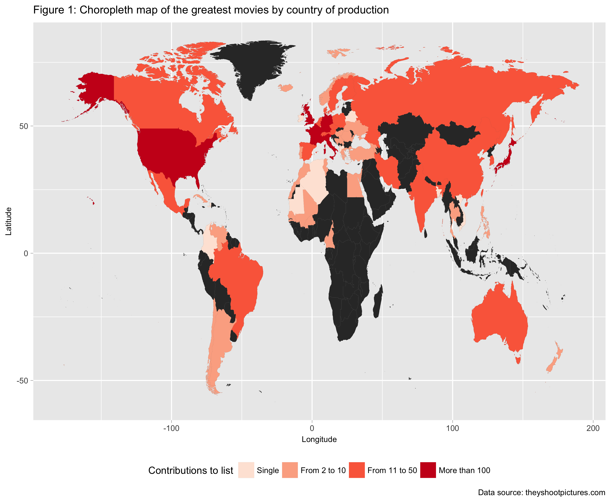
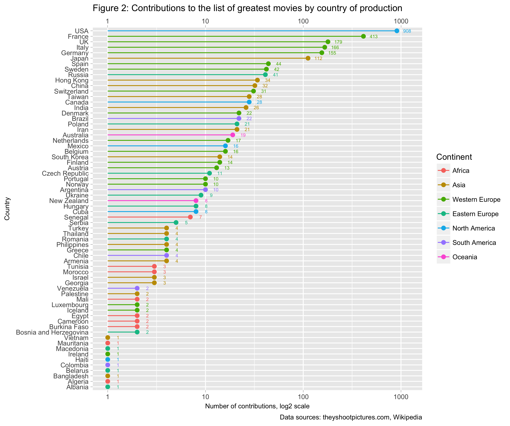

Data Analyst Nanodegree: P4 Explore and Summarise Data
================
**Federico Maria Massari / <federico.massari@bocconialumni.it>**

**Introduction**
----------------

*[They Shoot Pictures, Don't They?](http://www.theyshootpictures.com)*, by Bill Georgaris and Vicki Platt, is among the definitive guides for cinema aficionados. The website features some of the most referenced film lists on the Internet, most notably "The 1,000 Greatest Films", which showcases the most groundbreaking and highly artistic movies ever made (and which was recently expanded to include 2,000 films in total), "The 21st Century's Most Acclaimed Films", which presents the best works of the past two decades, and "Top 250 Directors", which ranks filmmakers by historical importance.

Each list is a synthesis of thousands of individual ballots, so it is not only pleasant to read, but also "statistically sound". As a consequence, the website represents an invaluable resource for both professionals and beginners alike.

**Data acquisition**
--------------------

#### **Acquire external datasets using Python**

``` r
#system("python3 ./python-modules/get_xls.py")
#system("python3 ./python-modules/scrape_webpage.py")
#system("python3 ./python-modules/scrape_wikipedia.py")
#system("python3 ./python-modules/scrape_others.py")
```

#### **Import datasets into R**

``` r
# Import frequently used libraries
library(dplyr)
library(ggplot2)
library(plotly)
```

``` r
# Import main files as data frames
greatest_pt1 <- readxl::read_excel("./data/xls/1000GreatestFilms.xls")
greatest_pt2 <- readxl::read_excel("./data/xls/Films-Ranked-1001-2000.xls")
directors <- read.csv("./data/csv/top_250_directors.csv")

# Import auxiliary data from Wikipedia
continents <- read.csv("./data/csv/continents.csv")
coordinates <- read.csv("./data/csv/coordinates.csv")
country_area <- read.csv("./data/csv/country_area.csv")
country_codes <- read.csv("./data/csv/country_codes.csv")
gdp <- read.csv("./data/csv/gdp.csv")

# Import world map from ggplot2 library
world <- filter(map_data("world"), region != "Antarctica")

# Uniform the data frames, append pt2 to pt1
greatest <- rbind(greatest_pt1[, -c(2:3)], greatest_pt2)
```

**Data cleaning**
-----------------

#### **Define auxiliary functions**

``` r
# Convert character columns to factors
convert.to.factor <- function(df) {
  # Convert all "chr" columns of a data frame to "Factor".
  #
  # Arguments:
  #   df: Data frame with columns of type "chr" to convert to "Factor".
  #
  # Returns:
  #   Data frame df with converted column types.
  #
  df <- as.data.frame(unclass(df))
  return(df)
}

replace.with.mean <- function(df, column, delimiter = "-") {
  # Replace entry "YYYY-YYYY" with the rounded mean of the single years.
  #
  # Arguments:
  #   df: Data frame.
  #   column: Data frame column with entries to replace. Enter as text (i.e.,
  #     "column", since the function evaluates it as df[["column"]]).
  #
  # Keyword arguments:
  #   delimiter: The character separating the two years (default: "-").
  #
  # Returns:
  #   A data frame in which entries "YYYY-YYYY" in the supplied column are
  #   replaced by the average of the single YYYY entries.
  #
  # Store all rows in which delimiter appears in a subset
  df_subset <- df[grepl(delimiter, df[[column]], fixed = TRUE), ]

  # Separately store corresponding row indices
  indices <- as.numeric(rownames(df_subset))

  # Replace entry with conditional mean value
  for (i in 1:length(indices)) {
    string <- stringr::str_split_fixed(df_subset[[column]][i], delimiter, Inf)
    string <- round(mean(as.numeric(string)), 0)
    df[[column]][indices[i]] <- as.factor(string)
  }
  return(df)
}

replace.value <- function(df, column, replacement, to_replace = "---") {
  # Replace data frame entry "---" with user-defined value.
  #
  # Arguments:
  #   df: Data frame.
  #   column: Data frame column with entries to replace. Enter as text (i.e.,
  #     "column", since the function evaluates it as df[["column"]]).
  #   replacement: The desired replacement value, as text.
  #
  # Keyword arguments:
  #   to_replace: The character to replace (default: "---").
  #
  # Returns:
  #   A data frame in which entries "---" in the supplied column are replaced
  #   by a custom value supplied by the user.
  #
  df[[column]][grepl(to_replace, df[[column]], fixed = TRUE)] <- replacement
  return(df)
}

add.bool.column <- function(df, cond.column, new.column, delimiter,
                            if.TRUE = "Yes", if.FALSE = "No") {
  # Add Boolean column to data frame.
  #
  # Arguments:
  #   df: Data frame.
  #   cond.column: The data frame column upon which to build the Boolean
  #     column. If entry i in cond.column contains a specific delimiter,
  #     new.column[i] is set to if.TRUE; else, it is set to if.FALSE.
  #     Enter cond.column as text (i.e., "cond.column").
  #   new.column: The new column name, as text.
  #   delimiter: Delimiter to search in cond.column, as text.
  #   
  # Keyword arguments:
  #   if.TRUE: The conditional affirmative value of new.column entries, as text
  #     (default: "Yes").
  #   if.FALSE: The conditional negative value of new.column entries, as text
  #     (default: "No").
  #
  # Returns:
  #   The data frame, augmented by a Boolean column according to the specified
  #   conditions.
  #
  # Initialise data frame column
  df[[new.column]] <- NA

  for (i in 1:nrow(df)) {
    ifelse(grepl(delimiter, df[[cond.column]][i], fixed = TRUE),
           df[[new.column]][i] <- if.TRUE,
           df[[new.column]][i] <- if.FALSE)  
  }
  return(df)
}
```

#### **Clean original data frames**

``` r
# Convert columns of type "chr" to "Factor"
world <- convert.to.factor(world)
greatest <- convert.to.factor(greatest)

# ggplot2 "world" only distinguishes between "China" and "Hong Kong" at the
# "subregion" level. For the analysis, also set "region" to "Hong Kong"
levels(world$region) <- c(levels(world$region), "Hong Kong")
index <- as.numeric(rownames(subset(world, subregion == "Hong Kong")))
world[index, ]$region <- "Hong Kong"

# Rename column "region" to "Country" in "world"
world <- rename(world, Country = region)

# Rename column "Country" to "All.Countries" in "greatest"
greatest <- rename(greatest, All.Countries = Country)

# Split each "YYYY-YYYY" in "Year", and replace with mean of the two values,
# then convert to numeric
greatest <- replace.with.mean(greatest, "Year")
greatest$Year <- as.numeric(as.character(greatest$Year))

# Replace "---" in columns "Colour" and "Genre" with suitable values
greatest <- replace.value(greatest, "Colour", "Col-BW")
greatest <- replace.value(greatest, "Genre", "Drama")

# Fix typo from xls file
greatest$All.Countries <- gsub("Herzergovina", "Herzegovina",
                               greatest$All.Countries)

# Fix typo in column "Country: "--" -> "-"
greatest$All.Countries <- gsub("--", "-", greatest$All.Countries)

# Replace delimiters with clearer ones
for (column in c("All.Countries", "Genre")) {
  greatest[[column]] <- gsub("-", ", ", greatest[[column]])
}
greatest$Director <- gsub("/", "; ", greatest$Director)

# Rename column "Rank" to "Dir.Rank" in "directors"
directors <- rename(directors, Dir.Rank = Rank)

# Add new row related to "Hong Kong" in "continents"
continents <- rbind(continents, data.frame(Continent = "Asia",
                                           Country = "Hong Kong"))

# Convert "gdp" factor columns to numeric using lambda function
cols <- c("Agriculture", "Industry", "Services")
gdp[, cols] = apply(gdp[, cols], 2, function(x) as.numeric(as.character(x)))
```

#### **Add columns to data frame**

``` r
# Add column "Co.Production"
greatest <- add.bool.column(df = greatest, cond.column = "All.Countries",
                            new.column = "Co.Production", delimiter = ", ")

# Add column "Co.Director"
greatest <- add.bool.column(df = greatest, cond.column = "Director",
                            new.column = "Co.Director", delimiter = "; ")

# Add column "Decade"
greatest$Decade <- cut(greatest$Year, breaks = seq(1890, 2020, 10),
                       dig.lab = 5, right = FALSE)

levels(greatest$Decade) <- c("1890s", "1900s", "1910s", "1920s", "1930s",
                             "1940s", "1950s", "1960s", "1970s", "1980s",
                             "1990s", "2000s", "2010s")

# Add column "Rank.Category"
greatest$Rank.Category <- cut(greatest$Pos,
                              breaks=c(0, 10, 100, 500, 1000, 2000))

levels(greatest$Rank.Category) <- c("Top 10", "From 11 to 100",
                                    "From 101 to 500", "From 501 to 1000",
                                    "Bottom 1000")
```

#### **Generate main dataset**

``` r
split.strings <- function(df, column, delimiter = ", ") {
  # Split data frame column entries by delimiter and vectorise the output.
  #
  # Arguments:
  #   df: Data frame.
  #   column: Data frame column with entries to split. Enter as text (i.e.,
  #     "column", since the function evaluates it as df[["column"]]).
  #
  # Keyword arguments:
  #   delimiter: The character separating the individual items (default: ", ").
  #
  # Returns:
  #   A single column of type "chr", where each row represents a single element
  #   resulting from splitting each entry of the original data frame column by
  #   the provided delimiter, and where blank spaces are not removed.
  #
  output <- stringr::str_split_fixed(df[[column]], delimiter, Inf)

  # Do not remove blanks yet
  output <- unlist((as.list(output)))
  return(output)
}

rename.factor <- function(df, column, old_name, new_name) {
  # Rename a single factor level in a data frame column.
  #
  # Arguments:
  #   df: Data frame.
  #   column: Data frame column with factor level to rename. Enter as text
  #     (i.e., "column", since the function evaluates it as df[["column"]]).
  #   old_name: The factor level to replace.
  #   new_name: The new name of the factor level.
  #
  # Returns:
  #   A data frame with a replaced factor level in the supplied column.
  #
  df[[column]][df[[column]] == old_name] <- new_name
  return(df)
}

rename.all.factors <- function(df, column, old_names, new_names) {
  # Rename all factor levels in a data frame column.
  #
  # Arguments:
  #   df: Data frame
  #   column: Data frame column with factor levels to rename. Enter as text
  #     (i.e., "column", since the function evaluates it as df[["column"]]).
  #   old_names: List of factor levels to replace.
  #   new_names: List of new names for the factor levels.
  #
  # Returns:
  #   A data frame with the replaced factor levels in the supplied column.
  #
  for (i in 1:length(old_names)) {
    df <- rename.factor(df, column, old_names[i], new_names[i])
  }
  return(df)  
}

update.factor.columns <- function(df, old_names, new_names) {
  # Rename factor levels in all the columns of a data frame.
  #
  # Arguments:
  #   df: Data frame.
  #   old_names: Array of factor levels to replace.
  #   new_names: Array of new factor levels.
  #
  # Returns:
  #   A data frame with the replaced factor levels in all columns.
  #
  for (column in names(df)) {
    # Add new factor levels to data frame column
    levels(df[[column]]) <- c(levels(df[[column]]), new_names)
    # Rename factor levels for each column
    df <- rename.all.factors(df, column, old_names, new_names)
  }
  return(df)
}

extract.countries <- function(df, column, old_names, new_names) {
  # Extract Countries from data frame column with delimiter-separated levels.
  #
  # Arguments:
  #   df: Data frame.
  #   column: Data frame column with factor levels to split. Enter as text
  #     (i.e., "column", since the function evaluates it as df[["column"]]).
  #   old_names: Array of factor levels to replace.
  #   new_names: Array of new factor levels.
  #
  # Returns:
  #   A (n*m, 1)-dimensional data frame, in which "n" is the length of the
  #   supplied column, and "m" the largest number of split factor levels in
  #   a row. Blank spaces are not removed (see function: "split.strings");
  #   additionally, all factor levels are uniformed to those of the "world"
  #   dataset.
  #
  # Split column by delimiter and convert to data frame
  Country <- split.strings(df, column)
  df_out <- data.frame(Country, stringsAsFactors = TRUE)

  # Add new factor levels to data frame
  levels(df_out$Country) <- c(levels(df_out$Country), new_names)

  # Update Country names, sort factor levels alphabetically
  df_out <- rename.all.factors(df_out, "Country", old_names, new_names)
  df_out$Country <- as.factor(as.character(df_out$Country))

  return(df_out)
}
```

``` r
# Uniform Country levels with those of world map
old_names <- c("Czechia", "Czechoslovakia", "Kingdom of the Netherlands",
               "Korea, South", "Palestinian Territories", "Republic of Ireland",
               "Republic of Macedonia", "State of Palestine", "United Kingdom",
               "United States", "USSR", "West Bank and Gaza", "West Germany",
               "Yugoslavia")

new_names <- c("Czech Republic", "Czech Republic", "Netherlands", "South Korea",
               "Palestine", "Ireland", "Macedonia", "Palestine", "UK", "USA",
               "Russia", "Palestine", "Germany", "Serbia")

# Single out all Countries of production (including co-production ones) and
# store into "countries", which becomes the main dataset for exploration
countries <- extract.countries(greatest, "All.Countries", old_names, new_names)
```

#### **Migrate content to new dataset**

``` r
append.columns <- function(df, to_append, shared_col, old_names, new_names) {
  # Append data frame columns to a different data frame.
  #
  # Arguments:
  #   df: The data frame to augment.
  #   to_append: The data frame whose columns are to append to df.
  #   shared_col: Column shared by the two data frames. Enter as text,
  #     (i.e., "column", since the function evaluates it as df[["column"]]).
  #   old_names: List of factor levels to replace.
  #   new_names: List of new names for the factor levels.
  #
  # Returns:
  #   Data frame df, augmented with the columns of a second data frame.
  #
  # Add factor levels and rename
  levels(to_append[[shared_col]]) <- c(levels(to_append[[shared_col]]),
                                       new_names)

  to_append <- rename.all.factors(to_append, shared_col, old_names,
                                  new_names)

  # Append columns to data frame
  df <- plyr::join(x = df, y = to_append, by = shared_col)

  return(df)
}
```

``` r
# Determine the number of array repetitions
nreps <- nrow(countries) / nrow(greatest)

# Uniform column "Pos" to the length of "countries". "Pos" will work as a
# primary key in order to migrate content from "greatest"
added_column <- do.call("rbind", replicate(nreps, greatest["Pos"],
                                           simplify = FALSE))

# Column bind, then shrink, the two datasets
countries <- subset(cbind(countries, added_column), !Country == "")

# Swap columns
countries <- countries[, c("Pos", "Country")]
```

``` r
# Append columns to data frame. This is an elegant, albeit space inefficient,
# way to append multiple data frame columns to "countries"
df.list <- list(country_codes, continents, coordinates, country_area, gdp)

for (df in df.list) {
  countries <- append.columns(countries, df, "Country", old_names, new_names)
}

# Migrate content of data frame "greatest" to "countries"
countries <- merge(countries, greatest, by = "Pos")
```

#### **Clean up Global Environment**

``` r
# Remove all but necessary variables and functions
required <- c(lsf.str(), "countries", "directors", "world", "old_names",
              "new_names")
rm(list = setdiff(ls(), required))
```

**Data exploration**
--------------------

### **Atlas of the greatest films**

#### **Aggregate data for exploration**

``` r
aggregate.df <- function(df, column) {
  # Group data frame by column variable and count values.
  #
  # Arguments:
  #   df: Data frame.
  #   column: Data frame column to summarise. Enter as a normal variable, not
  #     as text (i.e., column instead of "column").
  #
  # Returns:
  #   A summary data frame counting the occurrences of factor levels in the
  #   supplied column.
  #
  # Create quosure to use dplyr in function environment
  column <- enquo(column)

  # Unquote (evaluate immediately) quosure expression
  df_out <- df %>%
    group_by(!!column) %>%
    summarise(n = n())

  return(df_out)
}
```

``` r
# Aggregate data
greatest.by_country <- aggregate.df(countries, Country)

# Group and label factor levels for convenient representation
greatest.by_country$bin <- cut(greatest.by_country$n,
                               breaks = c(-Inf, 1,  10, 50, 100, +Inf))

levels(greatest.by_country$bin) <- c("Single", "From 2 to 10", "From 11 to 50",
                                     "From 51 to 100", "More than 100")

# Append selected columns to the dataset
greatest.by_country <- merge(greatest.by_country,
                             unique(countries[, c(2:12)]),
                             by = "Country")

# Append selected columns to data frame "world"
world <- plyr::join(world, greatest.by_country[, c(1:3)], by = "Country")
```

#### **Generate choropleth**

``` r
# Define attributes shared by plots, to override if necessary
shared_themes <- theme(plot.title = element_text(size = 11),
                       plot.caption = element_text(size = 8),
                       axis.title = element_text(size = 8),
                       axis.text = element_text(size = 8),
                       axis.ticks = element_line(size = 0.1),
                       legend.title = element_text(size = 10),
                       legend.text = element_text(size = 8),
                       legend.position = "bottom")
```

``` r
# Generate world map and define common features
world_base <- ggplot() +
  geom_polygon(data = world, aes(x = long, y = lat, group = group)) +
  xlab("Longitude") +
  ylab("Latitude") +
  labs(fill = "Contributions to list",
       caption = "Data source: theyshootpictures.com") +
  scale_fill_brewer(palette = "Reds") +
  shared_themes

# Make choropleth map
world_base +
  geom_polygon(data = subset(world, !is.na(bin)),
             aes(x = long, y = lat, group = group, fill = bin)) +
  ggtitle(paste("Figure 1: Choropleth map of the greatest movies by Country",
                "of production"))
```



#### **Observations**

``` r
custom_ticks <- c(0, 1, 10, 100, 1000)

ggplot(data = greatest.by_country,
       aes(x = log2(n), y = reorder(Country, n), color = Continent)) +
  geom_point(size = 2) +
  geom_segment(aes(x = 0, xend = log2(n), y = Country, yend = Country),
               size = 0.5) +
  geom_text(aes(label = n), size = 2, nudge_x = 0.35, check_overlap = TRUE) +
  scale_x_continuous(breaks = log2(custom_ticks), labels = custom_ticks,
                     sec.axis = dup_axis(name = NULL)) +
  ggtitle(paste("Figure 2: Contributions to the list of greatest movies by",
                "Country of production")) +
  xlab("Number of contributions, log2 scale") +
  ylab("Country") +
  labs(fill = "Contributions to list",
       caption = "Data sources: theyshootpictures.com, Wikipedia") +
  shared_themes +
  # Override "shared_themes" legend position
  theme(legend.position = "right")
```



#### **Observations**

``` r
ggplot(data = greatest.by_country,
       aes(x = log2(n), y = Services, color = Continent)) +
  geom_point(size = 1) +
  # Use ggrepel to avoid label overlapping
  ggrepel::geom_text_repel(aes(label = Country), size = 2.5,
                           show.legend = FALSE) +
  geom_smooth(method = "lm", se = FALSE, size = 0.5, color = "royalblue") +
  scale_x_continuous(breaks = log2(custom_ticks), labels = custom_ticks) +
  scale_y_continuous(breaks = seq(0, 100, 5)) +
  ggtitle(paste("Figure 3: Relationship between movies produced and resources",
                "to the service sector (% GDP) by Country")) +
  xlab("Number of contributions, log2 scale") +
  ylab("Resources to the service sector (% GDP)") +
  labs(caption = "Data sources: theyshootpictures.com, Wikipedia") +
  shared_themes
```


#### **Observations**

``` r
linear.regression <- function(df, x, y, transform.x = NA, transform.y = NA) {
  # Calculate linear regression y ~ x and provide summary statistics.
  #
  # Arguments:
  #   df: Data frame.
  #   x: The independent, or explanatory, variable. Enter as the name of a
  #     data frame column, as text (i.e., "x" instead of x).
  #   y: The dependent, or explained variable (see x for input).
  #
  # Keyword arguments:
  #   transform.x, transform.y: Optional transformations for x and y. Enter as
  #     text, which is then evaluated by the function (default: NA).
  #
  # Returns:
  #   A summary of the linear regression.
  #
  if (!is.na(transform.x)) {
    x <- eval(parse(text = transform.x))(df[[x]])
  } else {
    x <- df[[x]]
  }
  if (!is.na(transform.y)) {
    y <- eval(parse(text = transform.y))(df[[y]])
  } else {
    y <- df[[y]]
  }
  fit <- lm(y ~ x)
  output <- summary(fit)
  return(output)
}
```

``` r
linear.regression(greatest.by_country, "n", "Services", transform.x = "log2")
```

    ##
    ## Call:
    ## lm(formula = y ~ x)
    ##
    ## Residuals:
    ##      Min       1Q   Median       3Q      Max
    ## -25.2063  -6.1733  -0.4499   5.8646  27.4262
    ##
    ## Coefficients:
    ##             Estimate Std. Error t value Pr(>|t|)    
    ## (Intercept)  56.1407     2.1279  26.383  < 2e-16 ***
    ## x             2.4331     0.5533   4.398 4.46e-05 ***
    ## ---
    ## Signif. codes:  0 '***' 0.001 '**' 0.01 '*' 0.05 '.' 0.1 ' ' 1
    ##
    ## Residual standard error: 10.29 on 61 degrees of freedom
    ## Multiple R-squared:  0.2407, Adjusted R-squared:  0.2283
    ## F-statistic: 19.34 on 1 and 61 DF,  p-value: 4.458e-05

### **Golden and silver periods of world cinema**

``` r
# Aggregate data by Country and Decade, then summarise
greatest.by_decade <- countries %>%
  group_by(.dots = c("Country", "Decade")) %>%
  summarise(Max.Rank = min(Pos))

# Add column "Rank.Category" to data frame
greatest.by_decade$Rank.Category <-
  cut(greatest.by_decade$Max.Rank, breaks = c(0, 10, 100, 500, 1000, 2000))

levels(greatest.by_decade$Rank.Category) <-
  c("Top 10", "From 11 to 100", "From 101 to 500", "From 501 to 1000",
    "Bottom 1000")
```

``` r
ggplot(data = greatest.by_decade, aes(x = Decade, y = Country)) +
  geom_tile(aes(fill = Rank.Category), colour = "black") +
  scale_x_discrete(position = "top") +
  scale_fill_brewer(palette = "Reds", direction = -1) +
  ggtitle("Figure 4: Heatmap of peak positions by Country and decade") +
  labs(fill = "Maximum rank reached",
       caption = "Data source: theyshootpictures.com") +
  shared_themes +
  theme(axis.text.x = element_text(angle = -45, hjust = 1.05))
```


#### **Observations**

### **Most frequent co-productions**

#### **Define auxiliary functions**

``` r
rbind.factor.comb <- function(df, column, delimiter = ", ") {
  # Extract all factor combinations out of each row of a data frame column
  # and rbind the output of each iteration [1].
  #
  # Arguments:
  #   df: Data frame.
  #   column: The data frame column containing, for each row, factor level
  #     combinations, separated by a delimiter. Enter as text (i.e., "column").
  #
  # Keyword arguments:
  #   delimiter: The character separating factor levels (default: ", ").
  #
  # Returns:
  #   A new data frame with all possible combinations among pairs of factors.
  #
  # References:
  #   [1] https://stackoverflow.com/questions/29402528/append-data-frames-
  #       together-in-a-for-loop/29419402
  #
  # Create empty list, to which to add after each loop
  df_out <- list()

  for (i in 1:length(df[[column]])) {
    # Make an expanded grid of all combinations of factors in each row
    expanded_row <- expand.grid(
      stringr::str_split_fixed(df[[column]][i], delimiter, Inf),
      stringr::str_split_fixed(df[[column]][i], delimiter, Inf))

    # Add the output of each loop to the list
    df_out[[i]] <- expanded_row
  }
  # Row bind the list elements
  df_out <- data.table::rbindlist(df_out)
  return(df_out)
}

cbind.coordinates <- function(df, coord.df, columns.x, column.y) {
  # Append coordinate pairs to each column of the provided data frame.
  #
  # Arguments:
  #   df: The data frame to which to append the coordinate pairs.
  #   coord.df: The data frame containing the coordinate pairs. Must share
  #     a column with df.
  #   columns.x: Each of the columns of df to which to append the coordinates.
  #     Enter as a vector of column names (e.g., c("col.1", "col.2")).
  #   column.y: Unique column of coord.df whose factor levels are shared by the
  #     columns of df. Enter as column name (i.e., "column.y").
  #
  # Returns:
  #   The original data frame, (column-) augmented by coordinate pairs for each
  #   of its columns. The output is optimised for ggplot2 "geom_curve", which
  #   requires both (x, y) and (xend, yend).
  #
  for (column in columns.x) {
    df <- merge(df, coord.df, by.x = column, by.y = column.y, all.x = TRUE)
  }
  return(df)
}

remove.duplicates <- function(df, column, na.rm = TRUE) {
  # Remove duplicate rows in a data frame based on a column.
  #
  # Arguments:
  #   df: Data frame.
  #   column: The data frame column based on which duplicate rows are removed.
  #     Enter as text (i.e., "column" instead of column).
  #
  # Keyword arguments:
  #   na.rm: Choose whether to remove (TRUE) or to keep (FALSE) one NA value in
  #     the provided data frame column (default: TRUE).
  #
  # Returns:
  #   A shrunken data frame which only keeps unique values in the supplied
  #   column.
  #
  df_out <- df[!duplicated(df[[column]]), ]

  if (na.rm == TRUE) {
    # Clear away duplicates from the data frame
    df_out <- subset(df_out, !is.na(eval(parse(text = column))))
  }
  return(df_out)
}

count.movie.coproducers <- function(df, column, delimiter = ", ") {
  # Count the number of co-producing Countries for each column entry.
  #
  # Arguments:
  #   df: Data frame.
  #   column: Data frame column with the individual Countries, separated by a
  #     delimiter, to split. Enter column as text (i.e., "column").
  #
  # Keyword arguments:
  #   delimiter: The character separating the co-producers (default: ", ").
  #
  # Returns:
  #   A vector containing the number of co-producing Countries for each film
  #   in the data frame column.
  n.times <- vector(mode = "integer", length = length(df[[column]]))

  for (i in 1:length(df[[column]])) {
    n.times[i] <- ncol(stringr::str_split_fixed(df[[column]][i], ", ", Inf))
  }
  return(n.times)
}

expand.to.comb <- function(df, column, times) {
  # Expand a data frame column to the size of "rbind.factor.comb" output.
  #
  # Arguments:
  #  df: Data frame.
  #  column: The data frame column to expand. Enter as text (i.e., "column").
  #  times: A vector of integers representing the number of times each single
  #    column entry should be expanded.
  #
  # Returns:
  #   A data frame column with entries expanded according to vector "times",
  #   to conform to the size of "rbind.factor.comb" output.
  #
  col.name <- rep.int(df[[column]], times)
  df_out <- data.frame(col.name)
  return(df_out)
}
```

#### **Count co-production relationships**

``` r
# Single out and sum co-productions
co_productions <- subset(countries, Co.Production == "Yes")

greatest.by_connection <- co_productions %>%
  group_by(All.Countries) %>%
  summarise(n = n(),
            # Summary variable to detect two-way co-productions
            Mean.Latitude.All = mean(Latitude))

# Sum two-way co-productions detected in the previous data frame
auxiliary.df <- greatest.by_connection %>%
  group_by(Mean.Latitude.All) %>%
  summarise(Sum.Co.Productions = sum(n))

# Merge the two data frames, dropping unnecessary columns
greatest.by_connection <- merge(subset(greatest.by_connection, select = -n),
                                auxiliary.df, by = "Mean.Latitude.All")

# Generate all possible combinations of two-Country co-productions
combinations <- rbind.factor.comb(co_productions, "All.Countries", ", ")

# Update column names and factor levels
combinations <- rename(combinations, Country.x = Var1, Country.y = Var2)
combinations <- update.factor.columns(combinations, old_names, new_names)

# Keep track of the times each entry was expanded
n.times <- count.movie.coproducers(co_productions, "All.Countries")

# Expand column "All.Countries" to the length of "combinations".
# The column will work as primary key, to join different data frames
shared_col <- expand.to.comb(co_productions, "All.Countries", n.times**2)
shared_col <- rename(shared_col, All.Countries = col.name)

# Column bind "All.Countries" to "combinations"
combinations <- cbind(combinations, shared_col)

# Append coordinate pairs to Country.x and Country.y
unique_coord <- greatest.by_country[, c("Country", "Latitude", "Longitude")]

combinations <- cbind.coordinates(combinations, unique_coord,
                                  columns.x = c("Country.x", "Country.y"),
                                  column.y = "Country")

combinations <- merge(combinations, greatest.by_connection,
                      by = "All.Countries", all.x = TRUE)

# Shrink data frame and remove duplicate elements
combinations <- unique(combinations)
combinations <- combinations[apply(combinations[, c("Country.x", "Country.y")],
                                   1, function(x) length(unique(x)) > 1), ]

# Include "Mean.Latitude" as one of the two columns used to identify unique
# co-production relationships (the other being "Mean.Latitude.All")
combinations$Mean.Latitude <-
  0.5 * (combinations$Latitude.x + combinations$Latitude.y)

# Single out unique co-productions
combinations <- combinations[!duplicated(
  combinations[, c("Mean.Latitude", "Mean.Latitude.All")]), ]

# Sum all two-Country co-productions
greatest.by_coproduction <- combinations %>%
  group_by(.dots = c("Country.x", "Country.y")) %>%
  summarise(Total.Co.Productions = sum(Sum.Co.Productions))

# Append coordinates to optimise output for "geom_curve"
greatest.by_coproduction <- cbind.coordinates(
  greatest.by_coproduction, unique_coord,
  columns.x = c("Country.x", "Country.y"), column.y = "Country")

# Add factor levels for neater visualisation
greatest.by_coproduction$Two.Country.Relationships <-
  cut(greatest.by_coproduction$Total.Co.Productions,
      breaks = c(0, 10, 20, 50, 100, Inf))

levels(greatest.by_coproduction$Two.Country.Relationships) <-
  c("Up to 10", "From 11 to 20", "From 21 to 50", "From 51 to 100",
    "More than 100")
```

#### **Clean up Global Environment**

``` r
# Remove all but necessary variables and functions
required <- c(lsf.str(), "countries", "directors", "world", "old_names",
              "new_names", "greatest.by_country", "greatest.by_decade",
              "greatest.by_coproduction", "shared_themes", "world_base")
rm(list = setdiff(ls(), required))
```

``` r
# Define transparent world map for network plot
world_transparent <- ggplot() +
  geom_polygon(data = world, aes(x = long, y = lat, group = group),
               color = "#b2b2b2", size = 0.3, fill = NA) +
  labs(caption = "Data source: theyshootpictures.com") +
  shared_themes +
  # Use map theme from the "ggthemes" package
  ggthemes::theme_map()

world_transparent +
  geom_point(data = countries, aes(x = Longitude, y = Latitude),
             color = "orange", size = 1.2) +
  geom_curve(data = greatest.by_coproduction,
             aes(x = Longitude.x, xend = Longitude.y,
                 y = Latitude.x, yend = Latitude.y,
                 alpha = Two.Country.Relationships), color = "#a50026") +
  scale_alpha_manual(values = c(0.05, 0.1, 0.2, 0.5, 1)) +
  ggtitle(paste("Figure 5: Most frequent two-Country co-production",
                "relationships"))
```


#### **Observations**

### **Colour and black-and-white**
