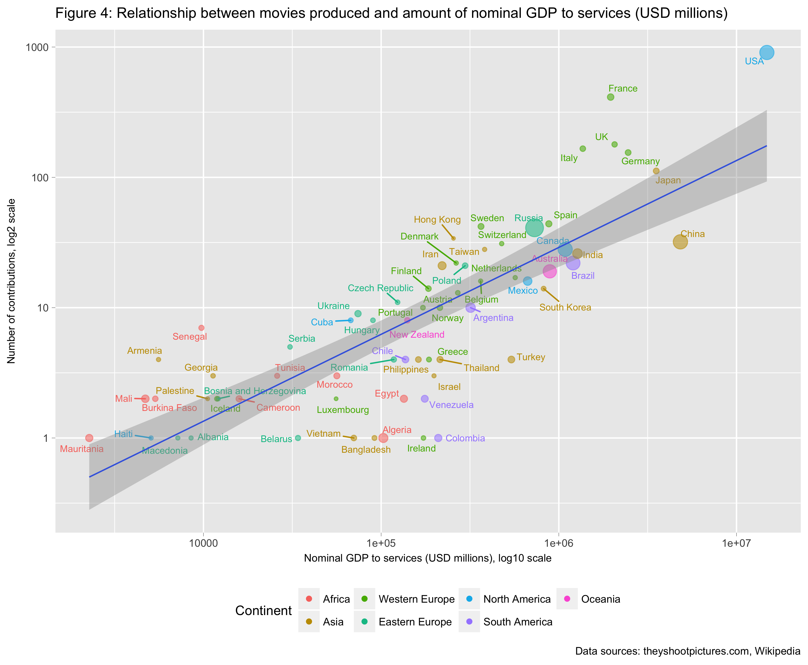

Previous: [P3 Wrangle OpenStreetMap](https://github.com/federicomariamassari/udacity-dand/blob/master/projects/p3/dand-p3-wrangle-openstreetmap.md) | [Table of Contents](https://github.com/federicomariamassari/udacity-dand/blob/master/README.md) | Next:
# Data Analyst Nanodegree: P4 Explore and Summarise Data
__Federico Maria Massari / federico.massari@bocconialumni.it__

The project is connected to the course _[Data Analysis with R](https://eu.udacity.com/course/data-analysis-with-r--ud651)_.




```
y <- Resources destined to the service sector, as a percentage of Country GDP
x <- Number of movies produced by Country

Call:
lm(formula = y ~ x)

Residuals:
     Min       1Q   Median       3Q      Max
-26.5737  -5.8390   0.8142   4.9851  27.3688

Coefficients:
            Estimate Std. Error t value Pr(>|t|)    
(Intercept)   56.442      2.057  27.437  < 2e-16 ***
x              7.272      1.776   4.094 0.000129 ***
---
Signif. codes:  0 ‘***’ 0.001 ‘**’ 0.01 ‘*’ 0.05 ‘.’ 0.1 ‘ ’ 1

Residual standard error: 9.959 on 60 degrees of freedom
Multiple R-squared:  0.2183,	Adjusted R-squared:  0.2053
F-statistic: 16.76 on 1 and 60 DF,  p-value: 0.0001288
```
